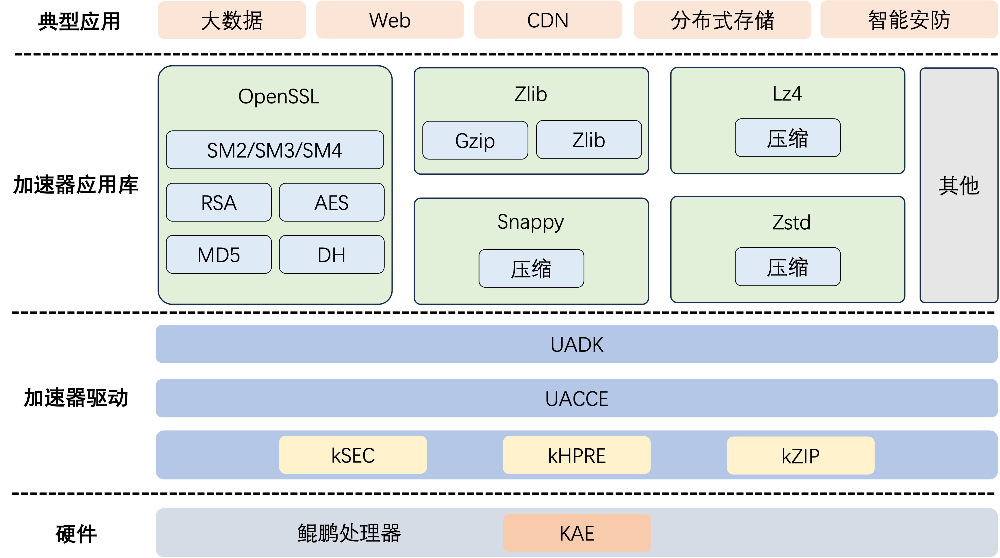

# KAE鲲鹏加速引擎介绍

## 最新消息

- \[2026.06.30\]：KAE2.0新增支持4.19内核用户态使用，不支持内核态加解密及压缩/解压缩接口；新增支持在KVM虚拟机场景下通过VF查询HostOS上PF设备的硬件故障隔离状态和隔离阈值。
- \[2026.03.20\]：KAEZlib加速压缩库新增支持异步模式；KAE2.0解压缩模块新增适配Snappy硬加速。
- \[2025.12.30\]：KAE2.0新增支持鲲鹏950处理器；KAELz4加速压缩库异步接口新增支持polling模式。
- \[2025.09.30\]：KAE代码仓切换到Gitcode平台；优化KAELz4、KAEZstd解压性能。
- \[2025.06.24\]：KAE2.0新增适配TencentOS 5.4操作系统；KAE2.0加解密模块新增适配BoringSSL RSA硬加速；KAELz4加速压缩库新增支持异步模式。
- \[2025.03.30\]：KAE2.0加解密模块基于鲲鹏920系列处理器新增适配Tongsuo 8.4.0。
- \[2024.12.30\]：KAE2.0新增适配openEuler 22.03 LTS-SP3/SP4操作系统；KAE2.0加解密模块新增支持OpenSSL 3.0.x系列版本；KAE2.0解压缩模块新增KAEZstd、KAELz4加速库适配鲲鹏920新型号处理器；新增使用RPM软件包方式安装、升级、卸载KAE2.0的操作指导。
- \[2024.03.21\]：新增使用Java调用KAE内容，详细请参见最佳实践。
- \[2024.02.22\]：发布KAE2.0版本，适配鲲鹏920新型号处理器和5.10内核版本。

## 项目简介

### 简介

KAE（Kunpeng Accelerator Engine，鲲鹏加速引擎）是基于鲲鹏处理器内置的硬件加速单元提供的硬件加速解决方案。通过专用硬件加速单元与优化指令集，KAE能够实现数据压缩/解压缩、对称/非对称加解密、数字签名等操作的硬件卸载，对应用层屏蔽了其内部实现细节。KAE兼容OpenSSL、Tongsuo、BoringSSL、Zlib、ZSTD、LZ4、Snappy等标准接口，用户无需修改业务代码即可快速集成，极大地降低了迁移成本与风险，为分布式存储、Web服务、数据库等场景提供高性能、低成本的加速方案，助力企业提升业务效率、降低成本并保障安全合规。KAE核心模块包括：

- KAE加解密，使用鲲鹏硬加速模块实现RSA/SM2/SM3/SM4/DH/MD5/AES算法，结合无损用户态驱动框架，提供高性能对称加解密、非对称加解密算法能力，兼容OpenSSL 1.1.1x、OpenSSL 3.0.x系列版本、Tongsuo 8.4.0、BoringSSL，支持同步和异步机制，用于加速SSL（Secure Sockets Layer，安全套接字层）/TLS（Transport Layer Security，传输层安全协议）应用。
- KAE解压缩，使用鲲鹏硬加速模块实现deflate、lz77\_zstd、lz77\_lz4、lz77\_snappy算法，结合无损用户态驱动框架，提供高性能Gzip/zlib格式压缩接口、ZSTD库标准接口、LZ4库标准接口、Snappy库标准接口，用于加速数据压缩和解压，可以显著降低处理器消耗，提高处理器效率。

### 软件架构

鲲鹏加速引擎软件架构如[**图 1** 软件架构](#软件架构)所示。

**图 1** 软件架构<a name="fig9931619182"></a><a id="软件架构"></a>



软件架构中各模块功能如[**表 1** 模块功能描述](#模块功能描述)所示。

**表 1** 模块功能描述<a id="模块功能描述"></a>

|模块名称|功能描述|
|--|--|
|加速器应用库|集成加解密或解压缩算法的应用开发库，可作为上层应用与硬件加速器交互的桥梁。|
|UADK|UADK（User Space Accelerator Development Kit，用户态加速器开发包），用户态接口适配层，为用户提供了硬件加速计算密码学、压缩等算法的统一编程接口。|
|UACCE|UACCE（User Space Accelerator，用户态加速器），用户态加速框架，为用户态提供统一驱动接口，帮助降低调用路径性能损耗。|
|kSEC|kSEC（Kunpeng Security Engine，鲲鹏安全加速引擎），对称加密/解密专用硬件加速模块，聚焦高速、高并发的对称加解密场景，解决传统软件实现对称加解密时 CPU占用高、吞吐低的问题。|
|kHPRE|kHPRE（Kunpeng High Performance RSA Engine，鲲鹏高性能RSA加速引擎），非对称加密/解密、数字签名/验签专用硬件加速模块，聚焦计算复杂度高、软件处理效率低的非对称密码学操作，提升处理器效率。|
|kZIP|kZIP（Kunpeng Hardware Acceleration Compression Engine，鲲鹏硬件加速压缩引擎），数据压缩/解压缩专用硬件加速模块，聚焦海量数据的实时压缩、解压缩场景，解决软件压缩方案CPU占用高、吞吐低、延迟高的问题。|
|KAE|鲲鹏加速器引擎，是基于鲲鹏920系列处理器提供的硬件加速解决方案。|

### 算法支持与规格

详细介绍KAE加解密模块及KAE解压缩模块（含KAEZlib、KAEZstd、KAELz4、KAESnappy）所支持的算法与模型，并列出各算法兼容的处理器型号。

**KAE加解密<a name="section420191313182"></a>**

KAE加解密是鲲鹏加速引擎的加解密模块，使用鲲鹏硬加速引擎实现RSA/SM2/SM3/SM4/DH/MD5/AES算法，结合无损用户态驱动框架，提供高性能对称加解密、非对称加解密算法能力，兼容OpenSSL 1.1.1x、OpenSSL 3.0.x系列版本、Tongsuo 8.4.0、BoringSSL，支持同步和异步机制。

- OpenSSL 1.1.1x系列主要支持以下算法：

    - 摘要算法SM3/MD5，支持异步模式。
    - 对称加密算法SM4，支持异步模式，支持CTR/XTS/CBC/ECB/OFB/CFB模式。
    - 对称加密算法AES，支持异步模式，支持ECB/CTR/XTS/CBC/OFB/CFB模式。
    - 非对称算法RSA，支持异步模式，支持Key Sizes：1024/2048/3072/4096。
    - 非对称算法SM2，支持异步模式。
    - 密钥协商算法DH，支持异步模式，支持Key Sizes：768/1024/1536/2048/3072/4096。

- OpenSSL 3.0.x系列目前以Engine机制提供加解密算法能力，已支持SM3/MD5/SM4/AES/RSA算法。
- Tongsuo 8.4.0目前以Engine机制提供加解密算法能力，已支持SM3/SM4/AES/RSA算法。
- BoringSSL目前以Engine机制提供加解密算法能力，已支持RSA算法（私钥加密、私钥解密）。

> **说明：**
>
>- 暂不支持Provider机制和更高版本的OpenSSL。
>- Tongsuo是基于OpenSSL衍生的一个加解密库，接口、用法兼容OpenSSL。
>- BoringSSL是Google基于早期OpenSSL开发并维护的一个开源加密库，一些接口、用法与OpenSSL有差异。BoringSSL+KAE的使用请参见《用户指南》中的“[通过BoringSSL调用KAE加解密库](./docs/zh/user_guide.md#通过boringssl调用kae加解密库)”章节。

**KAE解压缩-KAEZlib<a name="section1478918384188"></a>**

KAEZlib是鲲鹏加速引擎的解压缩模块，使用鲲鹏硬加速模块实现Deflate算法，结合无损用户态驱动框架，提供高性能Gzip/zlib格式压缩接口。

- 支持zlib/Gzip数据格式，符合RFC1950/RFC1952标准规范。
- 支持Deflate算法。
- 支持压缩等级及窗长配置。
- 支持同步和异步模式。
- 单处理器（鲲鹏920处理器）最大压缩带宽7GB/s，最大解压带宽8GB/s。
- 兼容开源zlib 1.2.11接口。

通过加速引擎可以提升不同场景下的应用性能，例如在分布式存储场景下，通过KAEZlib加速库加速数据压缩和解压。 同时，基于KAEZlib加速库，提供了KAEGzip压缩工具，使用户能够更加便捷地进行文件的压缩和解压操作，而不必通过API方式进行调用。

**KAE解压缩-KAEZstd<a name="section2606115365815"></a>**

KAEZstd是鲲鹏加速引擎的解压缩模块，使用鲲鹏硬加速模块实现lz77\_zstd算法，提供ZSTD库标准接口。

- 支持通用压缩和解压功能，不支持ZSTD字典模式，不支持多线程模式。
- 支持压缩硬件加速，暂不支持解压缩硬件加速功能。
- 支持小包（小于64KB）和大包（大于1GB）压缩。
- 支持配置ZSTD压缩等级。

通过加速引擎可以实现不同场景下应用性能的提升，压缩效率有显著提升。

**KAE解压缩-KAELz4<a name="section175146346247"></a>**

KAELz4是鲲鹏加速引擎的解压缩模块，使用鲲鹏硬加速模块实现lz77\_lz4算法，提供LZ4库标准接口。

- 支持lz4\_block\_format和lz4\_frame\_format两种格式。
- 支持压缩硬件加速，暂不支持解压缩硬件加速功能。
- 支持同步和异步模式。

**KAE解压缩-KAESnappy**

KAESnappy是鲲鹏加速引擎的解压缩模块，使用鲲鹏硬加速模块实现lz77\_snappy算法，提供Snappy库标准接口。

- 支持通用压缩和解压功能。
- 支持压缩硬件加速，暂不支持解压缩硬件加速功能。

**算法规格<a name="section37205443544"></a>**

由于硬件差异，不同处理器型号支持的加密/压缩算法存在不同。支持情况如[**表 2** 加密/压缩算法所支持的鲲鹏处理器型号](#加密/压缩算法所支持的鲲鹏处理器型号)所示。

**表 2** 加密/压缩算法所支持的鲲鹏处理器型号<a id="加密/压缩算法所支持的鲲鹏处理器型号"></a>

|算法分类|算法|鲲鹏920处理器|鲲鹏920新型号处理器|鲲鹏950处理器|
|--|--|--|--|--|
|加密算法|摘要算法SM3|√|√|√|
|加密算法|摘要算法MD5|√|√|√|
|加密算法|对称加密算法SM4-CTR|√|√|√|
|加密算法|对称加密算法SM4-XTS|√|√|√|
|加密算法|对称加密算法SM4-CBC|√|√|√|
|加密算法|对称加密算法SM4-ECB|√|√|√|
|加密算法|对称加密算法SM4-OFB|√|√|√|
|加密算法|对称加密算法SM4-CFB|x|√|√|
|加密算法|对称加密算法AES-ECB|√|√|√|
|加密算法|对称加密算法AES-CTR|√|√|√|
|加密算法|对称加密算法AES-XTS|√|√|√|
|加密算法|对称加密算法AES-CBC|√|√|√|
|加密算法|对称加密算法AES-OFB|x|√|√|
|加密算法|对称加密算法AES-CFB|x|√|√|
|加密算法|非对称算法RSA|√|√|√|
|加密算法|非对称算法SM2|x|√|√|
|加密算法|密钥协商算法DH|√|√|√|
|压缩算法|zlib（Gzip\zlib格式）|√|√|√|
|压缩算法|zlib（Deflate格式）|x|√|√|
|压缩算法|Gzip|√|√|√|
|压缩算法|Zstd|x|√|√|
|压缩算法|Lz4|x|√|√|
|压缩算法|Snappy|x|√|√|

> **说明：**
>
>√：表示支持；x：表示不支持。 <br>
>a：对称加密算法SM4-XTS只支持内核态使用，不支持OpenSSL。 <br>
>b：ZSTD、LZ4和Snappy算法仅压缩功能支持硬算，解压功能目前只支持软算处理。

## 目录结构

项目全量目录层级介绍如下：

```text
├── docs                                                     # 项目文档目录
│   └── zh                                                   # 中文文档目录
│       ├── figures                                          # 中文文档图片资源目录
│       ├── quick_start.md                                   # 快速入门
│       ├── release_notes.md                                 # KAE版本发布说明
│       ├── installation_guide.md                            # KAE安装指导
│       ├── user_guide.md                                    # KAE使用指导
│       ├── best_practices.md                                # KAE场景化应用最佳实践
│       ├── faq.md                                           # KAE安装使用常见问题
│   └── figures                                              # README图片
├── KAEGzip                                                  # KAEGzip压缩模块
│   ├── open_source                                          # 开源代码
│   ├── patch                                                # 适配补丁文件
│   └── build.sh                                             # 构建脚本
├── KAEKernelDriver                                          # 内核态驱动模块
│   ├── KAEKernelDriver-OLK-4.19                             # 适配4.19内核
│   ├── KAEKernelDriver-OLK-5.10                             # 适配5.10内核
│   ├── KAEKernelDriver-OLK-5.4                              # 适配5.4内核
│   ├── KAEKernelDriver-OLK-6.6                              # 适配6.6内核
├── KAELz4                                                   # KAELz4压缩模块
│   ├── include                                              # 头文件
│   ├── open_source                                          # 开源代码
│   ├── src                                                  # 功能源码
│   ├── test                                                 # 测试用例
│   └── build.sh                                             # 构建脚本
├── KAEOpensslEngine                                         # KAE加解密模块
│   ├── patch                                                # 适配补丁
│   ├── src                                                  # 功能源码
│   ├── test                                                 # 测试用例
│   └── Makefile.am                                          # 构建规则文件
├── KAEZlib                                                  # KAEZlib压缩模块
│   ├── include                                              # 头文件
│   ├── open_source                                          # 开源代码
│   ├── patch                                                # 适配补丁
│   ├── src                                                  # 功能源码
│   ├── test                                                 # 测试用例
│   └── setup.sh                                             # 构建脚本
├── KAEZstd                                                  # KAEZstd压缩模块
│   ├── include                                              # 头文件
│   ├── open_source                                          # 开源代码
│   ├── src                                                  # 功能源码
│   ├── test                                                 # 测试用例
│   └── build.sh                                             # 构建脚本
├── KAESnappy                                                # KAESnappy压缩模块
│   ├── include                                              # 头文件
│   ├── open_source                                          # 开源代码
│   ├── src                                                  # 功能源码
│   ├── test                                                 # 测试用例
│   └── build.sh                                             # 构建脚本
├── scripts                                                  # 公共文件
│   ├── buildScript                                          # 脚本文件
│   └── compressTestDataset                                  # 压缩测试数据集
│   └── kaeTools                                             # KAE工具
│   └── patches                                              # 补丁文件
│   └── perftest                                             # 压缩性能测试工具
│   └── specFile                                             # RPM构建规则文件
├── uadk                                                     # 用户态驱动模块
│   └── drv                                                  # 驱动层源码
│   └── include                                              # 头文件
│   └── lib                                                  # 第三方依赖
│   └── sample                                               # Demo样例
│   └── test                                                 # 测试用例
│   └── uadk_tool                                            # 驱动测试工具
│   └── v1                                                   # no-sva模式源码
├── LICENSE                                                  # 项目许可证
└── README.md                                                # 项目说明文档
└── build.sh                                                 # 构建脚本
└── env.check.sh                                             # 环境检测脚本
```

## 版本说明

KAE2.0为当前维护版本，后续新增特性、适配OS/内核及问题修复均以KAE2.0为主。KAE1.0为历史版本，即有版本记录继续保留，不再新增特性、OS/内核适配或问题修复。

**KAE2.0内核支持范围<a name="section10131916143616"></a>**

KAE2.0基于UADK（User Space Accelerator Development Kit）框架提供加速能力，当前支持范围如[**表 3** KAE2.0内核支持范围](#KAE2.0内核支持范围)所示。

**表 3** KAE2.0内核支持范围<a id="KAE2.0内核支持范围"></a>

|内核版本|设备形态|支持范围|
|--|--|--|
|4.19|鲲鹏920处理器、鲲鹏920新型号处理器、鲲鹏950处理器|仅支持用户态使用，不支持内核态加解密及压缩/解压缩接口。|
|5.4|鲲鹏920处理器、鲲鹏920新型号处理器、鲲鹏950处理器|支持用户态使用及文档列明的内核态接口。|
|5.10|鲲鹏920处理器、鲲鹏920新型号处理器、鲲鹏950处理器|支持用户态使用及文档列明的内核态接口。|
|6.6|鲲鹏920处理器、鲲鹏920新型号处理器、鲲鹏950处理器|支持用户态使用及文档列明的内核态接口。|

> **说明：**
>
>- 用户态使用包括通过UADK、OpenSSL/Tongsuo/BoringSSL、Zlib、ZSTD、LZ4、Snappy、Gzip等接口调用KAE加速能力。
>- 内核态接口包括Linux内核crypto API中的加解密及压缩/解压缩接口、dm-crypt、SM4-XTS等内核模块或内核态场景。

> **须知：**
>
>由于不同版本内核接口可能存在差异，不同的操作系统使能KAE需要实际编译内核驱动验证是否匹配，若特定OS内核编译KAE驱动遇到接口报错，则说明驱动不兼容。

**变更说明<a name="section4408930144513"></a>**

每个发布版本特性变更详细信息，请参见《[版本说明书](./docs/zh/release_notes.md)》。

## 环境部署

由于KAE是针对硬件的加速解决方案，因此安装KAE前请正确安装相应的License，License安装成功之后，操作系统才能识别到加速器设备。

**安装License<a name="section8301973474"></a>**

> **说明：**
>
>- 鲲鹏服务器K系列硬件KAE加速引擎已默认开启，无需申请License。
>- 鲲鹏920新型号处理器在BIOS升级至21.23及更新版本的情况下，可实现免License使用KAE加速引擎。

1. License申请和安装操作，请根据实际场景选择对应版本的《[华为服务器 iBMC 许可证 使用指导书](https://support.huawei.com/enterprise/zh/management-software/ibmc-pid-8060757?category=operation-maintenance)》。

2. 安装成功后，通过**lspci**命令查看操作系统是否有加速器设备，如下所示。

    > **说明：**
    >
    >不同的操作系统**lspci**查到的加速器描述信息可能不同，除了通过关键字进行过滤，用户还可以查看是否存在HPRE/SEC/ZIP等具体型号加速器的sbdf号信息。

    1. 查看是否存在高性能RSA加速引擎HPRE。

        ```shell
        lspci | grep HPRE
        ```

        回显如下所示，说明HPRE存在。

        ```text
        79:00.0 Network and computing encryption device: Huawei Technologies Co., Ltd. HiSilicon HPRE Engine (rev 21)
        b9:00.0 Network and computing encryption device: Huawei Technologies Co., Ltd. HiSilicon HPRE Engine (rev 21)
        ```

    2. 查看是否存在安全加速引擎SEC。

        ```shell
        lspci | grep SEC
        ```

        回显如下信息，说明SEC存在。

        ```text
        76:00.0 Network and computing encryption device: Huawei Technologies Co., Ltd. HiSilicon SEC Engine (rev 21)
        b6:00.0 Network and computing encryption device: Huawei Technologies Co., Ltd. HiSilicon SEC Engine (rev 21)
        ```

    3. 查看是否存在压缩加速引擎ZIP。

        ```shell
        lspci | grep ZIP
        ```

        回显如下所示，说明ZIP存在。

        ```text
        75:00.0 Processing accelerators: Huawei Technologies Co., Ltd. HiSilicon ZIP Engine (rev 21)
        b5:00.0 Processing accelerators: Huawei Technologies Co., Ltd. HiSilicon ZIP Engine (rev 21)
        ```

    若执行以上命令后没有任何回显信息打印，说明操作系统中没有KAE加速器设备，请检查License是否安装成功。

**安装KAE<a name="section3745131824710"></a>**

KAE提供源码安装和RPM包安装两种方式，支持的硬件环境、操作系统和详细安装步骤请参见《[安装指南](./docs/zh/installation_guide.md)》。

**驱动加载失败问题排查<a name="section3745131824710"></a>**

* 原因一：内核版本和内核开发包版本不一致导致内核安装失败（包括小版本号）。
  
  查看内核版本和内核开发包版本。

  ```shell
  uname -r  
  rpm -qa | grep kernel-devel
  ```

  若查询结果不一致则需要安装和内核版本一致的开发包。

* 原因二：缺少License导致加载失败。

  查看License是否正确安装。

  ```shell
  lspci | grep HPRE lspci | grep SEC lspci | grep ZIP
  ```

  若没有任何显示则License没有正确安装或未安装。

  解决办法：鲲鹏920处理器需要申请License，并且正确安装License；鲲鹏920新型号处理器需要更新免License版本的BIOS。

**修改硬件加速器instance数量**
  
每个加速器设备默认安装的驱动instance数量为256个。
  
```bash
cat /sys/class/uacce/hisi_*/available_instances
```

显示的数量结果为256（每个加速器）。

每个加速器最大的instance数量为1024，如果业务并发量较大，需要通过以下步骤设置更多的加速器instance（选择1种合适的方式即可）。

* 方法一：在驱动目录对应的Makefile文件将pf_q_num=256修改为pf_q_num=1024之后，卸载驱动重新编译安装。

* 方法二：执行以下命令。

  ```bash
  modprobe -r hisi_zip
  modprobe -r hisi_hpre
  modprobe -r hisi_sec2
  modprobe -r hisi_qm
  modprobe -r uacce
  ```

  先卸载驱动，再执行以下命令。

  ```bash
  modprobe uacce 
  modprobe hisi_qm
  modprobe hisi_sec2 uacce_mode=2 pf_q_num=1024
  modprobe hisi_hpre uacce_mode=2 pf_q_num=1024
  modprobe hisi_zip uacce_mode=2 pf_q_num=1024
  ```
  
  按新的队列数量加载驱动（uacce_mode=2是nosva模式，一般场景不涉及）。
  
  > **说明：**
  >
  >若为容器场景，则每个设备虚拟出的VF，也是与PF共享1024个instance，也就是PF+VF的instance最大为1024。

## 快速入门

安装KAE后如何快速验证KAE加速引擎是否生效，性能是否提升，具体请参见《[快速入门](./docs/zh/quick_start.md)》。

## 文档

|资源名称|资源简介|
|--|--|
|[快速入门](docs/zh/quick_start.md)|提供KAE加解密和压缩库快速使能并验证加速能力的快速入门指导。|
|[版本说明书](docs/zh/release_notes.md)|提供KAE每个发布版本的基础信息和特性更新信息。|
|[安装指南](docs/zh/installation_guide.md)|提供KAE源码编译安装和RPM包安装方式的详细指导。|
|[用户指南](docs/zh/user_guide.md)|提供接口说明、接口调用示例、日志查询方法等。|
|[最佳实践](docs/zh/best_practices.md)|提供KAE在Web、分布式存储、数据库、虚拟化场景下使用的实践案例。|
|[常见问题](docs/zh/faq.md)|提供KAE安装、使用过程的常见问题和解决方法。|

## 免责声明

**致KAE使用者**

- 本软件仅供调试和开发之用，使用者需自行承担使用风险，并理解以下内容：

    - 此代码仓计划参与OpenSSL/Tongsuo/BoringSSL/Lz4/Zlib/Gzip/Zstd/Snappy软件开源，仅作OpenSSL/Tongsuo/BoringSSL/Lz4/Zlib/Gzip/Zstd/Snappy功能扩展或性能提升，编码风格遵照原生开源软件，继承原生开源软件安全设计，不破坏原生开源软件设计及编码风格和方式，软件的任何漏洞与安全问题，均由相应的上游社区根据其漏洞和安全响应机制解决。请密切关注上游社区发布的通知和版本更新。鲲鹏计算社区对软件的漏洞及安全问题不承担任何责任。
    - 数据处理及删除：用户在使用本软件过程中产生的数据属于用户责任范畴。建议用户在使用完毕后及时删除相关数据，以防信息泄露。
    - 数据保密与传播：使用者了解并同意不得将通过本软件产生的数据随意外发或传播。对于由此产生的信息泄露、数据泄露或其他不良后果，本软件及其开发者概不负责。
    - 用户输入安全性：用户需自行保证输入的命令行的安全性，并承担因输入不当而导致的任何安全风险或损失。对于输入命令行不当所导致的问题，本软件及其开发者概不负责。

- 免责声明范围：本免责声明适用于所有使用本软件的个人或实体。使用本软件即表示您同意并接受本声明的内容，并愿意承担因使用该功能而产生的风险和责任，如有异议请停止使用本软件。
- 在使用本软件之前，请**谨慎阅读并理解以上免责声明的内容**。对于使用本软件所产生的任何问题或疑问，请及时联系开发者。

**致数据所有者**

如果您不希望您的数据集等信息在KAE中被提及，或希望更新KAE中有关的描述，请在GitCode提交issue，我们将根据您的issue要求删除或更新您相关描述。衷心感谢您对KAE的理解和贡献。

## License

KAE产品的使用许可证，具体请参见[LICENSE](https://gitcode.com/boostkit/KAE/blob/kae2/LICENSE)文件。

KAE docs目录下的文档适用CC-BY 4.0许可证，具体请参见[LICENSE](https://gitcode.com/boostkit/KAE/blob/kae2/docs/LICENSE)文件。

## 贡献声明

如果使用过程中有任何问题，或者需要反馈特性需求和bug报告，可以提交Issue联系我们，具体贡献方法可参考[这里](https://gitcode.com/boostkit/community/blob/master/docs/contributor/contributing.md)。

1. 提交错误报告：如果您在KAE中发现了一个不存在安全问题的漏洞，请在KAE仓库中的Issues中搜索，以防该漏洞被重复提交，如果找不到漏洞可以创建一个新的Issues。如果发现了一个安全问题请不要将其公开，请参阅安全问题处理方式。提交错误报告时应该包含完整信息。
2. 安全问题处理：本项目中对安全问题处理的形式，请通过邮箱通知项目核心人员确认编辑。
3. 解决现有问题：通过查看仓库的Issues列表可以发现需要处理的问题信息，可以尝试解决其中的某个问题。
4. 如何提出新功能：请使用Issues的Feature标签进行标记，我们会定期处理和确认开发。
5. 开始贡献：
    1. Fork本项目的仓库。
    2. Clone到本地。
    3. 创建开发分支。
    4. 本地测试：提交前请通过所有单元测试，包括新增的测试用例。
    5. 提交代码。
    6. 新建Pull Request。
    7. 代码检视：您需要根据评审意见修改代码，并重新提交更新。此流程可能涉及多轮迭代。
    8. 当您的PR获得足够数量的检视者批准后，Committer会进行最终审核。
    9. 审核和测试通过后，CI会将您的PR合并入到项目的主干分支。

## 建议与交流

欢迎大家为社区做贡献。如果有任何疑问或建议，请提交[Issues](https://gitcode.com/boostkit/community/blob/master/docs/contributor/issue-submit.md)，我们会尽快回复。感谢您的支持。

## 致谢

KAE由华为公司的下列部门联合贡献：

- 鲲鹏计算Boostkit开发部

感谢来自社区的每一个PR，欢迎贡献KAE！
