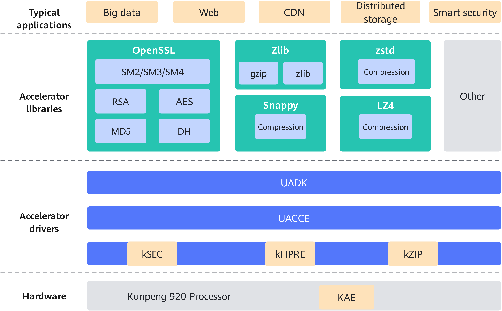

# Introduction to KAE

## Latest Updates

- \[2026-06-30\]: Enabled user-mode support for kernel 4.19 in KAE 2.0 (kernel-mode encryption/decryption and compression/decompression interfaces are not supported), and allowed VFs to query the hardware fault isolation status and isolation thresholds of Host OS PF devices in KVM scenarios.
- \[2026-03-20\]: Added asynchronous support to the KAEZlib compression library, and adapted the KAE 2.0 decompression module to Snappy hardware acceleration.
- \[2025-12-30\]: Supported Kunpeng 950 processors in KAE 2.0, and the polling mode for asynchronous APIs of the KAELz4 compression library.
- \[2025-09-30\]: Migrated the KAE code repository to the GitCode platform, and optimized the decompression performance of KAELz4 and KAEZstd.
- \[2025-06-24\]: Adapted to TencentOS 5.4 in KAE 2.0 and to BoringSSL RSA hardware acceleration in the KAE 2.0 encryption and decryption module, and supported asynchronous mode for the KAELz4 library.
- \[2025-03-30\] Adapted to Tongsuo 8.4.0 in the KAE 2.0 encryption and decryption module based on Kunpeng 920 series processors.
- \[2024-12-30\]: Adapted to openEuler 22.03 LTS SP3/SP4 in KAE 2.0, supported OpenSSL 3.0.x in the KAE 2.0 encryption and decryption module, adapted to the new Kunpeng 920 processor model in the KAEZstd and KAELz4 libraries of the KAE 2.0 decompression module, and added the operation guide for installing, upgrading, and uninstalling KAE 2.0 using RPM packages.
- \[2024-03-21\]: Added the content about using Java to call KAE. For details, see *Best Practices*.
- \[2024-02-22\] Released KAE 2.0 to adapt to the new Kunpeng 920 processor model and kernel 5.10.

## Project Introduction

### Overview

Kunpeng Accelerator Engine (KAE) is a hardware-based acceleration solution built on Kunpeng processors. By using dedicated hardware acceleration units and optimized instruction sets, KAE enables hardware offloading of operations such as data compression and decompression, symmetric and asymmetric encryption and decryption, and digital signature, while shielding the internal implementation details from the application layer. KAE is compatible with standard APIs such as OpenSSL, Tongsuo, BoringSSL, zlib, zstd, LZ4, and Snappy. It can be quickly integrated without modifications to the service code, which greatly reduces migration costs and risks. KAE provides high-performance and low-cost acceleration solutions for scenarios such as distributed storage, web services, and databases, helping enterprises improve service efficiency, reduce costs, and ensure security compliance. The core modules of KAE include:

- KAE encryption and decryption module: It uses the Kunpeng hardware acceleration engine to implement the RSA, SM2, SM3, SM4, DH, MD5, and AES algorithms. It provides high-performance symmetric and asymmetric encryption and decryption based on the lossless user-mode driver framework. It is compatible with OpenSSL 1.1.1x, OpenSSL 3.0.x, Tongsuo 8.4.0, and BoringSSL, and supports synchronous and asynchronous mechanisms. It is used to accelerate Secure Sockets Layer (SSL) and Transport Layer Security (TLS) applications.
- KAE decompression module: It uses the Kunpeng hardware acceleration module to implement the deflate, lz77\_zstd, lz77\_lz4, and lz77\_snappy algorithms. Under the lossless user-mode driver framework, KAE provides high-performance gzip/zlib compression APIs, standard zstd library APIs, standard LZ4 library APIs, and standard Snappy library APIs to accelerate data compression and decompression, significantly reducing processor consumption and improving processor efficiency.

### Software Architecture

[Figure 1](#software-architecture) shows the software architecture of KAE.

**Figure 1** Software architecture<a name="fig9931619182"></a><a id="software-architecture"></a>



[Table 1](#module-functions) describes the functions of each module in the software architecture.

**Table 1** Module functions<a id="module-functions"></a>

|Module Name|Function|
|--|--|
|Accelerator libraries|Application development libraries that integrate encryption, decryption, or decompression algorithms. A library can serve as a bridge between upper-layer applications and hardware accelerators.|
|UADK|User Space Accelerator Development Kit. It provides a unified API for hardware-based acceleration of cryptographic and compression algorithms.|
|UACCE|User Space Accelerator. It is a user-mode acceleration framework that provides a unified driver API for user space and helps reduce the performance loss caused by call path overheads.|
|kSEC|Kunpeng Security Engine. It is a hardware acceleration module for high-speed and high-concurrency symmetric encryption and decryption scenarios and solves the problems of high CPU usage and low throughput when traditional software is used for symmetric encryption and decryption.|
|kHPRE|Kunpeng High Performance RSA Engine. It is a hardware acceleration module dedicated to asymmetric encryption/decryption and digital signature/verification. It can improve the processor efficiency in asymmetric cryptography operations with high computing complexity and low software processing efficiency.|
|kZIP|Kunpeng Hardware Acceleration Compression Engine. It is a hardware acceleration module that is used for real-time compression and decompression of massive data and solves the problems of high CPU usage, low throughput, and high latency in software compression solutions.|
|KAE|Kunpeng Accelerator Engine. It is an acceleration solution based on Kunpeng 920 series processors.|

### Supported Algorithms and Specifications

This section describes the algorithms and models supported by the KAE encryption and decryption module and KAE decompression module (including KAEZlib, KAEZstd, KAELz4, and KAESnappy), and lists the processor models compatible with each algorithm.

**KAE Encryption and Decryption<a name="section420191313182"></a>**

The KAE encryption and decryption module implements the RSA, SM2, SM3, SM4, DH, MD5, and AES algorithms. It provides high-performance symmetric and asymmetric encryption and decryption based on the lossless user-mode driver framework. It is compatible with OpenSSL 1.1.1x, OpenSSL 3.0.x, Tongsuo 8.4.0, and BoringSSL and supports synchronous and asynchronous mechanisms.

- OpenSSL 1.1.1x supports the following algorithms:

    - Digest algorithms SM3 and MD5, operating in asynchronous mode
    - Symmetric encryption algorithm SM4, operating in asynchronous mode and supporting CTR, XTS, CBC, ECB, OFB, and CFB
    - Symmetric encryption algorithm AES, operating in asynchronous mode and supporting ECB, CTR, XTS, CBC, OFB, and CFB
    - Asymmetric algorithm RSA, operating in asynchronous mode, with key sizes of 1024, 2048, 3072, and 4096
    - Asymmetric algorithm SM2, operating in asynchronous mode
    - Key negotiation algorithm DH, operating in asynchronous mode, with key sizes of 768, 1024, 1536, 2048, 3072, and 4096

- OpenSSL 3.0.x offers encryption and decryption algorithm implementations through the engine mechanism and supports the SM3, MD5, SM4, AES, and RSA algorithms.
- Tongsuo 8.4.0 offers encryption and decryption algorithm implementations through the engine mechanism and supports the SM3, SM4, AES, and RSA algorithms.
- BoringSSL offers encryption and decryption algorithm implementations through the engine mechanism and supports the RSA algorithm (private key encryption and decryption).

> **NOTE**
>
>- The provider mechanism and later OpenSSL versions are not supported.
>- Tongsuo is an encryption and decryption library derived from OpenSSL. Its APIs and usage patterns are compatible with OpenSSL.
>- BoringSSL is an open-source encryption library developed and maintained by Google and derived from earlier OpenSSL versions. Some of its interfaces and usage patterns are different from those of OpenSSL. For details about how to use KAE with BoringSSL, see [Calling the KAE Encryption and Decryption Library Using BoringSSL](./docs/en/user_guide.md#calling-the-KAE-encryption-and-decryption-library-using-BoringSSL) in the *User Guide*.

**KAEZlib<a name="section1478918384188"></a>**

KAEZlib is a KAE decompression module. It uses Kunpeng hardware-based acceleration to implement the Deflate algorithm, and works with the lossless user-space driver framework to provide APIs for high-performance compression in gzip or zlib format.

- It supports the zlib and gzip formats and complies with the RFC 1950 and RFC 1952 standards.
- It supports the Deflate algorithm.
- It supports configurable compression levels and window lengths.
- It supports both synchronous and asynchronous modes.
- A single Kunpeng 920 processor can use KAEzip to achieve a maximum compression bandwidth of 7 GB/s and a maximum decompression bandwidth of 8 GB/s.
- It is compatible with open source zlib 1.2.11 APIs.

KAE can be used to improve application performance in different scenarios. For example, in software-defined storage (SDS) scenarios, the KAEZlib library can accelerate data compression and decompression. In addition, the KAEGzip compression tool is built on the KAEZlib library, enabling you to compress and decompress files without calling APIs.

**KAEZstd<a name="section2606115365815"></a>**

KAEZstd is a KAE decompression module. It uses Kunpeng hardware-based acceleration to implement the lz77\_zstd algorithm and provides standard zstd library APIs.

- It allows general compression and decompression, but does not support the zstd dictionary mode or multi-thread mode.
- It supports hardware-based acceleration for compression but not for decompression.
- It can compress both small packets (less than 64 KB) and large packets (greater than 1 GB).
- It supports configurable zstd compression levels.

KAE can improve application performance in different scenarios and significantly enhances compression efficiency.

**KAELz4<a name="section175146346247"></a>**

KAELz4 is a KAE decompression module. It uses Kunpeng hardware-based acceleration to implement the lz77\_lz4 algorithm and provides standard LZ4 library APIs.

- It supports lz4\_block\_format and lz4\_frame\_format.
- It supports hardware-based acceleration for compression but not for decompression.
- It supports both synchronous and asynchronous modes.

**KAESnappy**

KAESnappy is a KAE decompression module. It uses Kunpeng hardware-based acceleration to implement the lz77\_snappy algorithm and provides standard Snappy library APIs.

- It supports general compression and decompression.
- It supports hardware-based acceleration for compression but not for decompression.

**Algorithm Specifications<a name="section37205443544"></a>**

Encryption and compression algorithms supported by different processor models vary due to hardware differences. For details, see [**Table 2**](#Kunpeng-processor-models-supported-by-encryption-and-compression-algorithms).

**Table 2** Kunpeng processor models supported by encryption and compression algorithms<a id="Kunpeng-processor-models-supported-by-encryption-and-compression-algorithms"></a>

|Type|Algorithm|Kunpeng 920 Processor|New Kunpeng 920 Processor Model|Kunpeng 950 Processor|
|--|--|--|--|--|
|Encryption algorithm|Digest algorithm SM3|√|√|√|
|Encryption algorithm|Digest algorithm MD5|√|√|√|
|Encryption algorithm|Symmetric encryption algorithm SM4-CTR|√|√|√|
|Encryption algorithm|Symmetric encryption algorithm SM4-XTS|√|√|√|
|Encryption algorithm|Symmetric encryption algorithm SM4-CBC|√|√|√|
|Encryption algorithm|Symmetric encryption algorithm SM4-ECB|√|√|√|
|Encryption algorithm|Symmetric encryption algorithm SM4-OFB|√|√|√|
|Encryption algorithm|Symmetric encryption algorithm SM4-CFB|x|√|√|
|Encryption algorithm|Symmetric encryption algorithm AES-ECB|√|√|√|
|Encryption algorithm|Symmetric encryption algorithm AES-CTR|√|√|√|
|Encryption algorithm|Symmetric encryption algorithm AES-XTS|√|√|√|
|Encryption algorithm|Symmetric encryption algorithm AES-CBC|√|√|√|
|Encryption algorithm|Symmetric encryption algorithm AES-OFB|x|√|√|
|Encryption algorithm|Symmetric encryption algorithm AES-CFB|x|√|√|
|Encryption algorithm|Asymmetric algorithm RSA|√|√|√|
|Encryption algorithm|Asymmetric algorithm SM2|x|√|√|
|Encryption algorithm|Key negotiation algorithm DH|√|√|√|
|Compression algorithm|zlib (gzip/zlib format)|√|√|√|
|Compression algorithm|zlib (Deflate format)|x|√|√|
|Compression algorithm|gzip|√|√|√|
|Compression algorithm|zstd|x|√|√|
|Compression algorithm|Lz4|x|√|√|
|Compression algorithm|Snappy|x|√|√|

> **NOTE**
>
>* √: supported; x: not supported
>* SM4-XTS can be used only in kernel space and does not support OpenSSL.
>* For zstd, LZ4, and Snappy, compression can leverage hardware-based acceleration, while decompression is handled by software only.

## Directory Structure

The project directory structure is as follows:

```text
├── docs                                                     # Project document directory
│   └── en                                                   # English document directory
│       ├── figures                                          # Directory of figures in documents
│       ├── quick_start.md                                   # Quick Start
│       ├── release_notes.md                                 # KAE Version Release Notes
│       ├── installation_guide.md                            # KAE Installation Guide
│       ├── user_guide.md                                    # KAE User Guide
│       ├── best_practices.md                                # KAE Scenario-specific Application Best Practices
│       ├── faq.md                                           # KAE Installation FAQs
│   └── figures                                              # Figures in README
├── KAEGzip                                                  # KAEGzip compression module
│   ├── open_source                                          # Open-source code
│   ├── patch                                                # Adaptation patch
│   └── build.sh                                             # Build script
├── KAEKernelDriver                                          # Kernel-mode driver module
│   ├── KAEKernelDriver-OLK-4.19                             # Adaptation to kernel 4.19
│   ├── KAEKernelDriver-OLK-5.10                             # Adaptation to kernel 5.10
│   ├── KAEKernelDriver-OLK-5.4                              # Adaptation to kernel 5.4
│   ├── KAEKernelDriver-OLK-6.6                              # Adaptation to kernel 6.6
├── KAELz4                                                   # KAELz4 compression module
│   ├── include                                              # Header file
│   ├── open_source                                          # Open-source code
│   ├── src                                                  # Function source code
│   ├── test                                                 # Test cases
│   └── build.sh                                             # Build script
├── KAEOpensslEngine                                         # KAE encryption and decryption module
│   ├── patch                                                # Adaptation patch
│   ├── src                                                  # Function source code
│   ├── test                                                 # Test cases
│   └── Makefile.am                                          # Build rule file
├── KAEZlib                                                  # KAEZlib compression module
│   ├── include                                              # Header file
│   ├── open_source                                          # Open-source code
│   ├── patch                                                # Adaptation patch
│   ├── src                                                  # Function source code
│   ├── test                                                 # Test cases
│   └── setup.sh                                             # Build script
├── KAEZstd                                                  # KAEZstd compression module
│   ├── include                                              # Header file
│   ├── open_source                                          # Open-source code
│   ├── src                                                  # Function source code
│   ├── test                                                 # Test cases
│   └── build.sh                                             # Build script
├── KAESnappy                                                # KAESnappy compression module
│   ├── include                                              # Header file
│   ├── open_source                                          # Open-source code
│   ├── src                                                  # Function source code
│   ├── test                                                 # Test cases
│   └── build.sh                                             # Build script
├── scripts                                                  # Public files
│   ├── buildScript                                          # Script file
│   └── compressTestDataset                                  # Compression test dataset
│   └── kaeTools                                             # KAE tools
│   └── patches                                              # Patch files
│   └── perftest                                             # Compression performance test tool
│   └── specFile                                             # RPM build rule file
├── uadk                                                     # User-mode driver module
│   └── drv                                                  # Driver layer source code
│   └── include                                              # Header file
│   └── lib                                                  # Third-party dependency
│   └── sample                                               # Demo
│   └── test                                                 # Test cases
│   └── uadk_tool                                            # Driver test tool
│   └── v1                                                   # Source code in No-SVA mode
├── LICENSE                                                  # Project license
└── README_EN.md                                             # Project description document
└── build.sh                                                 # Build script
└── env.check.sh                                             # Environment check script
```

## Version Description

KAE 2.0 is the active maintenance version. All future new features, OS/kernel adaptations, and bug fixes will focus on KAE 2.0. KAE 1.0 is a legacy version; historical versions will be retained, but no new features, OS/kernel adaptations, or bug fixes will be provided.

**KAE 2.0 Kernel Support Range<a name="section10131916143616"></a>**

KAE 2.0 provides acceleration capabilities based on the Userspace Accelerator Development Kit (UADK) framework. The current support range is shown in [**Table  3** KAE 2.0 kernel support range](#kae2.0-kernel-support-range).

**Table 3** KAE 2.0 kernel support range<a id="kae2.0-kernel-support-range"></a>

| Kernel Version | Device Model | Support Range |
| -- | -- | -- |
| 4.19 | Kunpeng 920 processor, new Kunpeng 920 processor model, Kunpeng 950 processor | Supports user mode only; kernel-mode encryption/decryption and compression/decompression interfaces are not supported. |
| 5.4 | Kunpeng 920 processor, new Kunpeng 920 processor model, Kunpeng 950 processor | Supports user mode and the kernel-mode interfaces listed in the documentation. |
| 5.10 | Kunpeng 920 processor, new Kunpeng 920 processor model, Kunpeng 950 processor | Supports user mode and the kernel-mode interfaces listed in the documentation. |
| 6.6 | Kunpeng 920 processor, new Kunpeng 920 processor model, Kunpeng 950 processor | Supports user mode and the kernel-mode interfaces listed in the documentation. |

> **NOTE**
>
>- User-mode support includes invoking KAE acceleration capabilities via interfaces such as UADK, OpenSSL/Tongsuo/BoringSSL, zlib, zstd, LZ4, Snappy, and gzip.
>- Kernel-mode interfaces include encryption/decryption and compression/decompression interfaces in the Linux kernel crypto API, as well as kernel modules or kernel-mode scenarios such as dm-crypt and SM4-XTS.
>- The kernel APIs may vary depending on the version. To enable KAE in different OSs, you need to compile the kernel driver to check whether it matches the OS. If an interface error is reported during the compilation of the KAE driver for a specific OS kernel, the driver is incompatible.

**Change Description<a name="section4408930144513"></a>**

For details about feature changes in each released version, see [Release Notes](./docs/en/release_notes.md).

## Environment Deployment

Since KAE is a hardware-targeted acceleration solution, ensure that the corresponding license is properly installed before installing KAE. The OS can recognize the accelerator devices only after the license is successfully installed.

**Installing the License<a name="section8301973474"></a>**

> **NOTE**
>
>- KAE is enabled on Kunpeng K series servers by default. You do not need to apply for a license.
>- The new Kunpeng 920 processor model can use KAE without a license after the BIOS is upgraded to 21.23 or later.

1. To apply for and install the license, refer to [Huawei Server iBMC License User Guide](https://support.huawei.com/enterprise/en/management-software/ibmc-pid-8060757?category=operation-maintenance) corresponding to your actual scenario.

2. After the license is installed, run the **lspci** command to check whether the OS has an accelerator device.

    > **NOTE**
    >
    >The accelerator description returned by the **lspci** command varies depending on the OS. In addition to filtering by keywords, you can also check whether the HPRE/SEC/ZIP accelerator SBDF information exists.

    1. Check whether the high-performance RSA accelerator engine HPRE exists in the system.

        ```shell
        lspci | grep HPRE
        ```

        If the following information is displayed, HPRE exists in the OS:

        ```text
        79:00.0 Network and computing encryption device: Huawei Technologies Co., Ltd. HiSilicon HPRE Engine (rev 21)
        b9:00.0 Network and computing encryption device: Huawei Technologies Co., Ltd. HiSilicon HPRE Engine (rev 21)
        ```

    2. Check for the Security Engine (SEC).

        ```shell
        lspci | grep SEC
        ```

        If the following information is displayed, SEC exists in the OS:

        ```text
        76:00.0 Network and computing encryption device: Huawei Technologies Co., Ltd. HiSilicon SEC Engine (rev 21)
        b6:00.0 Network and computing encryption device: Huawei Technologies Co., Ltd. HiSilicon SEC Engine (rev 21)
        ```

    3. Check for the ZIP compression acceleration engine.

        ```shell
        lspci | grep ZIP
        ```

        If the following information is displayed, ZIP exists in the OS:

        ```text
        75:00.0 Processing accelerators: Huawei Technologies Co., Ltd. HiSilicon ZIP Engine (rev 21)
        b5:00.0 Processing accelerators: Huawei Technologies Co., Ltd. HiSilicon ZIP Engine (rev 21)
        ```

    If no command output is displayed, no KAE accelerator device exists in the OS. Check whether the license has been installed.

**Installing KAE<a name="section3745131824710"></a>**

KAE can be installed using the source code or RPM package. For details about the supported hardware, OSs, and installation procedures, see [Installation Guide](./docs/en/installation_guide.md).

**Troubleshooting Driver Loading Failures<a name="section3745131824710"></a>**

* Cause 1: Kernel installation failure due to inconsistency between the kernel version and the kernel development package version (including the minor version number).
  
  Check the kernel version and the kernel development package version:

  ```shell
  uname -r  
  rpm -qa | grep kernel-devel
  ```

If the query results are inconsistent, install the development package that matches the kernel version.

* Cause 2: Loading failure due to a missing license.

  Check whether the license is properly installed:

  ```shell
  lspci | grep HPRE
  lspci | grep SEC
  lspci | grep ZIP
  ```

If no output is displayed, the license is not properly installed or is not installed.

Solution: For the Kunpeng 920 processor, apply for and properly install the license. For a new Kunpeng 920 processor model, update the BIOS to a license-free version.

**Changing the Number of Hardware Accelerator Instances**

Each accelerator device has 256 driver instances installed by default.

```bash
cat /sys/class/uacce/hisi_*/available_instances
```

The displayed number of instances is 256 (per accelerator).

The maximum number of instances per accelerator is 1,024. If the service concurrency volume is high, use one of the following methods to configure more accelerator instances:

* In the Makefile of the driver directory, change **pf_q_num=256** to **pf_q_num=1024**, and then uninstall, recompile, and reinstall the drivers.

* Method 2: Run the following commands:

  ```bash
  modprobe -r hisi_zip
  modprobe -r hisi_hpre
  modprobe -r hisi_sec2
  modprobe -r hisi_qm
  modprobe -r uacce
  ```

  Uninstall the drivers, and then run the following commands:

  ```bash
  modprobe uacce 
  modprobe hisi_qm
  modprobe hisi_sec2 uacce_mode=2 pf_q_num=1024
  modprobe hisi_hpre uacce_mode=2 pf_q_num=1024
  modprobe hisi_zip uacce_mode=2 pf_q_num=1024
  ```

  Load the driver based on the new number of queues. (**uacce_mode=2** indicates the NO-SVA mode, which is not involved in common scenarios.)

  > **NOTE**
  >
  > In a container scenario, the Virtual Functions (VFs) virtualized from each device shares the 1,024 instances with the Physical Function (PF). That means the maximum number of instances for the PF and VFs is 1,024.

## Quick Start

For details about how to quickly verify that KAE is working normally and the performance is improved after KAE is installed, see [Quick Start](./docs/en/quick_start.md).

## Documentation

|Document Name|Description|
|--|--|
|[Quick Start](docs/en/quick_start.md)|Provides guidance on how to quickly enable KAE encryption, decryption, and compression libraries and verify the acceleration capabilities.|
|[Release Notes](docs/en/release_notes.md)|Provides basic information and feature updates of each KAE version.|
|[Installation Guide](docs/en/installation_guide.md)|Provides detailed instructions for installing KAE by compiling the source code and installing the RPM package.|
|[User Guide](docs/en/user_guide.md)|Provides API descriptions, API calling examples, log query methods, and more.|
|[Best Practices](docs/en/best_practices.md)|Provides the practices of using the KAE in web, distributed storage, database, and virtualization scenarios.|
|[FAQs](docs/en/faq.md)|Provides answers to frequently asked questions (FAQs) about installing and using KAE.|

## Disclaimer

**To KAE Users**

- This software is intended solely for debugging and development. You are responsible for any risks and should carefully review the following information:
  
    - This code repository contributes to the OpenSSL, Tongsuo, BoringSSL, Lz4, zlib, gzip, zstd, and Snappy open-source projects solely for performance optimization. It strictly adheres to the coding style and methods, as well as security design of the native open-source software. Any vulnerability and security issues of the software shall be resolved by the corresponding upstream communities according to their response mechanisms. Please pay attention to the notifications and version updates released by the upstream communities. The Kunpeng computing community does not assume any responsibility for software vulnerabilities and security issues.
    - Data processing and deletion: Users are responsible for managing and deleting any data generated while using this software. Users are advised to delete such data promptly after use to prevent information leakage.
    - Data confidentiality and transmission: Users understand and agree not to share or transmit any data generated by this software. Neither the software nor its developers are responsible for any information leakage, data breaches, or other negative consequences.
    - User input security: Users are responsible for the security of any commands they enter and for any risks or losses resulting from improper input. The software and its developers are not liable for issues caused by incorrect command usage.

- Disclaimer scope: This disclaimer applies to all individuals and entities using this software. By using the software, you acknowledge and accept this statement and assume all risks and responsibilities arising from its use. If you do not agree, please stop using the software immediately.
- Before using this software, please **read and understand the preceding disclaimer**. If you have any questions, contact the developer.

**To Data Owners**

If you do not want your information such as your dataset to be mentioned in KAE, or if you wish to update its description, please submit an issue on GitCode. We will delete or update your description according to your request. Thank you for your understanding and contribution to KAE.

## License

For details about the license of KAE, see [LICENSE](https://gitcode.com/boostkit/KAE/blob/kae2/LICENSE).

The documents of this project are licensed under CC-BY 4.0. For details, see [LICENSE](https://gitcode.com/boostkit/KAE/blob/kae2/docs/LICENSE).

## Contribution Statement

If you have any questions or want to provide feedback on feature requirements and bug reports, you can submit issues. For details, see the [contribution guideline](https://gitcode.com/boostkit/community/blob/master/docs/contributor/contributing.md).

1. Submit an error report: If you find a non-security vulnerability in KAE, first search the **Issues** in the KAE repository to avoid submitting duplicates. If the vulnerability is not listed, create a new issue. If you discover a security-related issue, do not disclose it publicly. Please refer to the security handling guidelines for details. All error reports must include complete information about the issue.
2. Handling security issues: For guidance on handling security issues in this project, please contact the core team via email for instructions.
3. Resolving existing issues: Review the issue list of the repository to identify issues that need attention, and attempt to resolve them.
4. Proposing new features: Use the **Feature** label when creating an issue for a new feature. We will review and confirm proposals periodically.
5. How to contribute:
    1. Fork the repository of the project.
    2. Clone it to your local machine.
    3. Create a development branch.
    4. Conduct local testing. All unit tests, including any new test cases, must pass before submission.
    5. Submit your code.
    6. Create a pull request (PR).
    7. Code review: Modify the code according to review comments and resubmit your changes. This process may involve multiple rounds of iterations.
    8. After your PR is approved by the required number of reviewers, the committer will conduct the final review.
    9. After your PR is approved and all tests pass, the CI system will merge it into the project's main branch.

## Suggestions and Communication

You are welcome to contribute to the community. If you have any questions or suggestions, submit [issues](https://gitcode.com/boostkit/community/blob/master/docs/contributor/issue-submit.md). We will reply to you as soon as possible. Thank you for your support.

## Acknowledgement

KAE is jointly developed by the following Huawei department:

- Kunpeng Computing BoostKit Development Dept

Thank you to everyone in the community for your PRs. We warmly welcome contributions to KAE!
