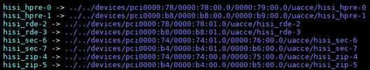
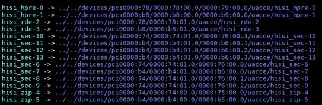
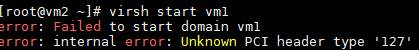

# Best Practices

## Introduction

This document provides examples of using the encryption, decryption, and compression modules of the Kunpeng Accelerator Engine (KAE) to help you use KAE in specific scenarios.

The restrictions on some algorithms are as follows:

- If you have not purchased a KAE license, do not use KAE to call the algorithms. Otherwise, the performance of the OpenSSL encryption algorithm may be affected.
- The SM4-XTS mode can be used only in kernel mode. For details, see [Using KAE to Improve SM4-XTS Algorithm Performance](#using-kae-to-improve-sm4-xts-algorithm-performance).
- SM4 performs better in synchronous mode than in asynchronous mode for small packets with size smaller than 2 KB. If small packets are mostly used, the synchronous mode is recommended.
- AES has implemented acceleration of software instruction sets on the AArch64 platform. Hardware acceleration has obvious asynchronous performance advantages over OpenSSL in the medium- or large-packet scenario (packet size: 16 KB to 256 KB). In this scenario, hardware acceleration is recommended.
- The SM4 and AES asynchronous modes support the data size of up to 256 KB. If the data size is greater than 256 KB, the synchronous mode is used for calculation.
- The MD5 algorithm cannot prevent collision attacks and is not applicable to security authentication, such as SSL public key authentication or digital signature.
- The SM3 and SM4 algorithms are enabled by default. You can enable or disable the two algorithms in the **openssl.cnf** file.
- zlib, gzip, zstd, LZ4, and Snappy algorithms can be used for compression and decompression.

## Encryption and Decryption Library

### Using KAE to Accelerate Nginx

This section describes how to enable Nginx acceleration using KAE in web scenarios.

**Environment Requirements<a name="section1880691084819"></a>**

[**Table 1** Hardware requirements](#hardware-requirements) and [**Table 2** OS and software requirements](#os-and-software-requirements) list the environment requirements. You can also refer to this section to verify Nginx and OSs of other versions.

**Table 1** Hardware requirements<a id="hardware-requirements"></a>

|Item|Description|
|--|--|
|CPU|Kunpeng 920 processor|

**Table 2** OS and software requirements<a id="os-and-software-requirements"></a>

|Item|Version|
|--|--|
|OS|openEuler 20.03 LTS SP1/SP2|
|Nginx|1.14.2|
|OpenSSL|1.1.1x/3.0.12|
|httpress|1.1.0|

**Prerequisites<a name="section2031774312223"></a>**

1. Install Nginx by compiling the source code and configure the HTTPS function of Nginx. For details, see [Nginx Porting Guide](https://www.hikunpeng.com/document/detail/en/kunpengwebs/ecosystemEnable/Nginx/kunpengnginx_02_0001.html).

    > **NOTE**
    >
    > The performance data varies with algorithm suites. You can choose an algorithm suite based on your requirements. If an algorithm in the algorithm suite is not supported by KAE, the OpenSSL software computing API is called.

2. Install and verify httpress by compiling the source code. For details, see [httpress Test Guide](https://www.hikunpeng.com/document/detail/en/kunpengwebs/testguide/tstg/kunpenghttpress_06_0001.html).

**Using Software Computing to Test Nginx Performance<a name="section11318543102210"></a>**

1. Start Nginx.

    ```shell
    /usr/local/nginx/sbin/nginx -c /usr/local/nginx/conf/nginx.conf
    ps -ef | grep nginx
    ```

2. Test the software computing performance, that is, the performance data when KAE is not used. 500,000 requests, 100 concurrent connections, and 100 threads are used as an example.

    ```shell
    ./httpress -n 500000 -c 100 -t 100 https://127.0.0.1:20000/index.html
    ```

    

**Using Hardware Computing to Test Nginx Performance<a name="section183186437221"></a>**

1. Install and verify KAE by referring to [Installation Guide](installation_guide.md).
2. Quit Nginx.

    ```shell
    /usr/local/nginx/sbin/nginx -s quit
    ps -ef | grep nginx
    ```

3. Ensure that OpenSSL can call the configuration file using **OPENSSL\_CONF** and identify KAE. For details, see section "Calling the KAE Encryption and Decryption Library Using the OpenSSL/Tongsuo Configuration File openssl.cnf" in the [User Guide](./user_guide.md).
4. Start Nginx.

    ```shell
    /usr/local/nginx/sbin/nginx -c /usr/local/nginx/conf/nginx.conf
    ps -ef | grep nginx
    ```

5. Test the hardware computing performance, that is, the performance data when KAE is used. 500,000 requests, 100 concurrent connections, and 100 threads are used as an example.

    ```shell
    ./httpress -n 500000 -c 100 -t 100 https://127.0.0.1:20000/index.html
    ```

    

    During the test, open a new terminal window and run the **cat /sys/class/uacce/hisi\_hpre-\*/attrs/available\_instances** command. The command output changes from 256 to 255, indicating that a hardware queue has been consumed. After the test is complete, the value is restored to 256. This indicates that KAE works.

    If KAE works, that is, hardware computing is enabled, the performance data does not increase significantly, and the value of **available\_instances** does not change, check whether the preceding steps are properly performed. If Nginx and KAE are normal, the **OPENSSL\_CONF** configuration file may be incorrect, or its permission is incorrect. You can contact Huawei technical support to solve this problem.

**Data Comparison<a name="section1632969175612"></a>**

According to the preceding test results, the software computing performance is 6,939 requests per second, and the hardware computing performance is 12,262 requests per second. After KAE acceleration is used, the performance is significantly improved.

> **NOTE**
>
>- The performance data varies with algorithm suites. The test result of the algorithm suite you use may be different.
>- If you run the **openssl req -new -x509** command to generate a certificate, configure **openssl.cnf** by referring to Method 2 described in [Certificates Fail to Be Generated After Running openssl req -new -x509](./faq.md#en-us_topic_0000001217022681_section3941254).

### Using KAE to Improve SM4-XTS Algorithm Performance

KAE supports the XTS mode of the symmetric encryption algorithm SM4 to improve algorithm performance. This mode can be used only in kernel mode through transparent partition/drive encryption based on dm-crypt.

KAE 2.0 under kernel 4.19 supports user mode only, and does not support kernel-mode interfaces such as encryption/decryption and compression/decompression interfaces in the Linux kernel crypto API, dm-crypt, and SM4-XTS. Therefore, this section does not apply to the user-mode support range of KAE 2.0 under kernel 4.19.

dm-crypt is presented as a target device of the device mapper. After being mapped and mounted, dm-crypt can be used as a transparent encrypted partition or drive.

The dm-crypt algorithm is registered in the crypto module. After the hisi\_sec2 driver is installed, the SM4-XTS algorithm is registered in the crypto module. You can implement hardware encryption and decryption using the Linux Unified Key Setup (LUKS) for configuration.

An operation on an encryption drive occupies 24 queues. Currently, the accelerator restricts the number of queues to 256 × 2. If more encryption drives need to be operated, you need to enable all the 1,024 × 2 accelerator queues. To enable all the accelerator queues, modify the **pf\_q\_num** parameter in the **/etc/modprobe.d/hisi\_sec2.conf** configuration file and reload the driver for the modification to take effect.

**Environment Requirements<a name="section23981735101217"></a>**

- The hisi\_sec2 driver has been installed. For details about how to install the driver, see [Installation Guide](./installation_guide.md).
- To improve the performance of the SM4-XTS algorithm, upgrade cryptsetup (the LUKS tool) to version 2.2.0.

    The built-in cryptsetup of the OS may not correctly use the SM4-XTS algorithm to encrypt drives. You need to download the cryptsetup-2.2.0 source code to the environment to update the software. The following uses EulerOS 2.8 as an example to describe how to upgrade cryptsetup:

    1. Install the dependency packages in sequence: libuuid-devel, device-mapper-devel, popt-devel, json-c-devel, and libblkid-devel.

        ```shell
        yum install libuuid-devel
        yum install device-mapper-devel
        yum install popt-devel
        yum install json-c-devel
        yum install libblkid-devel
        ```

    2. Perform the compilation and installation in the **cryptsetup-2.2.0** source code directory.

        ```shell
        ./configure
        make && make install
        ```

    libuuid-devel, device-mapper-devel, popt-devel, json-c-devel, and libblkid-devel are dependencies of cryptsetup.

**Encrypting a Partition or Drive<a name="section4178174054811"></a>**

1. Generate the keyfile in the root directory of the system.

    ```shell
    dd if=/dev/random of=/home/EncryptKeyFile bs=4k count=1
    ```

    The command output is displayed as follows:

    ```text
    1+0 records in
    1+0 records out
    4096 bytes (4.1 kB, 4.0 KiB) copied, 7.635e-05 s, 23.6 MB/s
    ```

2. <a name="li123563427301"></a>Encrypt the partition or disk.

    ```shell
    cryptsetup --batch-mode --cipher sm4-xts-plain64 --key-size 256 --hash sha256 --sector-size=4096 --type=luks2 --key-file /home/EncryptKeyFile luksFormat /dev/sdb
    ```

3. Map the partition or drive.

    ```shell
    cryptsetup --key-file /home/EncryptKeyFile luksOpen /dev/sdb sx_disk
    ```

4. Check whether the partition or drive is encrypted.

    ```shell
    lsblk
    ```

    If **crypt** is displayed, the partition or drive has been encrypted.

    ```text
    NAME           MAJ:MIN RM   SIZE RO TYPE  MOUNTPOINT
    loop0            7:0    0   5.5G  1 loop  /os_lhl
    sda              8:0    0   2.2T  0 disk
    ├─sda1           8:1    0     1G  0 part  /boot/efi
    └─sda2           8:2    0   2.2T  0 part
      ├─vg_os-swap 254:0    0    20G  0 lvm   [SWAP]
      └─vg_os-root 254:1    0   2.2T  0 lvm   /
    sdb              8:16   0 278.5G  0 disk
    └─sx_disk      254:2    0 278.5G  0 crypt
    ```

5. Format the partition or drive.

    ```shell
    mkfs.xfs /dev/mapper/sx_disk
    ```

    The command output is displayed as follows:

    ```text
    meta-data=/dev/mapper/sx_disk    isize=512    agcount=16, agsize=4562368 blks
             =                       sectsz=512   attr=2, projid32bit=1
             =                       crc=1        finobt=1, sparse=0, rmapbt=0, reflink=0
    data     =                       bsize=4096   blocks=72997376, imaxpct=25
             =                       sunit=64     swidth=64 blks
    naming   =version 2              bsize=4096   ascii-ci=0 ftype=1
    log      =internal log           bsize=4096   blocks=35648, version=2
             =                       sectsz=512   sunit=0 blks, lazy-count=1
    realtime =none                   extsz=4096   blocks=0, rtextents=0
    ```

6. Create a mounting directory.

    ```shell
    mkdir /home/sec_test
    ```

7. Mount the partition or drive to the directory.

    ```shell
    mount /dev/mapper/sx_disk /home/sec_test/
    df -h
    ```

    The command output is displayed as follows:

    ```text
    Filesystem              Size  Used Avail Use% Mounted on
    devtmpfs                 63G     0   63G   0% /dev
    tmpfs                    63G     0   63G   0% /dev/shm
    tmpfs                    63G   28M   63G   1% /run
    tmpfs                    63G     0   63G   0% /sys/fs/cgroup
    /dev/mapper/vg_os-root  2.2T   18G  2.1T   1% /
    /dev/sda1              1022M  172K 1022M   1% /boot/efi
    tmpfs                    13G   20K   13G   1% /run/user/472
    tmpfs                    13G     0   13G   0% /run/user/0
    /dev/loop0              5.5G  5.5G     0 100% /os_lhl
    /dev/mapper/sx_disk     279G  317M  279G   1% /home/sec_test
    ```

8. Ensure that the directory can be accessed.

    ```shell
    cd /home/sec_test/;ll
    ```

9. Check that the partition or drive is encrypted in the **/home/sec\_test** directory and that the partition or drive corresponds to the directory.

    ```shell
    lsblk
    ```

    The command output is displayed as follows:

    ```text
    NAME           MAJ:MIN RM   SIZE RO TYPE  MOUNTPOINT
    loop0            7:0    0   5.5G  1 loop  /os_lhl
    sda              8:0    0   2.2T  0 disk
    ├─sda1           8:1    0     1G  0 part  /boot/efi
    └─sda2           8:2    0   2.2T  0 part
      ├─vg_os-swap 254:0    0    20G  0 lvm   [SWAP]
      └─vg_os-root 254:1    0   2.2T  0 lvm   /
    sdb              8:16   0 278.5G  0 disk
    └─sx_disk      254:2    0 278.5G  0 crypt /home/sec_test
    ```

10. <a name="li3196911104520"></a>View the detailed encryption information about the partition or drive in the **/home** directory.

    ```shell
    cryptsetup status /dev/mapper/sx_disk
    ```

    The command output is as follows:

    ```text
    /dev/mapper/sx_disk is active and is in use.
      type:    LUKS1
      cipher:  sm4-xts-plain64
      keysize: 256 bits
      key location: dm-crypt
      device:  /dev/sdb
      sector size:  512
      offset:  4096 sectors
      size:    583979008 sectors
      mode:    read/write
    ```

11. Perform [2](#li123563427301) to [10](#li3196911104520) to encrypt multiple partitions or drives.

**Deleting an Encrypted Partition or Drive<a name="section15565311498"></a>**

1. Unmount the partition or drive from the mounting directory.

    > **NOTE**
    >
    >Before running this command, you must exit the directory.
    >If multiple partitions or drives are mounted, you need to run this command multiple times.

    ```shell
    umount -l /home/sec_test
    ```

2. Run the **lsblk** command to check whether the partition or drive mounting directory is unmounted.

    ```shell
    lsblk
    ```

    The command output is displayed as follows:

    ```text
    NAME           MAJ:MIN RM   SIZE RO TYPE  MOUNTPOINT
    loop0            7:0    0   5.5G  1 loop  /os_lhl
    sda              8:0    0   2.2T  0 disk
    ├─sda1           8:1    0     1G  0 part  /boot/efi
    └─sda2           8:2    0   2.2T  0 part
      ├─vg_os-swap 254:0    0    20G  0 lvm   [SWAP]
      └─vg_os-root 254:1    0   2.2T  0 lvm   /
    sdb              8:16   0 278.5G  0 disk
    └─sx_disk      254:2    0 278.5G  0 crypt
    ```

3. Disable the mapping. You need to run this command multiple times to disable the mapping of all partitions or drives.

    ```shell
    cryptsetup luksClose sx_disk
    ```

4. Check whether the mapping is disabled.

    ```shell
    ll /dev/mapper/
    ```

    The command output is as follows:

    ```text
    total 0
    crw---- 1 root root 10, 236 Jul 31 22:27 control
    lrwxrwxrwx 1 root root       7 Jul 31 22:27 vg_os-root -> ../dm-1
    lrwxrwxrwx 1 root root       7 Jul 31 22:27 vg_os-swap -> ../dm-0
    ```

### MD5 Hardware Acceleration Tuning

The RADOS gateway (RGW) can use KAE during MD5 computing when writing objects to accelerate RGW digest computing.

For details, see section "KAE MD5 Digest Algorithm Tuning" in [Ceph Object Storage Tuning Guide](https://www.hikunpeng.com/document/detail/en/kunpengsdss/ecosystemEnable/Ceph/kunpengcephobject_05_0018.html).

## Compression Library

### Calling the KAEZlib Compression Library in Ceph

Offloading zlib compression in Ceph to KAE can maximize the CPU's capability to execute OSD processes. The section provides use cases and methods of calling the KAEZlib compression library in Ceph.

For details, see:

- "KAE zlib Compression Tuning" in [Ceph Block Storage Tuning Guide](https://www.hikunpeng.com/document/detail/en/kunpengsdss/ecosystemEnable/Ceph/kunpengcephblock_05_0009.html).
- "KAE zlib Compression Tuning" in [Ceph Object Storage Tuning Guide](https://www.hikunpeng.com/document/detail/en/kunpengsdss/ecosystemEnable/Ceph/kunpengcephobject_05_0013.html).
- "KAE zlib Compression Tuning" in [Ceph File Storage Tuning Guide](https://www.hikunpeng.com/document/detail/en/kunpengsdss/ecosystemEnable/Ceph/kunpengcephfile_05_0009.html).

### Calling the KAEZstd Compression Library in RocksDB

RocksDB uses zstd as the compression algorithm during data compaction, and KAEZstd can be used to accelerate the compression. The section provides use cases and methods of calling the KAEZstd compression library in RocksDB.

For details, see [Installing KAEZstd](https://www.hikunpeng.com/document/detail/en/kunpengsdss/appAccelFeatures/metaaccel/kunpengMetadata_34_0007.html) in the Metadata Acceleration Feature Guide.

### Calling the KAEZstd Compression Library in MySQL

KAEZstd supports transparent page compression in MySQL. It uses the Kunpeng hardware-based acceleration module to accelerate zstd-related compression and decompression algorithms. The section provides use cases and methods of calling the KAEZstd compression library in MySQL.

For details, see [MySQL KAEZstd Page Compression and Decompression Optimization Feature Guide](https://support.huawei.com/enterprise/en/doc/EDOC1100433077/f5fe3e32/introduction).

### Enabling the KAELz4 Compression Library for Kafka

Enabling the KAELz4 compression library can improve Kafka performance when Kafka uses the LZ4 compression format. The section provides use cases and methods of enabling the KAELz4 compression library for Kafka.

For details, see [Enabling the LZ4 Compression Algorithm for Kafka](https://www.hikunpeng.com/document/detail/en/kunpengbds/ecosystemEnable/Kafka/kunpengkafkahdp_05_0019.html) in the Kafka Tuning Guide.

## General Purposes

### Using KAE on a KVM

KAE can be used on a kernel-based virtual machine (KVM). Before using KAE, ensure that VMs have been created on the host OS, KAE has been installed, and related configurations have been completed on the host OS.

The accelerator device complies with the Peripheral Component Interconnect express (PCIe) specifications, is presented as a PCIe device on the OS, and supports the single-root I/O virtualization (SR-IOV) capability. Each accelerator provides 1,024 queues. A Physical Function (PF) uses 256 queues by default, and the other 768 queues are reserved for Virtual Functions (VFs). Number of VF queues = \(1,024 – Number of PF queues\)/Number of VFs. The remainder queues are added to the last VF.

The PF cannot be directly passed through to VMs. Instead, it needs to be virtualized into multiple VFs for VMs.

**Configuring Virtualization Settings on the Host OS<a name="section19621152014528"></a>**

1. Query the accelerators installed in the host OS environment and the corresponding BDF numbers.

    ```shell
    ls -al /sys/class/uacce
    ```

    

2. Configure accelerator VF settings. For example, virtualize three VFs from each hisi\_sec device, corresponding to hisi\_sec - 8 to hisi\_sec - 13.

    ```shell
    echo 3 > /sys/devices/pci0000:74/0000:74:01.0/0000:76:00.0/sriov_numvfs
    echo 3 > /sys/devices/pci0000:b4/0000:b4:01.0/0000:b6:00.0/sriov_numvfs
    ```

    

**Configuring Accelerator Settings on the VM<a name="section76221320165215"></a>**

1. Edit the configuration file of vm1.

    ```shell
    virsh edit vm1
    ```

2. Add the vCPU configuration to the configuration file. For example, configure four cores for the VM.

    ```xml
    <cputune>
    <vcpupin vcpu='0' cpuset='4'/>
    <vcpupin vcpu='1' cpuset='5'/>
    <vcpupin vcpu='2' cpuset='6'/>
    <vcpupin vcpu='3' cpuset='7'/>
    <emulatorpin cpuset='4-7'/>
    </cputune>
    ```

    After the configuration, the VM processes run on the physical CPUs of the specified host.

3. Configure VFs for the VM.

    - Configure one VF.

        ```xml
        <hostdev mode='subsystem' type='pci' managed='yes'>
          <source>
            <address bus='0x76' slot='0x00' function='0x1'/>
          </source>
        </hostdev>
        ```

        After the configuration, a VF virtualized by the accelerator is mounted to the VM.

    - Configure multiple VFs.

        ```xml
        <hostdev mode='subsystem' type='pci' managed='yes'>
          <source>
            <address bus='0x76' slot='0x00' function='0x1'/>
          </source>
        </hostdev>
        <hostdev mode='subsystem' type='pci' managed='yes'>
          <source>
            <address bus='0x76' slot='0x00' function='0x2'/>
          </source>
        </hostdev>
        ```

    > **NOTE**
    >
    >- In this section, the VF configured for the VM is virtualized by **hisi\_sec-8**, whose BDF number is **hisi\_sec-8 -\> ../../devices/pci0000:74/0000:74:01.0/0000:76:00.1/uacce/hisi\_sec-8**. The data configured in the VM XML file comes from **76:00.1** in the BDF number. **76** indicates the bus, **00** indicates the slot, and **1** indicates the function. Since the data is hexadecimal, **0x** must be added.
    >- In this section, only the SEC device is virtualized and configured. Therefore, after the VM is installed, only this device is available. If the VM requires a ZIP or HPRE device, add the required device by referring to the method of configuring the SEC device.
    >- A hisi\_sec device with the SBDF number of 0000:7x:xx.x corresponds to a device on CPU 0. The value starting with 0000:bx:xx.x corresponds to a device on CPU 1.
    >- To ensure stable performance, you are advised to select the core of the corresponding CPU for the VM and select the VF virtualized by the corresponding accelerator.
    >- The host OS allows a maximum of 11 VFs to be mounted to a VM.

4. Start the VM.

    ```shell
    virsh start vm1
    ```

    > **NOTE**
    >
    >If the VM fails to be started and the message "Unknown PCI header type '127'" is displayed, unbind the mounted VFs and restart the VM.
    >
    >
    >
    >```shell
    >echo 0000:76:00.1 > /sys/bus/pci/drivers/hisi_sec/unbind
    >echo vfio-pci > /sys/devices/pci0000:74/0000:74:01.0/0000:76:00.1/driver_override
    >echo 0000:76:00.1 > /sys/bus/pci/drivers_probe
    >```

5. Log in to the VM and install KAE.

    For details about how to install KAE on the VM, see [Installation Guide](../en/installation_guide.md).

6. Query devices on the VM.

    ```shell
    ls /sys/class/uacce/
    ```

    If the following information is displayed, the VF is detected on the VM.

    ```text
    hisi_sec-0
    ```

7. Check the VF isolation status on the VM.

    KAE supports querying the accelerator isolation status through the sysfs attributes of UACCE. After a PF device on the host OS triggers isolation, the driver synchronizes the isolation status to the corresponding VF, allowing the isolation status of the VF device to be queried directly within the VM.

    1. Run the following command in the VM to check whether the VF device is currently isolated.

       ```shell
       cat /sys/class/uacce/hisi_sec-0/isolate
       ```

       An output of `0` indicates that the device status is normal, `1` indicates that the device is isolated, and `-1` indicates a query exception.

    2. Query the hardware fault isolation threshold synchronized to the VF device from the PF.

       ```shell
       cat /sys/class/uacce/hisi_sec-0/isolate_strategy
       ```

    If a hisi_hpre or hisi_zip device is mounted in the VM, replace `hisi_sec-0` in the commands with the actual device name detected in the VM.

    > **NOTE**
    >
    >- This feature is used to view the hardware fault isolation status of the PF device on the host OS via the VF inside the VM.
    >- The `isolate` attribute of a VF device indicates the current hardware fault isolation status, and `isolate_strategy` indicates the hardware fault isolation threshold synchronized from the PF to the VF.

### Using KAE on Docker

KAE can be used on Docker. Before using KAE, ensure that Docker containers have been created on the host OS, KAE has been installed, and related configurations have been completed on the host OS.

The accelerator device complies with the PCIe specifications. It is presented as a PCIe device on the OS and supports SR-IOV. Each accelerator provides 1,024 queues. A PF uses 256 queues by default, and the other 768 queues are reserved for VFs. Number of VF queues = \(1,024 – Number of PF queues\)/Number of VFs. The remainder queues are added to the last VF. You are advised to virtualize one PF into eight VFs.

**Configuring Virtualization Settings on the Host OS<a name="section749210494521"></a>**

1. Query the accelerators installed in the host OS environment and the corresponding BDF numbers.

    ```shell
    ls -al /sys/class/uacce
    ```

    

2. Configure accelerator VF settings. For example, virtualize three VFs from each hisi\_sec device, corresponding to hisi\_sec - 8 to hisi\_sec - 13.

    ```shell
    echo 3 > /sys/devices/pci0000:74/0000:74:01.0/0000:76:00.0/sriov_numvfs
    echo 3 > /sys/devices/pci0000:b4/0000:b4:01.0/0000:b6:00.0/sriov_numvfs
    ```

    

3. Start the Docker container and allocate an accelerator VF to the container.

    ```shell
    docker run -it -v /usr/:/usr/ --device=/dev/hisi_sec-8:/dev/hisi_sec-2:rwm -m 8192m --cpuset-cpus="4-7"  90b5058926a2  /bin/bash
    ```

    

    **Table 1** Startup parameters<a id="startup-parameters "></a>

   |Parameter|Description|
   |--|--|
   |- i|Enables Docker to allocate a pseudo terminal and bind it to the standard input of the container.|
   |- t|Always enables the standard input of the container.|
   |- v|Mounts the host directory to the image. The directory before the colon (:) is the host directory, which must be an absolute path. The directory after the colon (:) is the mount path in the image.|
   |--device|Specifies the host device used by the container. The value before the colon (:) indicates the VF device created on the host. The value after the colon (:) indicates the directory in the container. **r**, **w**, and **m** give the container the permissions to read, write, and create device files.|
   |-m|Specifies the maximum memory used by the container.|
   |--cpuset-cpus|Specifies the CPU cores on which the container runs.|
   |90b5058926a2|Indicates the image ID. You can also use the image name. To query the image name, run the **docker images** command.|
   |/bin/bash|Indicates the bash that starts the container.|

### Calling KAE in Java

To call KAE in Java, use the KAE Provider feature of the BiSheng JDK. For details, see the *KAE Provider User Guide (BiSheng JDK 8)* or *KAE Provider User Guide (BiSheng JDK 11)*.
