# FAQs

## Hardware

### BIOS and iBMC Versions Supported by the Kunpeng Accelerator Engine

**Question<a name="section188741043123519"></a>**

Does the KAE have requirements on the BIOS and iBMC versions? Which versions are supported?

**Answer<a name="section81851034203615"></a>**

- iBMC: V365 or later
- BIOS: V105 or later

### Obtaining and Installing a License Before Installing KAE

**Question<a name="section76749596402"></a>**

Do I need to install a license before installing KAE? If so, how can I obtain the license?

**Answer<a name="section20155184504116"></a>**

Before installing KAE, you need to install a license. The OS can identify KAE devices only after the license is installed successfully. For details about how to apply for a license, see [Huawei Server iBMC License User Guide](https://support.huawei.com/enterprise/en/management-software/ibmc-pid-8060757?category=operation-maintenance).

KAE license classification:

iBMC V316 and later versions use license files to control version functions.

A license file is an authorization file generated using a dedicated encryption tool based on the contract signed by you and Huawei as well as the server information. After obtaining the license file, load it to the iBMC system and activate the permission to use the iBMC system.

Currently, iBMC supports three types of licenses.

|**License Type**|**Validity Period**|**Description**|**Applicable Scenario**|
|--|--|--|--|
|Commissioning license|30 days|It can be applied from the Electronic Software Delivery Platform (ESDP). You can flexibly select the number of resources.|Commissioning by Huawei engineers|
|Temporary license|60 days|It can be applied from the Electronic Software Delivery Platform (ESDP). You can flexibly select the number of resources.|Pre-sales marketing, brand exhibition, and external test; engineering delivery commissioning and network fault recovery|
|Commercial license|Permanent|It can be applied from the ESDP. The available functions and resources are the same as those specified in the contract.|Full functions, ESN changes, product rectification, and goods feedback|

### Querying the ESN of a Device

**Question<a name="section18240164145513"></a>**

How do I query the ESN of a device?

**Answer<a name="section204963045613"></a>**

To query the ESN of a device, log in to the iBMC system and choose **Configuration** > **License Management**. The ESN of the device is displayed, as shown in the following figure.

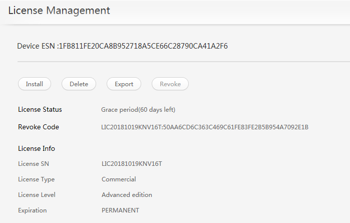

## License

### Checking Whether KAE Hardware Devices Are Enabled by the License

**Question<a name="section989811482218"></a>**

After the license is installed, how do I check whether the license has enabled KAE hardware devices?

**Answer<a name="section118041549736"></a>**

You can use either of the following methods:

- Accessing the BIOS Setup Utility

    Press **Esc** to go to the BIOS Setup Utility and choose **Advanced** \> **Accelerators Status**. If the following information is displayed, the devices are installed.

    

- Running the **lspci** command on the CLI of the OS

    Run the **lspci | grep "***xxx***"** command (*xxx* indicates the driver module, which can be **HPRE**, **SEC**, **RDE**, or **ZIP**). If the following information is displayed, the license has enabled the KAE hardware devices.

    

### Verification Failure During License Installation

**Symptom<a name="en-us_topic_0000001217022677_section3941254"></a>**

The system displays a message indicating that the verification fails during license installation.

**Key Process and Cause Analysis<a name="en-us_topic_0000001217022677_section35471290"></a>**

The possible causes are as follows:

- The iBMC system time is incorrect.
- The iBMC version is too early.

**Conclusion and Solution<a name="en-us_topic_0000001217022677_section50806158"></a>**

If the iBMC system time is incorrect:

Check the system time zone. If the time zone is incorrect, correct it.

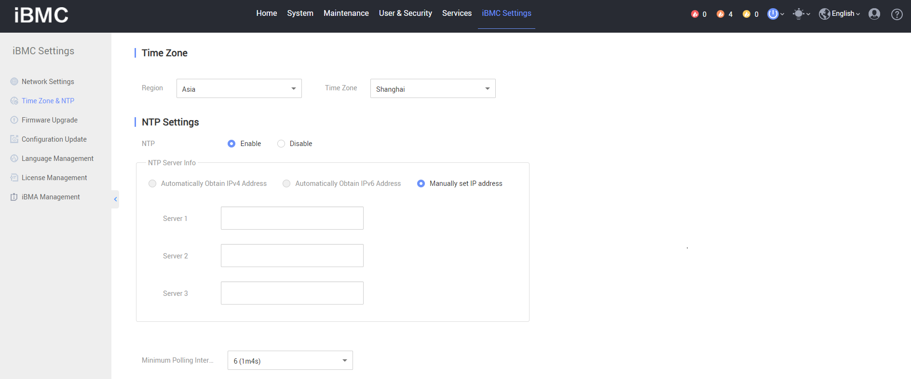

If the iBMC version is too early:

Download the latest iBMC installation package of your server from the [Huawei carrier website](https://support.huawei.com/carrier/navi?coltype=software#col=software&path=PBI1-21430725/PBI1-21430756/PBI1-21431670/PBI1-251366796) or [Huawei enterprise website](https://support.huawei.com/enterprise/en/category/arm-based-pid-1548148188432?submodel=software) and install the package.

### SEC Device Not Found After the License Is Loaded During KAE Enablement

**Symptom<a name="en-us_topic_0000001721633562_en-us_topic_0000001742708945_section13982317239"></a>**

KAE is enabled on two machines. After the license is successfully loaded, one machine cannot find the SEC device. After the BMC is powered off and restarted, reload the license and SEC driver. However, the PCI still cannot find the SEC device.

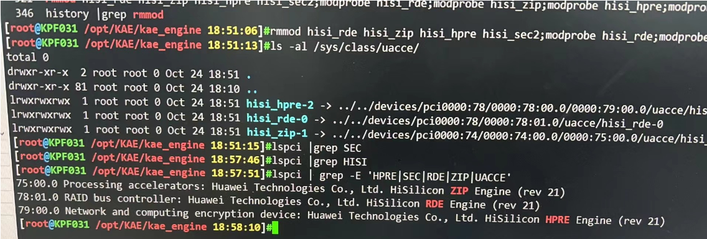

**Key Process and Cause Analysis<a name="en-us_topic_0000001721633562_en-us_topic_0000001742708945_section31242048897"></a>**

1. Log in to the server iBMC, choose **iBMC Settings** \> **License Management**, and check whether all accelerator devices are enabled.

2. Check whether both KAE and TEE features are enabled on a single-socket server.

    For a single-socket server, KAE and TEE features cannot be used simultaneously. Releasing TEE will release the SEC device. To use the KAE SEC algorithm on a single-socket server, disable TEE.

**Conclusion and Solution<a name="en-us_topic_0000001721633562_section1511044274711"></a>**

Disable the TEE function on the server. Access the server BIOS, choose **Advanced** \> **TEE Config**, and set **TEE Config** to **Disable**. For details, see [Configuring the BIOS](https://www.hikunpeng.com/document/detail/en/kunpengcctrustzone/trustzone/fg/kunpengtrustzone_20_0019.html#EN-US_TOPIC_0000002258299325__section132520219345) in the *Confidential Computing TrustZone Kit Feature Guide*.

## KAE Installation

### Obtaining the KAE Software Package

**Question<a name="section63626415588"></a>**

How do I obtain the KAE software package?

**Answer<a name="section1016841975912"></a>**

- Download the KAE 2.0 software package from [Kunpeng/KAE](https://gitcode.com/boostkit/KAE/tree/kae2).
- Download the KAE 1.0 software package from [Kunpeng/KAE](https://gitcode.com/boostkit/KAE/tree/kae1).

### Installing and Upgrading KAE

**Question<a name="section382213371104"></a>**

How do I install and upgrade KAE?

**Answer<a name="section8247142112"></a>**

For details, see [Installation Guide](./installation_guide.md).

### Troubleshooting Driver Loading Failures

1. Check whether the kernel version is consistent with the kernel development package version (including the minor version number). The inconsistency may cause the kernel installation failures.
  
     > uname -r kernel_version rpm -qa | grep kernel-devel kernel_development_package_version
  
     Solution: Install the development package that matches the kernel version.
  
2. Check whether the loading fails due to lack of the license.
  
     > lspci | grep HPRE lspci | grep SEC lspci | grep ZIP
  
     Solution: For Kunpeng 920 processors, apply for a license. For the new Kunpeng 920 processor model, update the BIOS to a license-free version.

### "cannot create regular file" Displayed When KAE Is Compiled Through Source Code

**Symptom<a name="en-us_topic_0000001216544209_section3941254"></a>**

When the KAE is compiled and installed using source code and the **make** command is executed, an error message "cannot create regular file '...':No such file or directory" is displayed, indicating that common files cannot be created, which means that the directory to which the build soft link points does not exist.


**Key Process and Cause Analysis<a name="en-us_topic_0000001216544209_section35471290"></a>**

The kernel-devel software package is not installed in the OS or the installed kernel-devel does not match the kernel version of the OS. As a result, the kernel header file directory to which the build soft link points does not exist.

**Conclusion and Solution<a name="en-us_topic_0000001216544209_section50806158"></a>**

Check whether kernel-devel is installed in the system or whether the installed kernel-devel software package matches the OS kernel version.

Query the version of the installed kernel-devel software package.

```shell
rpm -qa | grep kernel-devel
```

- If the installed kernel-devel software package can be found, perform the following steps:
    1. Query the version of the running kernel.

        ```shell
        uname -r
        ```

    2. Check whether the version of the kernel-devel software package matches the OS kernel version.

        If they do not match, run the following command to install the kernel-devel software package:

        ```shell
        yum install kernel-devel-$(uname -r)
        ```

- If no kernel-devel software package is found, run the following command to install it:

    ```shell
    yum install kernel-devel-$(uname -r)
    ```

### engine.h Not Found When the KAE Is Compiled and Installed Using Source Code

**Symptom<a name="en-us_topic_0000001217022679_section3941254"></a>**

When the engine layer code of the KAE is compiled using source code, the **engine.h** file is missing. Detailed error information: " engine.h: No such file or directory"

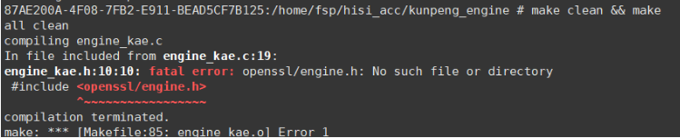

**Key Process and Cause Analysis<a name="en-us_topic_0000001217022679_section35471290"></a>**

This error message is displayed because the **engine.h** header file is required for compiling the engine layer code of the KAE. The compiler searches for the file in the default path. If the file cannot be found and no other search path is configured, this error message is displayed.

**Conclusion and Solution<a name="en-us_topic_0000001217022679_section50806158"></a>**

1. Ensure that OpenSSL has been correctly installed by following the instructions in section "Installing OpenSSL/Tongsuo" in [Kunpeng Accelerator Engine User Guide](./installation_guide.md).
2. Find the directory where the **engine.h** file is located.

    ```shell
    find / -name engine.h
    ```

3. Add the directory to the **C\_INCLUDE\_PATH** environment variable.

    ```shell
    export C_INCLUDE_PATH=Queried_directory:$C_INCLUDE_PATH
    ```

4. Check whether the environment variable is successfully added.

    ```shell
    echo $C_INCLUDE_PATH
    ```

    If the directory where the **engine.h** file is located is displayed, the directory is successfully added.

### "no such device" Displayed When KAE Is Installed Using RPM Packages

**Symptom<a name="en-us_topic_0000001171624344_section3941254"></a>**

When KAE is installed using RPM packages, the error message "modprobe: ERROR: could not insert 'hisi\_rde': No such device" is displayed.


**Key Process and Cause Analysis<a name="en-us_topic_0000001171624344_section35471290"></a>**

A possible cause is that KAE hardware devices are not enabled, that is, there is no valid license.

**Conclusion and Solution<a name="en-us_topic_0000001171624344_section50806158"></a>**

Install a valid license. For details, see "Environment Deployment > Obtaining a License" in [Installation Guide](./installation_guide.md).

### KAE Fails to Be Used by OpenSSL 1.1.1c Installed on EulerOS 2.8

**Symptom<a name="en-us_topic_0000001171464370_section3941254"></a>**

The KAE fails to be used by OpenSSL 1.1.1c installed on EulerOS 2.8 by default, and a message is displayed indicating that the symbol cannot be found.

**Key Process and Cause Analysis<a name="en-us_topic_0000001171464370_section35471290"></a>**

The SM algorithm (controlled by the **OPENSSL\_NO\_SM4** compilation option) is not enabled for OpenSSL 1.1.1c installed on EulerOS 2.8 by default, and the generated crypto library does not have the corresponding function symbols.

**Conclusion and Solution<a name="en-us_topic_0000001171464370_section50806158"></a>**

Download an OpenSSL version and compile and install it again. You do not need to add the **OPENSSL\_NO\_SM4** macro in the configuration before compilation. Then install OpenSSL following the instructions in "Installing OpenSSL/Tongsuo" in [Installation Guide](./installation_guide.md).

### SSH Connection Fails After OpenSSL of openEuler Is Upgraded to 1.1.1e

**Symptom<a name="en-us_topic_0000001216944169_section3941254"></a>**

After OpenSSL of openEuler 20.03 LTS is upgraded to 1.1.1e, the SSH connection fails.

**Key Process and Cause Analysis<a name="en-us_topic_0000001216944169_section35471290"></a>**

The default **openssl.cnf** file of the OpenSSL tool does not take effect because the file name is manually changed. You can run the following command to check whether the **openssl.cnf** file can be found:

```shell
find / -name "openssl.cnf"
```


**Conclusion and Solution<a name="en-us_topic_0000001216944169_section50806158"></a>**

The detailed OpenSSL installation process is as follows:

1. Check the environment.

    OS: openEuler 20.03 LTS

    Hardware: Kunpeng server with 128 CPU cores

2. Install OpenSSL and KAE by referring to [Installation Guide](./installation_guide.md).
3. Check the version of OpenSSL built in the system.

    

4. Use the built-in OpenSSL or upgrade it by referring to either of the following methods:
    - Method 1: using the built-in OpenSSL

        KAE supports OpenSSL 1.1.1d. You can use OpenSSL 1.1.1d built in the OS without upgrading it to OpenSSL 1.1.1e. The procedure is as follows:

        1. Install the local source.
            - If the server is not directly connected to the Internet, you are advised to use **openEuler-20.03-LTS-everything-aarch64-dvd.iso** to configure the local source.
            - If the server is directly connected to the Internet, skip this step.

        2. Install openssl-devel.

            ```shell
            yum install -y openssl-devel
            ```

        3. Prepare the KAE environment for tests. For details, see "Installation Using Source Code" in [Installation Guide](./installation_guide.md).

    - Method 2: upgrading OpenSSL to 1.1.1e
        1. Install the dependency packages by referring to section "Installing OpenSSL/Tongsuo" in [Installation Guide](./installation_guide.md).
            1. Download **openssl-OpenSSL\_1\_1\_1e.zip** from the official website.
            2. Decompress the source package.

                ```shell
                unzip openssl-OpenSSL_1_1_1e.zip
                ```

                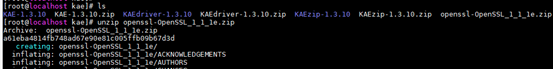

            3. Configure and install OpenSSL.

                ```shell
                ./config --prefixm/usr/local/openssl_1
                ```

                ```shell
                make
                ```

                ```shell
                make install
                ```

                

                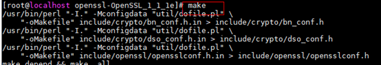

                

        2. Configure the OpenSSL environment variables.

            Check the OpenSSL version.

            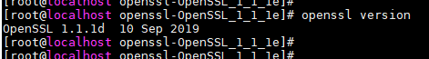

            The command output shows that the version is 1.1.1d.

            1. Set the environment variable.

                Add the path for the newly installed OpenSSL to the end of the **/etc/bashrc** file.

                ```shell
                vi /etc/bashrc
                ```

                ```shell
                export PATH=/usr/local/openssl_1/bin:$PATH
                ```

                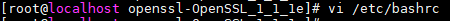

                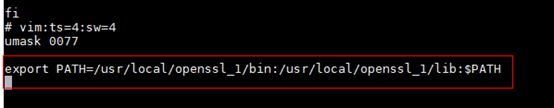

                Make the modification take effect.

                ```shell
                source /etc/bashrc
                ```

                Run the **export** command to check the environment variables. You can find that the OpenSSL configuration path exists in **PATH**.

                

                Check the OpenSSL version again.

                

                The command output shows that the version is 1.1.1e.

            2. Switch the OpenSSL link to the new installation path.

                Back up the current OpenSSL.

                ```shell
                mv /usr/bin/openssl /usr/bin/openssl.bak
                ```

                ```shell
                mv /usr/include/openssl /usr/include/openssl.bak //It does not exist for certain scenarios.
                ```

                Use the new version.

                ```shell
                ln -s /usr/local/openssl_1/bin/openssl /usr/bin/openssl
                ```

                ```shell
                ln -s /usr/local/openssl_1/include/openssl /usr/include/openssl
                ```

                Check the OpenSSL version.

                

                OpenSSL 1.1.1e has not been successfully installed.

            3. Update the dynamic link library (DLL) data.

                In the **/etc/ld.so.conf** configuration file, set the lib path of OpenSSL to **/usr/local/openssl\_1/lib**. Run the **ldconfig –v** command to make it take effect.

                

                Check the OpenSSL version again. If the following information is displayed, OpenSSL 1.1.1e has been installed.

                

            4. Export environment variables.

                

        3. Install KAEdriver-1.3.10.
            1. Go to the source code directory of KAEdriver-1.3.10 and install it.

                ```shell
                cd kae_driver/
                ```

                ```shell
                make
                ```

                ```shell
                make install
                ```

                

            2. Go to the **warpdrive** directory and run the **autogen.sh** script. Run the **./configure** command to configure the KAE driver.

                ```shell
                cd warpdrive/
                ```

                ```shell
                sh autogen.sh
                ```

                ```shell
                ./configure
                ```

                

            3. Install the KAE driver.

                ```shell
                make
                ```

                ```shell
                make install
                ```

                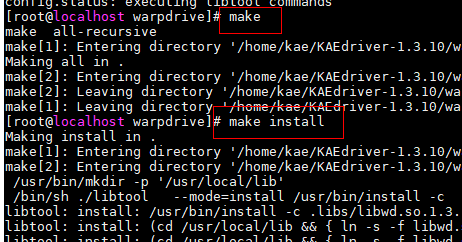

        4. Load the library.

            ```shell
            lsmod | grep uace
            ```

            

        5. Install KAE-1.3.10.
            1. Go to the KAE-1.3.10 source package and grant the execution permission on the **configure** file.

                ```shell
                chmod +x configure
                ```

                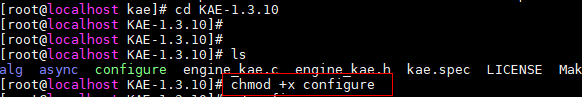

            2. Configure the KAE installation path.

                ```shell
                ./configure --openssl_path=/usr/local/openssl_1
                ```

                ```shell
                make clean && make
                ```

                ```shell
                make install
                ```

                > **Note:**
                >When running the **./configure** command, you must specify the path of the newly installed OpenSSL. Otherwise, the compilation fails.

                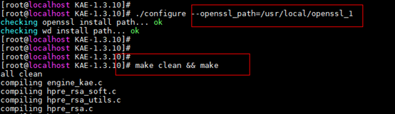

                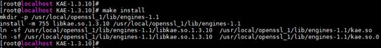

        6. Install KAEzip-1.3.10.

            Go to the KAEzip-1.3.10 source code directory and run the **setup.sh** script to install KAEzip.

            ```shell
            cd KAEzip-1.3.10
            ```

            ```shell
            sh setup.sh install
            ```

            

            

        7. Check whether the KAE driver, KAE, and KAEzip are successfully installed.

            ```shell
            ls -al /usr/local/lib/ | grep libwd
            ```

            ```shell
            ls -al /usr/local/openssl_1/lib/engines-1.1
            ```

            ```shell
            ls -al /sys/class/uacce
            ```

            

            

            

        8. Check whether the installation is successful.

            Run the hard computing (computing using KAE) command in one of the windows.

            ```shell
            openssl speed -engine kae rsa2048
            ```

            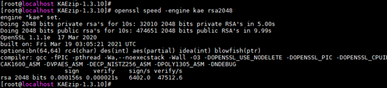

            At the same time, run the following command in another window.

            ```shell
            cat /sys/class/uacce/hisi_hpre-*/attrs/available_instances
            ```

            

            If "256  256" is displayed in the command output, the hardware computing queue is not consumed. In the preceding figure, "255  256" is displayed, indicating that one hardware computing queue has been consumed. It means that KAE has been successfully installed.

### Failed to Compile and Install the KAE Kernel Driver Using Source Code

**Symptom<a name="en-us_topic_0000001840968873_en-us_topic_0000001742708945_section13982317239"></a>**

When the KAE kernel driver is being compiled and installed through source code on UOS v20 SP1, the system displays a message indicating that the specified file or directory does not exist in the <filepath class="+ topic/ph sw-d/filepath " id="filepath74971023173516">/kae\_driver/hisilicon/sec/Makefile</filepath> directory after the **make** command is executed.

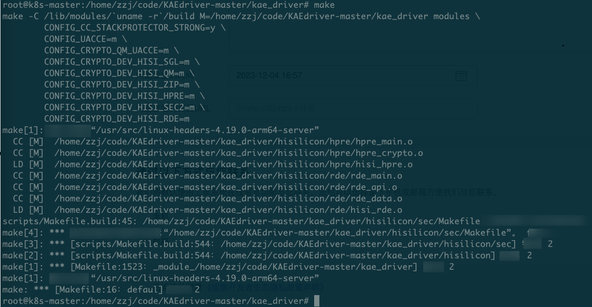

**Key Process and Cause Analysis<a name="en-us_topic_0000001840968873_en-us_topic_0000001742708945_section31242048897"></a>**

None

**Conclusion and Solution<a name="en-us_topic_0000001840968873_section1511044274711"></a>**

Delete the second line from the makefile in the **/kae\_driver/hisilicon/sec/Makefile** directory, and then run the compile command again.

### No Performance Gains When wrk Is Used to Test Nginx+KAE

**Symptom<a name="section0325446598"></a>**

In the same software and hardware conditions, when the httpress tool is used to test the HTTPS short connection performance of Nginx, the performance is greatly improved after KAE is enabled. However, when the wrk tool is used for testing, the performance is not improved after KAE is enabled.

**Key Process and Cause Analysis<a name="section1482511325"></a>**

Cause analysis: The wrk tool uses TLS reconnection. During the stress test, only one key exchange operation is performed, indicating a low RSA encryption proportion. As a result, the acceleration effect is not obvious.

Process analysis: According to the wrk source code, as shown in [**Figure 1**](#wrk-source-code-snippet), the client sends a Client Hello sub-message in the handshake phase, and the session ID in the message is empty. After a complete handshake phase, the client and server store the session ID locally (in the client memory and server cache respectively). After the session is closed and when the same HTTPS website is accessed next time, the client browser carries the session ID in the Client Hello sub-message. After receiving the request, the server matches the received session ID with that stored in the server cache. If matched, the server restores the previous TLS connection and uses the previously negotiated key instead of re-negotiating a key. In this case, the RSA algorithm is called only once.

**Figure 1** wrk source code snippet<a name="fig133708381251"></a><a id="wrk-source-code-snippet"></a>

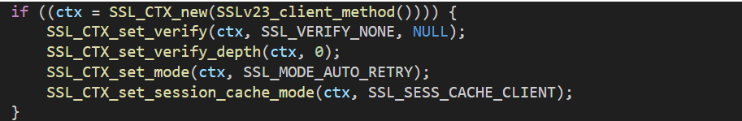

**Conclusion and Solution<a name="section133105342021"></a>**

KAE accelerates the RSA algorithm in the handshake phase. If the stress test tool uses TLS reconnection, the acceleration effect is not obvious. In this case, you are advised to use another tool, such as httpress.

### Failed to Upgrade the Accelerator Driver

**Symptom<a name="en-us_topic_0000002293564954_section0747162541710"></a>**

After the accelerator driver is upgraded, the driver version is not changed after the system is restarted.

**Key Process and Cause Analysis<a name="en-us_topic_0000002293564954_section7752122541710"></a>**

Before the accelerator driver is upgraded, the system upgrades other driver packages. These driver packages may update the boot file system **initramfs**, and update the accelerator driver to **initramfs** before upgrade. For example, if the NIC driver is updated or **initramfs** is manually updated, the system loads the accelerator driver from **initramfs** first during restart.

**Conclusion and Solution<a name="en-us_topic_0000002293564954_section5753192514171"></a>**

After the accelerator driver is upgraded, run the **dracut --force** command to update **initramfs** again.

### Failed to Identify the Related API Symbols After the OpenSSL of a New Version Is Installed

**Symptom<a name="en-us_topic_0000002327644537_section6238163892516"></a>**

The following error information is displayed when executing the **rpm** command:

```shell
rpm: relocation error: /lib64/librpmio.so.8: symbol EVP_md2 version OPENSSL_1_1_0 not defined in file libcrypto.so.1.1 with link time reference
```

The following error information is displayed when the OpenSSL command is executed:

```shell
/usr/bin/openssl: relocation error: /usr/bin/openssl: symbol EVP_md2 version OPENSSL_1_1_0 not defined in file libcrypto.so.1.1 with link time reference
```

**Key Process and Cause Analysis<a name="en-us_topic_0000002327644537_section1824263810250"></a>**

If the OpenSSL dynamic library path is configured to **LD\_LIBRARY\_PATH** or the library is installed in **/usr/local/lib** (that is, the dynamic library search path in the **/etc/ld.so.conf** file is set to **/usr/local/lib**), when the system tool or command attempts to call the OpenSSL dynamic library, the original system library rather than the library installed by the user is called.

**Conclusion and Solution<a name="en-us_topic_0000002327644537_section1824303852515"></a>**

You are advised to install the OpenSSL software by referring to "Installing OpenSSL/Tongsuo" in [Installation Guide](./installation_guide.md), and then install the KAE software package by referring to [Installation Methods](./installation_guide.md).

If the system needs to configure the **/usr/local/lib** path to the **LD\_LIBRARY\_PATH** environment variable or configure the path to **/etc/ld.so.conf**, specify the installation path and dynamic library path before installing the OpenSSL source code:

```shell
./config --prefix=/usr/local/openssl -Wl,-rpath,/usr/local/openssl/lib
make
make install
```

- If the accelerator is installed in RPM mode, perform the following modification:

    ```shell
    rpm -ivh libkae-1.0.1-1.euler2.0.aarch64.rpm --prefix=/usr/local/openssl/lib/engines-1.1
    ```

- If the accelerator is installed in source code mode, run the following compilation and installation commands in sequence.

    ```shell
    cd KAE
    chmod +x configure
    ./configure --openssl_path=/usr/local/openssl
    make clean && make
    make install
    ```

## KAE Verification

### Obtaining the KAE Performance Data

**Question<a name="section18596175620576"></a>**

Can the KAE performance data be provided?

**Answer<a name="section118369312588"></a>**

The performance data of the KAE is for Huawei internal reference only and cannot be released. For Huawei departments, some KAE performance data and corresponding test methods can be provided based on the purpose of use.

### Checking Whether a Program Calls KAE

**Question<a name="section9821201471713"></a>**

My program calls the APIs provided by OpenSSL and is bound to KAE. The program can run and stop properly. How do I know that the program uses KAE instead of the original software computing library in the system?

**Answer<a name="section19147131119195"></a>**

When the program is running, you can query the number of hardware device queues to check whether the program has called KAE. You can run the **cat /sys/class/uacce/hisi\_*xxx*/attrs/available\_instances** command to view the number of queues corresponding to a driver module. By default, the number of queues is 256.

**Figure 1** Checking the number of queues of each driver module<a name="fig104433984511"></a><a id="checking-the-number-of-queues-of-each-driver-module"></a>

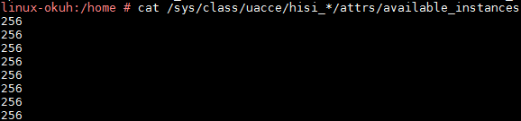

**Figure 2** Checking the number of queues in a specific driver module (for example, **hisi\_hpre**)<a name="fig676105110454"></a><a id="checking-the-number-of-queues-in-a-specific-driver-module-(for-example-hisi\_hpre)"></a>

.png "Checking the number of queues in a specific driver module (for example, **hisi\_hpre**)")

**Figure 3** Checking the number of queues of a specific device in a driver module (for example, **hisi\_hpre-2**)<a name="fig14841143462"></a><a id="checking-the-number-of-queues-of-a-specific-device-in-a-driver-module-(for-example-hisi\_hpre-2)"></a>

.png "Checking the number of queues of a specific device in a driver module (for example, **hisi\_hpre-2**)")

> **Note:**
>After the KAE is installed, the driver device IDs on each machine may vary. The preceding are for reference only.

### Certificates Fail to Be Generated After Running openssl req -new -x509

**Symptom<a name="en-us_topic_0000001217022681_section3941254"></a>**

After the KAE is installed, a certificate fails to be generated by running the **openssl req -new -x509** command, and the message "281461739307968:error:0E06D06C:configuration file routines:NCONF\_get\_string:no value:crypto/conf/conf\_lib.c:273:group=req name=distinguished\_name" is displayed.

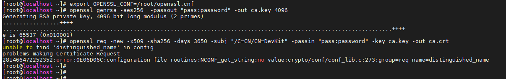

**Key Process and Cause Analysis<a name="en-us_topic_0000001217022681_section35471290"></a>**

When OpenSSL is used to generate a certificate, the system reads the **openssl.cnf** file in the OpenSSL installation directory. If KAE is installed and configured to be used through the **openssl.cnf** file, the error is reported when the OpenSSL certificate generation command is executed.

**Conclusion and Solution<a name="en-us_topic_0000001217022681_section50806158"></a>**

**Method 1: using KAE by specifying the KAE path instead of using openssl.cnf**

1. Cancel the **openssl.cnf** environment variable.

    ```shell
    unset OPENSSL_CONF
    ```

2. Specify the KAE path.

    ```shell
    export OPENSSL_ENGINES="/usr/local/lib/engines-1.1"
    ```

**Method 2: using openssl.cnf provided with OpenSSL instead of a custom openssl.cnf file created by KAE**

1. Cancel the **openssl.cnf** environment variable created by KAE.

    ```shell
    unset OPENSSL_CONF
    ```

2. Add the KAE configuration to the specified position, as shown in [**Figure 1**](#position-for-adding-the-KAE-configuration-in-the-openssl.cnf-file-of-OpenSSL), in the openssl.cnf file of the OpenSSL installation directory.

    Generally, the **openssl.cnf** file is stored in the **ssl** directory in the OpenSSL installation directory. You can also run the **find / -name "openssl.cnf"** command to search for the **openssl.cnf** file.

    ```ini
    openssl_conf=openssl_def
    [openssl_def]
    engines=engine_section
    [engine_section]
    kae=kae_section
    [kae_section]
    engine_id=kae
    dynamic_path=/usr/local/lib/engines-1.1/kae.so
    KAE_CMD_ENABLE_ASYNC=1 #(Optional) The value 0 indicates that the asynchronous function is disabled. The value 1 indicates that the asynchronous function is enabled (enabled by default).
    KAE_CMD_ENABLE_SM3=1 #(Optional) The value 0 indicates that the SM3 acceleration mode is disabled. The value 1 indicates that the SM3 acceleration function is enabled (enabled by default).
    KAE_CMD_ENABLE_SM4=1 #(Optional) The value 0 indicates that the SM4 acceleration mode is disabled. The value 1 indicates that the SM4 acceleration mode is enabled (enabled by default).
    default_algorithms=ALL #All algorithms preferentially search for the engine. If the engine does not support this configuration, switch to OpenSSL for computing.
    init=1 #Export
    ```

    **Figure 1** Position for adding the KAE configuration in the **openssl.cnf** file of OpenSSL<a name="en-us_topic_0000001217022681_fig1917317221555"></a><a id="position-for-adding-the-KAE-configuration-in-the-openssl.cnf-file-of-OpenSSL"></a>
    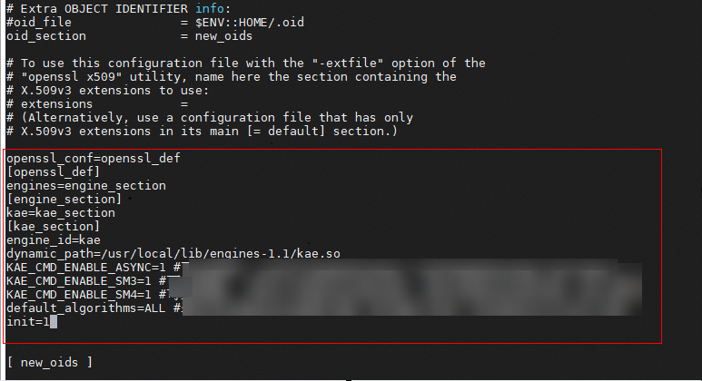

    Now you can use the certificate generation function properly.

### No RSA Performance Gains After KAE Is Called Through the OpenSSL Command

**Symptom<a name="en-us_topic_0000001769473497_en-us_topic_0000001742708945_section13982317239"></a>**

Environment:

- OS: openEuler 20.03 LTS for Arm
- Processor: 2 × Kunpeng 920 processor (64 cores, 2.6 GHz)
- Memory: 8 × 32 GB

After the following OpenSSL command is executed to call KAE to test the RSA performance, it is found that the performance is not improved.

```shell
./openssl speed -elapsed -engine kae rsa2048
```

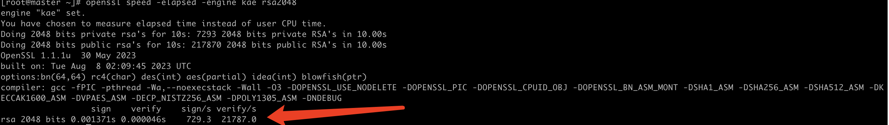

**Key Process and Cause Analysis<a name="en-us_topic_0000001769473497_en-us_topic_0000001742708945_section31242048897"></a>**

Perform the following steps:

1. KAE supports only the Kunpeng processor and requires a license. Check whether it is a Kunpeng hardware environment and whether the license has been loaded.
2. Check the KAE installation mode.
3. Check whether the OpenSSL environment variables are configured.
4. Check whether KAE is installed.
5. Check whether KAE is enabled after running the test command.

**Conclusion and Solution<a name="en-us_topic_0000001769473497_section1511044274711"></a>**

1. KAE supports only the Kunpeng processor and requires a license. Check whether it is a Kunpeng hardware environment and whether the license has been loaded.
    - Kunpeng K series servers have built-in licenses. You can run the **lspci | grep HPRE** and **lspci | grep ZIP** commands to check whether the license has been loaded.
    - For non-Kunpeng K series servers, you need to apply for and import a license. For details, see [Obtaining and Installing a License Before Installing KAE](#obtaining-and-installing-a-license-before-installing-kae). After the license is installed, run the **lspci | grep HPRE** and **lspci | grep ZIP** commands to check whether the license is supported. If the following information is displayed, the license has been loaded.

        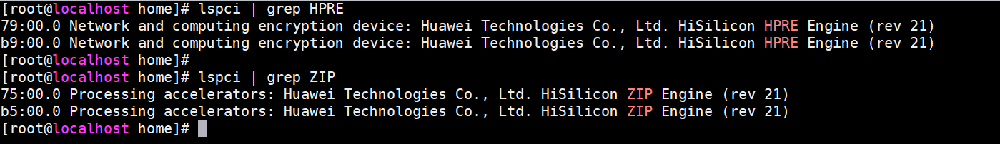

        Contact the local Huawei sales personnel or engineers to learn about the license charging policy.

2. Check the KAE installation mode.

    Currently, only the openEuler 4.19 kernel allows KAE installation using an RPM or DEB package. For other kernel versions, you need to compile and install KAE using the source code (the KAE 1 branch for kernel 4.19 and the KAE 2 branch for kernel 5.1*x*). Select a KAE installation method based on the actual situation. For details, see [Installation Guide](./installation_guide.md).

3. Check whether the OpenSSL environment variables are configured.

    The KAE encryption and decryption module is based on OpenSSL, and the OpenSSL version must be 1.1.1a or later.

4. Check whether KAE is installed. For details, see "Testing After Installation" in [Installation Guide](./installation_guide.md).
5. Check whether KAE is enabled after running the test command. The method is as follows:
    - If KAE hardware encryption is used, check acceleration queue usage when programs are running in encrypted zones. Run **cat /sys/class/uacce/hisi\_sec-1/attrs/available\_instances** to check whether any instances are consumed. If yes, KAE is enabled.
    - If software encryption (OpenSSL) is used, check whether there are hotspot functions when programs are running in encrypted zones. Run the **perf top** command to check whether libcrypto.so.1.1 exists. If yes, software encryption is used. If KAE hardware encryption is required, you are advised to recompile and install KAE using source code, and then enable KAE to perform a test again.

### Ineffective KAE After Being Installed and Configured on a VM

**Symptom<a name="en-us_topic_0000001925948013_en-us_topic_0000001742708945_section13982317239"></a>**

After the KAE virtualization environment is configured on a host running openEuler 22.03 LTS SP2, accelerator devices installed in the host OS and corresponding BDF numbers can be queried through the **ls -al /sys/class/uacce** command. However, the accelerator devices cannot be queried through the **ls /sys/class/uacce/** command on a VM. The following information is displayed in the VM log:

```text
modprobe: ERROR: could not insert 'hisi hpre': Invalid argument make:[Makefile:69: nosva] Error 1 (ignored)
modprobe hisi zip uacce mode=2 pf q num=256
modprobe: ERROR: could not insert hisi zip': Invalid argument make:[Makefile:70: nosva] Error 1 (ignored) 
```

**Key Process and Cause Analysis<a name="en-us_topic_0000001925948013_en-us_topic_0000001742708945_section31242048897"></a>**

The virtualization settings of the hisi\_hpre and hisi\_zip devices are not configured.

**Conclusion and Solution<a name="en-us_topic_0000001925948013_section1511044274711"></a>**

Configure the hisi\_hpre and hisi\_zip devices by referring to the virtualization configuration procedure of the hisi\_sec device. For details, see section [Using KAE on a KVM](./best_practices.md#using-kae-on-a-kvm) in the best practices.

### No Performance Gains After KAE Is Called Through openssl.cnf

**Symptom<a name="en-us_topic_0000001769473497_en-us_topic_0000001742708945_section13982317239"></a>**

The **OPENSSL\_CONF** environment variable has been configured based on [Calling the KAE Encryption and Decryption Library Using the OpenSSL/Tongsuo Configuration File openssl.cnf](./user_guide.md#calling-the-kae-encryption-and-decryption-library-using-the-openssltongsuo-configuration-file-opensslcnf) in the User Guide. After running the **openssl speed -elapsed rsa2048** and **openssl speed -elapsed -engine kae rsa2048** commands, you find that there are no performance changes.

**Key Process and Cause Analysis<a name="en-us_topic_0000001769473497_en-us_topic_0000001742708945_section31242048897"></a>**

If you have configured **OPENSSL\_CONF** by referring to [Calling the KAE Encryption and Decryption Library Using the OpenSSL/Tongsuo Configuration File openssl.cnf](./user_guide.md#calling-the-kae-encryption-and-decryption-library-using-the-engine_by_id-function) in the User Guide, both **openssl speed -elapsed rsa2048** and **openssl speed -elapsed -engine kae rsa2048** commands can call KAE. As a result, the performance is not improved.

**Conclusion and Solution<a name="en-us_topic_0000001769473497_section1511044274711"></a>**

1. Cancel the **OPENSSL\_CONF** configuration.

    ```shell
    unset OPENSSL_CONF
    export OPENSSL_ENGINES="/usr/local/lib/engines-1.1"
    ```

2. Test the RSA performance (KAE not called).

    ```shell
    openssl speed -elapsed rsa2048
    ```

3. Set the **OPENSSL\_CONF** environment variable.

    ```shell
    export OPENSSL_CONF=/home/app/openssl.cnf  
    ```

    > **Note:**
    >This path stores the **openssl.cnf** file. Replace it with the actual path.

4. Test the RSA performance (KAE called).

    ```shell
    openssl speed -elapsed -engine kae rsa2048
    ```

    If the Kunpeng 920 processor is used, the performance is expected to rise from about 750 signs/s to about 3,000 signs/s after KAE is called.

### Cannot Initialize the WD Pool When a Program Calls KAE

**Symptom<a name="section0325446598"></a>**

When a program is used to call KAE in some environments, the "dma\_num = x, not enough. failed to initialize wd pool" error message is displayed.


**Key Process and Cause Analysis<a name="section1482511325"></a>**

Available CMA space in the environment is insufficient. As a result, the program cannot apply for enough continuous memory.

If the system memory management unit (SMMU) is enabled, it can be used to map discrete memory to continuous memory.

**Conclusion and Solution<a name="section133105342021"></a>**

When using KAE with the SMMU disabled, ensure that the CMA memory space is sufficient. Otherwise, you are advised to enable the SMMU. For details about how to enable it, see [Configuring the BIOS](https://www.hikunpeng.com/document/detail/en/kunpengcpfs/ecosystemEnable/QEMU-KVM/kunpengkvm_03_0019.html).

### KAE Initialization Failure

**Symptom<a name="en-us_topic_0000002327644517_section189811511193010"></a>**

An error is reported or no acceleration effect is achieved when KAE is used to accelerate OpenSSL.

**Key Process and Cause Analysis<a name="en-us_topic_0000002327644517_section1578172814186"></a>**

- Check whether the accelerator drivers are loaded successfully.
- Check whether the KAE soft link is created successfully.
- Check whether the environment variable of the OpenSSL engine library path has been configured.

**Conclusion and Solution<a name="en-us_topic_0000002327644517_section1049923014301"></a>**

1. Check whether the accelerator drivers are loaded successfully. Check whether **uacce.ko**, **qm.ko**, **sgl.ko**, **hisi\_sec2.ko**, **hisi\_hpre.ko**, **hisi\_rde.ko** and **hisi\_zip.ko** are loaded.

    ```shell
    lsmod | grep uacce
    ```

    If the following information is displayed, the loading is successful. If any module is missing, check whether an exception occurred during the corresponding installation process. If yes, reinstall the module.

    ```text
    uacce                  262144  2 hisi_hpre,hisi_qm,hisi_sec2,hisi_rde,hisi_zip
    ```

2. Check whether the KAE library exists in the software installation directory (**/usr/lib64** for RPM installation and **/usr/local/lib** for source code installation) and OpenSSL installation directory, and whether the correct soft link is established.
    1. Check whether KAE is correctly installed and whether a soft link is established.

        - For OpenSSL 1.1.1x

            ```shell
            ll /usr/local/lib/engines-1.1/ | grep kae
            ```

        - For OpenSSL 3.0.x

            ```shell
            ll /usr/local/lib/engines-3.0/ | grep kae
            ```

        If the installation is correct, information similar to the following is displayed:

        ```text
        lrwxrwxrwx. 1 root root     22 Nov 12 02:33 kae.so -> kae.so.1.0.1
        lrwxrwxrwx. 1 root root     22 Nov 12 02:33 kae.so.0 -> kae.so.1.0.1
        -rwxr-xr-x. 1 root root 112632 May 25  2019 kae.so.1.0.1
        ```

    2. Check whether WD is correctly installed and whether a soft link is established.

        ```shell
        ll /usr/lib64/ | grep libwd  
        ```

        If the installation is correct, information similar to the following is displayed:

        ```text
        lrwxrwxrwx.  1 root root       14 Nov 12 02:33 libwd.so -> libwd.so.1.0.1
        lrwxrwxrwx.  1 root root       14 Nov 12 02:33 libwd.so.0 -> libwd.so.1.0.1
        -rwxr-xr-x.  1 root root   137120 May 25  2019 libwd.so.1.0.1
        ```

3. Check whether the path to the OpenSSL engine library is set by running the **export** command.

    ```shell
    echo $OPENSSL_ENGINES 
    ```

    - For OpenSSL 1.1.1x

        ```shell
        export OPENSSL_ENGINES=/usr/local/lib/engines-1.1
        ```

    - For OpenSSL 3.0.x

        ```shell
        export OPENSSL_ENGINES=/usr/local/lib/engines-3.0
        ```

### Failed to Identify Accelerator Devices After KAE Is Installed

**Symptom<a name="en-us_topic_0000002327644549_section14808174319516"></a>**

Accelerator devices cannot be identified after KAE is installed.

**Key Process and Cause Analysis<a name="en-us_topic_0000002327644549_section0392163331913"></a>**

1. Check whether the devices exist in the virtual file system.
2. Check whether KAE is correctly installed.
3. Check whether physical devices exist through the **lspci** command.
4. If no physical device is found, check whether the accelerator license has been correctly imported or whether the iBMC and BIOS versions support the accelerator features.

**Conclusion and Solution<a name="en-us_topic_0000002327644549_section168911281068"></a>**

1. <a name="en-us_topic_0000002327644549_li19353192114321"></a> Check whether the corresponding devices exist in the virtual file system.

    ```shell
    ls -al /sys/class/uacce/
    ```

    Normally, the following accelerators will be displayed:

    ```text
    total 0
    lrwxrwxrwx. 1 root root 0 Nov 14 03:45 hisi_hpre-2 -> ../../devices/pci0000:78/0000:78:00.0/0000:79:00.0/uacce/hisi_hpre-2
    lrwxrwxrwx. 1 root root 0 Nov 14 03:45 hisi_hpre-3 -> ../../devices/pci0000:b8/0000:b8:00.0/0000:b9:00.0/uacce/hisi_hpre-3
    lrwxrwxrwx. 1 root root 0 Nov 17 22:09 hisi_rde-4 -> ../../devices/pci0000:78/0000:78:01.0/uacce/hisi_rde-4
    lrwxrwxrwx. 1 root root 0 Nov 17 22:09 hisi_rde-5 -> ../../devices/pci0000:b8/0000:b8:01.0/uacce/hisi_rde-5
    lrwxrwxrwx. 1 root root 0 Nov 14 08:39 hisi_sec-0 -> ../../devices/pci0000:74/0000:74:01.0/0000:76:00.0/uacce/hisi_sec-0
    lrwxrwxrwx. 1 root root 0 Nov 14 08:39 hisi_sec-1 -> ../../devices/pci0000:b4/0000:b4:01.0/0000:b6:00.0/uacce/hisi_sec-1
    ../../devices/pci0000:74/0000:74:00.0/0000:75:00.0/uacce/hisi_zip-6
    lrwxrwxrwx. 1 root root 0 Nov 17 22:09 hisi_zip-7 -> ../../devices/pci0000:b4/0000:b4:00.0/0000:b5:00.0/uacce/hisi_zip-7
    ```

2. <a name="en-us_topic_0000002327644549_li1600175515610"></a> If the required HPRE or ZIP device is not found in [1](#en-us_topic_0000002327644549_li19353192114321), check whether the KAE software is correctly installed by referring to [KAE Initialization Failure](#kae-initialization-failure).
3. <a name="en-us_topic_0000002327644549_li1560012551369"></a> If the KAE software is correctly installed according to [2](#en-us_topic_0000002327644549_li1600175515610), run the **lspci** command to check whether the physical devices exist.
    1. Check whether HPRE exists.

        ```shell
        lspci | grep HPRE
        ```

        The command output is as follows:

        ```text
        79:00.0 Network and computing encryption device: Huawei Technologies Co., Ltd. HiSilicon HPRE Engine (rev 21)
        b9:00.0 Network and computing encryption device: Huawei Technologies Co., Ltd. HiSilicon HPRE Engine (rev 21)
        ```

    2. Check whether SEC exists.

        ```shell
        lspci | grep SEC
        ```

        The command output is as follows:

        ```text
        76:00.0 Network and computing encryption device: Huawei Technologies Co., Ltd. HiSilicon SEC Engine (rev 21)
        b6:00.0 Network and computing encryption device: Huawei Technologies Co., Ltd. HiSilicon SEC Engine (rev 21)
        ```

    3. Check whether RDE exists.

        ```shell
        lspci | grep RDE
        ```

        The command output is as follows:

        ```text
        78:01.0 RAID bus controller: Huawei Technologies Co., Ltd. HiSilicon RDE Engine (rev 21)
        b8:01.0 RAID bus controller: Huawei Technologies Co., Ltd. HiSilicon RDE Engine (rev 21)
        ```

    4. Check whether ZIP exists.

        ```shell
        lspci | grep ZIP
        ```

        The command output is as follows:

        ```text
        75:00.0 Processing accelerators: Huawei Technologies Co., Ltd. HiSilicon ZIP Engine (rev 21)
        b5:00.0 Processing accelerators: Huawei Technologies Co., Ltd. HiSilicon ZIP Engine (rev 21)
        ```

4. If no physical device is found in step [3](#en-us_topic_0000002327644549_li1560012551369), perform the following operations:
    - Check whether the accelerator license has been correctly imported. If the license is not imported, import it by following the instructions provided in "License Management" in [TaiShan Rack Server iBMC (V300 to V549) User Guide](https://support.huawei.com/enterprise/en/doc/EDOC1100048786/ba20dd15/license-management). After the accelerator license is imported, power off and restart the iBMC to enable the license.
    - Check whether the iBMC and BIOS versions support the accelerator features. To support KAE, the BIOS version must be later than 1.05, and the iBMC version must be later than 3.65.

### Error Reported When Ceph Uses KAEzip to Compress a File Larger Than 4 MB

**Symptom<a name="en-us_topic_0000002270266173_en-us_topic_0000001216722055_section3941254"></a>**

When a file larger than 4 MB is used to test the zlib hardware computing compression rate of Ceph object storage, the "Compression error: compress unused input" error message is displayed.

**Key Process and Cause Analysis<a name="en-us_topic_0000002270266173_en-us_topic_0000001216722055_section35471290"></a>**

Key process:

- Triggering scenarios

    In the following scenarios, the last data record may not be compressed:

    - The Deflate API of zlib is directly used for compression.
    - A file larger than 4 MB is compressed in block mode.
    - KAEzip exits in advance without compressing the last data record when the output buffer is small and data records need to be compressed in batches. **Z\_OK** is returned and **strm.vaild\_in** is not processed completely.
    - The application software does not determine that the valid data to be compressed is 0\(strm.vaild\_in\).

- Affected versions

    For Kunpeng servers that use KAEzip hardware acceleration, this problem exists in KAEzip 1.3.10 and earlier versions.

- Example of the problem code

    ```c
    int err = deflateInit(&strm, level);
    if (err != Z_OK) return err;
    strm.avail_out = 0;
    strm.avail_in = sourceLen; //The size is greater than 4 MB.
    strm.next_in = (Bytef*)source;
    int flush = Z_FINISH;
    
    char* szBuf = new char[CEPH_PAGE_SIZE];
    do {
    memset(szBuf, 0, CEPH_PAGE_SIZE); //CEPH_PAGE_SIZE=64*1024
    strm.next_out = (Bytef*)szBuf;
    strm.avail_out = CEPH_PAGE_SIZE;
    
    ret = deflate(&strm, flush);    /* no bad return value */
    if (ret == Z_STREAM_ERROR) {
    deflateEnd(&strm);
    return -1;
    }
    have = CEPH_PAGE_SIZE - strm.avail_out;
    
    memcpy(dest + outnum, szBuf, have);
    outnum += have;
    } while (strm.avail_out == 0);
    
    //When the compression exits in the preceding scenarios, ret = Z_OK and strm.avail_in! = 0.
    *destLen = outnum;
    
    if (strm.avail_in != 0) {
    deflateEnd(&strm);
    return -1; //Returns an error message.
    }
    ```

    If you do not follow the [zlib Usage Example](https://zlib.net/zlib_how.html) and do not make the judgment shown in the following figure, the compression of the last data record is not complete.

    

Root cause:

KAEzip has a cache for compressed output. When the external space is insufficient, KAEzip caches the data that is not transmitted. When the compression API is called next time, the data in the cache is obtained first. If this is the last time that the compression API is called, KAEzip exits after obtaining the cache without performing compression.

**Conclusion and Solution<a name="en-us_topic_0000002270266173_en-us_topic_0000001216722055_section50806158"></a>**

This problem exists in KAE 1.3.10 and earlier versions and has been resolved in version 1.3.11 (released on May 20, 2021). Upgrade the KAEzip software package to 1.3.11 to solve this problem.

### No Permissions to Obtain Device Resources in KAE Decompression Performance Tests

**Symptom<a name="en-us_topic_0000002235226834_en-us_topic_0000001925948013_en-us_topic_0000001742708945_section13982317239"></a>**

After KAE is installed and deployed, a message is displayed indicating that the character devices in the **/dev** directory cannot be opened during the KAE decompression performance test. Error message: "open /dev/hisi\_zip-5 failed, errno = 13"


**Key Process and Cause Analysis<a name="en-us_topic_0000002235226834_en-us_topic_0000001925948013_en-us_topic_0000001742708945_section31242048897"></a>**

Query the permissions on devices under **/dev**.

```shell
ll | grep hisi
```

As shown in the following figure, only the **root** user has the read and write permissions. When a common user runs the KAE performance test program, the system displays a message indicating lack of the permissions for opening character devices in the **/dev** directory.

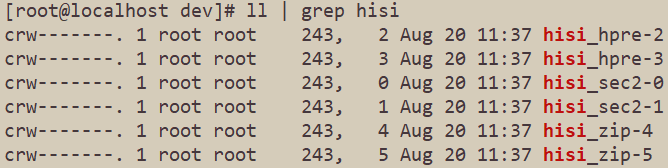

If KAE is installed by the **root** user and the service is executed by a common user, KAE may fail to be enabled because the common user does not have the permissions to obtain related device resources. In this case, you need to grant required permissions on devices prefixed with **hisi** in **/dev** to the common user.

**Conclusion and Solution<a name="en-us_topic_0000002235226834_en-us_topic_0000001925948013_section1511044274711"></a>**

1. Create a **kaegroup** user group, add device files to the user group, change device file permissions, and add the user who needs to use KAE to the user group.

    ```text
    groupadd kaegroup
    chown :kaegroup /dev/hisi_*
    chmod 660 /dev/hisi_*
    usermod -aG kaegroup *KAE_user_name*
    ```

2. Query the permissions on devices under **/dev**.

    ```shell
    ll | grep hisi
    ```

    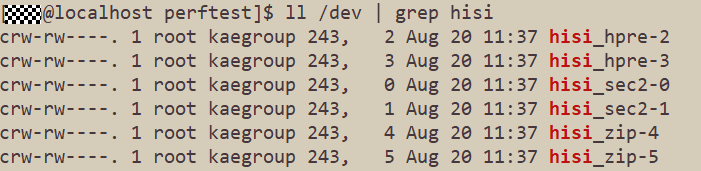

3. Run the performance test command again.

    ```shell
    ./kaezip_perf -m 8 -l 10240 -n 1000
    ```

    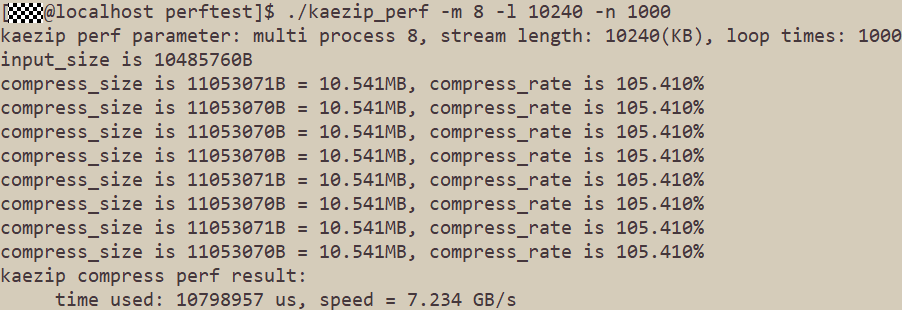

### Dynamic Libraries Not Found When Checking Whether Accelerators of the zlib Library Take Effect

**Symptom<a name="en-us_topic_0000002270146217_en-us_topic_0000001925948013_en-us_topic_0000001742708945_section13982317239"></a>**

After KAE is installed using the source code, when you run the **ldd /usr/local/kaezip/lib/libz.so.1.2.11** command to check whether the zlib acceleration library is linked to the dynamic library, an error message is displayed, indicating that libraries such as **libkaezip.so** and **libwd.so.2** are not found.

**Key Process and Cause Analysis<a name="en-us_topic_0000002270146217_en-us_topic_0000001925948013_en-us_topic_0000001742708945_section31242048897"></a>**

None

**Conclusion and Solution<a name="en-us_topic_0000002270146217_en-us_topic_0000001925948013_section1511044274711"></a>**

1. Modify the **ld.so.conf** file.

    ```shell
    vi /etc/ld.so.conf
    ```

2. Add the following content to the end of the file:

    ```text
    /usr/local/lib
    /usr/local/kaezip/lib
    ```

3. Make the configuration take effect.

    ```shell
    ldconfig
    ```

    Check whether the zlib library is successfully linked to the dynamic library.

### "gzip header append\_info\_sz is 0" Displayed When KAEzip Is Used for Decompression in BiSheng JDK

**Symptom<a name="en-us_topic_0000002270146249_en-us_topic_0000001925948013_en-us_topic_0000001742708945_section13982317239"></a>**

Scenario: The KAEzip feature is used to decompress the file generated after a zero-byte array is compressed in BiSheng JDK.

Prerequisites: BiSheng JDK 8u422 or later and KAE earlier than 2.0.3 have been deployed in the environment.

Procedure: Compress a zero-byte array by following the instructions in the [KAEzip User Guide](https://atomgit.com/openeuler/bishengjdk-8/wiki/KAE_ZIP_%E7%94%A8%E6%88%B7%E4%BD%BF%E7%94%A8%E6%8C%87%E5%AF%BC.md), and run the **jjava -DGZIP\_USE\_KAE=true** *test_file* command to decompress the compressed file. The message "gzip header append\_info\_sz is 0" is displayed, as shown in the following figure.

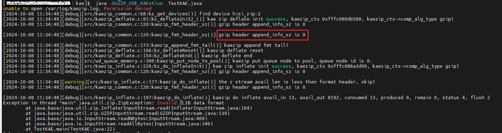

**Key Process and Cause Analysis<a name="en-us_topic_0000002270146249_en-us_topic_0000001925948013_en-us_topic_0000001742708945_section31242048897"></a>**

The format of the file compressed by KAEzip is different from that of the Gzip file. As a result, the file cannot be correctly decompressed.

**Conclusion and Solution<a name="en-ustopic_0000002270146249_en-us_topic_0000001925948013_section1511044274711"></a>**

This issue has been resolved in the latest KAE version. Obtain the latest version from the following link, install it, and execute the test case again.

Obtain the latest KAE version from [here](https://gitcode.com/boostkit/KAE).

### KAEGzip's Processing Logic on the Length Field at the Tail of a File

**Symptom<a name="en-us_topic_0000002235067006_en-us_topic_0000001925948013_en-us_topic_0000001742708945_section13982317239"></a>**

After the length field at the tail of a Gzip file is tampered with, the Gzip tool reports an error. However, KAEGzip can decompress the file correctly.


For the **test.gz** file, the length field at its tail is changed from **05 00 00 00** to **02 00 00 00**.

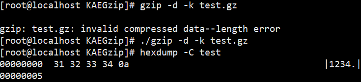

The Gzip tool reports an error due to this change. On the contrary, KAEGzip decompresses the correct original data that complies with standards.

**Cause Analysis and Description<a name="en-us_topic_0000002235067006_en-us_topic_0000001925948013_en-us_topic_0000001742708945_section31242048897"></a>**

The Gzip tool verifies the length field during decompression. However, the current hardware and driver cannot implement this function. KAEGzip uses different processing logic. For intact, core data segments that comply with standards, KAEGzip decompresses the correct original data.

### Abnormal Scenarios of Using KAEZlib Block Decompression APIs

The KAEZlib module provides some compression and decompression APIs compatible with the open-source zlib library, including the deflate and inflate APIs for stream processing and the compress and uncompress APIs for block processing.

When the uncompress API is called, the capacity of the destination buffer must be passed as a parameter. This means that the caller must ensure that the capacity of the destination buffer is greater than the amount of decompressed data. If the capacity of the destination buffer is insufficient, the decompression operation may trigger undefined behavior, causing unpredictable program running results.

Therefore, if the size of the original data is unknown, you are advised to use the stream decompression mode (inflate). If the block decompression API (uncompress) must be used, you must ensure a sufficient buffer capacity.
