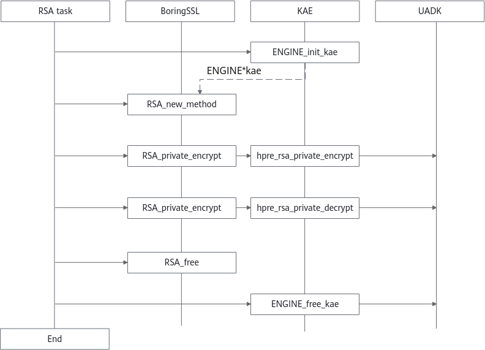

# User Guide

This document provides instructions on how to use the KAE encryption/decryption library and the KAE compression library. Before reading and performing the operations described in this document, ensure that KAE has been installed in the environment. For details about the installation steps, see [Installation Guide](./installation_guide.md).

## Using the KAE Encryption and Decryption Library

### Calling the KAE Encryption and Decryption Library Using the ENGINE\_by\_id Function

When you need to use the C language to invoke KAE, you can use the ENGINE\_by\_id function to obtain the KAE handle and then enable the corresponding algorithm. This section provides code for reference only. Modify the code as required.

```c
#include <stdio.h>
#include <stdlib.h>

/* OpenSSL headers */
#include <openssl/bio.h>
#include <openssl/ssl.h>
#include <openssl/err.h>
#include <openssl/engine.h>
 
int main(int argc, char **argv)
{
    /* Initializing OpenSSL */
    SSL_load_error_strings();
    ERR_load_BIO_strings();
    OpenSSL_add_all_algorithms();
    
    /*You can use ENGINE_by_id Function to get the handle of the Huawei Accelerator Engine*/
    ENGINE *e = ENGINE_by_id("kae");
    /*Enable the KAE asynchronization function. This function is optional. The value 0 indicates that this function is disabled, and the value 1 (default) indicates that this function is enabled.*/
    ENGINE_ctrl_cmd_string(e, "KAE_CMD_ENABLE_ASYNC", "1", 0);
    ENGINE_init(e);
    /*Specify the KAE for RSA-based encryption and decryption. If ENGINE_set_default_RSA(ENGINE *e) is used during initialization, e does not need to be passed.*/
    RSA *rsa = RSA_new_method(e);
    /*The user code*/
    ……
    
    ENGINE_free(e);
    
}
```

You can also specify KAE for the crypto algorithm during initialization (other algorithms do not require KAE). In this way, the code modification workload is reduced.

```c
int ENGINE_set_default_RSA(ENGINE *e); 
int ENGINE_set_default_DH(ENGINE *e);
int ENGINE_set_default_ciphers(ENGINE *e);
int ENGINE_set_default_digests(ENGINE *e);
int ENGINE_set_default(ENGINE *e, unsigned int flags);
```

For details about how to use the APIs, visit the [official OpenSSL website](https://www.openssl.org/docs/manpages.html).

### Calling the KAE Encryption and Decryption Library Using the OpenSSL/Tongsuo Configuration File openssl.cnf

To use the OpenSSL configuration file to invoke KAE, you need to add KAE-related configuration parameters to the **openssl.cnf** configuration file. Using KAE through the configuration file enables your applications to use the accelerator function with just a few modifications.

As shown below, the initialization API needs to be called only once.

```c
OPENSSL_init_crypto(OPENSSL_INIT_LOAD_CONFIG, NULL); // Load and initialize the configuration file.
```

> **NOTE**
>
>If Tongsuo is used for encryption and decryption, the configuration method is the same as that of OpenSSL.
>If you run the **openssl req -new -x509** command to generate a certificate, configure **openssl.cnf** by referring to Method 2 described in [Certificates Fail to Be Generated After Running openssl req -new -x509](./faq.md#en-us_topic_0000001217022681_section3941254).

Add the following configuration to **openssl.cnf**:

```ini
openssl_conf=openssl_def
[openssl_def]
engines=engine_section
[engine_section]
kae=kae_section
[kae_section]
engine_id=kae
#OpenSSL 1.1.1x
dynamic_path=/usr/local/lib/engines-1.1/kae.so
#For OpenSSL 3.0.x, use the following path:
#dynamic_path=/usr/local/lib/engines-3.0/kae.so
KAE_CMD_ENABLE_ASYNC=1
KAE_CMD_ENABLE_SM3=1
KAE_CMD_ENABLE_SM4=1
default_algorithms=ALL
init=1
```

> **NOTE**
>
>- **KAE\_CMD\_ENABLE\_ASYNC** is optional. The value **0** indicates that the asynchronization function is disabled, and the value **1** indicates that the asynchronization function is enabled. By default, the asynchronization function is enabled.
>- **KAE\_CMD\_ENABLE\_SM3** is optional. The value **0** indicates that the SM3 acceleration function is disabled, and the value **1** indicates that the SM3 acceleration function is enabled. By default, the SM3 acceleration function is enabled.
>- **KAE\_CMD\_ENABLE\_SM4** is optional. The value **0** indicates that the SM4 acceleration function is disabled, and the value **1** indicates that the SM4 acceleration function is enabled. By default, the SM4 acceleration function is enabled.
>- **default\_algorithms=ALL** indicates that all algorithms preferentially search for KAE. If the engine does not support the algorithm, switch to OpenSSL for computing.

Set the **OPENSSL\_CONF** environment variable.

```shell
export OPENSSL_CONF=/home/app/openssl.cnf  #Path for storing the **openssl.cnf** file
```

The following is an example of using the OpenSSL configuration file:

```c
#include <stdio.h> 
#include <stdlib.h> 
 
/* OpenSSL headers */ 
#include <openssl/bio.h> 
#include <openssl/err.h> 
#include <openssl/engine.h> 
int main(int argc, char **argv) 
{ 
    /* Initializing OpenSSL */  

    ERR_load_BIO_strings(); 
    /* Load openssl configure */
    OPENSSL_init_crypto(OPENSSL_INIT_LOAD_CONFIG, NULL);
    ENGINE *e = ENGINE_by_id("kae");
    /*Specify the KAE for RSA-based encryption and decryption. If ENGINE_set_default_RSA(ENGINE *e) is used during initialization, e does not need to be passed.*/
    RSA *rsa = RSA_new_method(e);
    /*The user code*/ 
    …… 

    ENGINE_free(e);
    
}
```

### Calling the KAE Encryption and Decryption Library Using BoringSSL

KAE supports invocation via BoringSSL. However, the engine mechanism of BoringSSL does not allow KAE to be called by setting environment variables like OPENSSL_ENGINES. Therefore, KAE provides external interfaces: `ENGINE_init_kae` and `ENGINE_free_kae`. Two methods are available for calling KAE from BoringSSL. Method 1: Invoke the APIs within the service code. Method 2: Modify the BoringSSL source code to integrate the relevant patches. This section describes the invocation prerequisites, principles, and examples for both solutions in detail.

#### Prerequisites

Before using BoringSSL to call KAE, you need to install KAE, compile BoringSSL, and select a calling method.

1. Compile and install KAEOpensslEngine. The BoringSSL source code path is required.

   ```shell
   sh build.sh engine_boringssl /opt/boringssl
   ```

2. Download the [BoringSSL source package](https://github.com/google/boringssl/releases). Copy the BoringSSL source package to a custom directory (for example, **/opt/boringssl**) and decompress the package.

3. Compile and install BoringSSL.

    By default, BoringSSL is compiled in debug mode. To compile BoringSSL in release mode, add **-DCMAKE\_BUILD\_TYPE=Release**.

    ```shell
    cmake -DCMAKE_BUILD_TYPE=Release  -B build -DBUILD_SHARED_LIBS=1
    make -C build -j
    cd build
    make install
    ```

4. Check whether the installation is successful.

    After the installation using **make install** is complete, the **install** directory is generated in the BoringSSL source code path. Check the files in the **install** directory.

    ```shell
    ll /opt/boringssl/install/
    ```

    If the following information is displayed, the installation is successful:

    ```text
    total 16
    drwxr-xr-x. 3 root root 4096 Apr  8 11:41 bin
    drwxr-xr-x. 3 root root 4096 Apr  8 09:14 include
    drwxr-xr-x. 3 root root 4096 Apr  8 09:14 lib
    drwxr-xr-x. 2 root root 4096 Apr  8 09:14 lib64
    ```

#### Method 1: Calling APIs in Service Code

**Principles**

This method does not require BoringSSL recompilation, but you may need to modify the existing BoringSSL service code.

The compatibility of RSA private key encryption and decryption APIs is as follows:

- RSA\_new\(\): KAE cannot be called.
- RSA\_new\_method\(\): KAE can be called when it is passed as an input parameter.

Before encryption, call ENGINE\_init\_kae to initiate KAE and pass KAE as an input parameter of RSA\_new\_method. Then, call KAE for private/public key encryption. After the task is complete, call ENGINE\_free\_kae to release KAE resources. [**Figure 1**](#BoringSSL-calling-KAE-through-APIs) shows the principles.

**Figure 1** BoringSSL calling KAE through APIs<a name="en-us_topic_0000002332729981_fig571210343319"></a><a id="BoringSSL-calling-KAE-through-APIs"></a>



**Prerequisites**

The KAE header file and dynamic library need to be linked during service code compilation.

- Header file: **/usr/local/boringssl/include/kae\_bssl.h**
- Dynamic library: **/usr/local/boringssl/lib/engines-1.1/kae\_bssl.so**

**Example**

For details, see the **testsuit\_rsa.cpp** file, which provides the sample code for calling KAE through APIs ENGINE\_init\_kae and ENGINE\_free\_kae. The file path is **KAEOpensslEngine/test/bssl\_test/src/rsa/**. The procedure is as follows:

1. Set the lookup paths for the KAE and BoringSSL dynamic libraries.

    ```shell
    export LD_LIBRARY_PATH=/usr/local/boringssl/lib/engines-1.1:/opt/boringssl/install/lib64
    ```

2. Go to the Makefile path and open the Makefile script.

    ```shell
    cd KAE/KAEOpensslEngine/test/bssl_test/src
    vi Makefile
    ```

3. Press **i** to enter the insert mode, and set **-I** in line 26 to the BoringSSL header file path and **-L** in line 28 to the BoringSSL dynamic library path.

    Press **Esc**, type **:wq!**, and press **Enter** to save the file and exit.

4. Go to the test script path and run **build.sh**. The script will automatically compile the **testsuit\_rsa.cpp** file.

    ```shell
    cd ../
    sh build.sh
    ```

5. Run the test case.

    ```shell
    cd src
    ./kaedemo
    ```

#### Method 2: Modifying the BoringSSL Source Code and Applying a Patch

**Principles**

Modify BoringSSL source code and apply a patch to enable the RSA algorithm of BoringSSL to use KAE by default for encryption and decryption. **bssl\_add\_kae\_support.patch** has been provided for BoringSSL 0.20250311.0. The patch is not compatible with other BoringSSL versions due to source code differences. If you use another BoringSSL version, you can adapt the patch based on BoringSSL source code, which requires minor modification effort.

This method requires no modifications to existing service code. However, BoringSSL has a strong dependency on the KAE dynamic library.

The compatibility of RSA private key encryption and decryption APIs is as follows:

- RSA\_new\(\): KAE is used by default.
- RSA\_new\_method\(\): KAE can be called when it is passed as an input parameter.

**Prerequisites**

The KAE header file and dynamic library need to be linked during service code compilation.

- **bssl\_add\_kae\_support.patch** provided by KAE applies only to BoringSSL 0.20250311.0. If BoringSSL of another version is used, modify the patch and then apply it. The modification points are described in detail in the patch, which requires only minor effort. (Plus signs (+) in the patch file indicate new content, and minus signs (-) indicate the content to be deleted. You can refer to the context to locate the modifications.)
- Header file: **/usr/local/boringssl/include/kae\_bssl.h**
- Dynamic library: **/usr/local/boringssl/lib/engines-1.1/kae\_bssl.so**

1. Download the BoringSSL source code again.
2. Copy the **bssl\_add\_kae\_support.patch** file to a new BoringSSL source code directory of the same level. The file path is **KAEOpensslEngine/patch/bssl\_add\_kae\_support.patch**.
3. Run the **cd** command to go to the BoringSSL source code directory.
4. Apply the **bssl\_add\_kae\_support.patch** file.

    ```shell
    patch -Np1 < ../bssl_add_kae_support.patch
    ```

5. Build the BoringSSL source code with **-DENABLE\_KAE=ON**.

    ```shell
    cmake -DENABLE_KAE=ON -DCMAKE_BUILD_TYPE=Release  -B build -DBUILD_SHARED_LIBS=1
    ```

6. Perform compilation and installation.

    ```shell
    make -C build -j
    cd build
    make install
    ```

**Example**

After BoringSSL is compiled and installed, run the **bssl** command to perform a performance test. The command is in the **install/bin** directory of BoringSSL source code. **Table 1** describes the parameters of the **bssl** command(#bssl-command-parameters).

**Table 1** bssl command parameters<a id="bssl-command-parameters"></a>

|Parameter|Description|
|--|--|
|-filter|Selects an algorithm.|
|-timeout|Specifies the test item running time.|

The following describes how to use **bssl speed** to perform performance tests. Compare the signing performance results of **bssl** with and without KAE.

- Without KAE: BoringSSL before the patch is applied
    1. Set the path to the KAE and BoringSSL dynamic libraries.

        ```shell
        export LD_LIBRARY_PATH=/opt/boringssl/install/lib64
        ```

    2. Go to the **bssl** command path and run the test command.

        ```shell
        cd /opt/boringssl/install/bin
        ./bssl speed -filter RSA -timeout 6
        ```

        Command output:

        ```text
        Did 4823 RSA 2048 signing operations in 6019561us (801.2 ops/sec)
        Did 202000 RSA 2048 verify (same key) operations in 6010664us (33606.9 ops/sec)
        Did 173000 RSA 2048 verify (fresh key) operations in 6005633us (28806.3 ops/sec)
        Did 28148 RSA 2048 private key parse operations in 6000050us (4691.3 ops/sec)
        Did 1650 RSA 3072 signing operations in 6006562us (274.7 ops/sec)
        Did 95000 RSA 3072 verify (same key) operations in 6010544us (15805.6 ops/sec)
        Did 85000 RSA 3072 verify (fresh key) operations in 6022383us (14114.0 ops/sec)
        Did 14204 RSA 3072 private key parse operations in 6050679us (2347.5 ops/sec)
        Did 750 RSA 4096 signing operations in 6039070us (124.2 ops/sec)
        Did 54808 RSA 4096 verify (same key) operations in 6075612us (9021.0 ops/sec)
        Did 49600 RSA 4096 verify (fresh key) operations in 6001654us (8264.4 ops/sec)
        Did 10004 RSA 4096 private key parse operations in 6073923us (1647.0 ops/sec)
        ```

        The RSA algorithm of BoringSSL before the patch is applied is used. The RSA 2048 signing performance is 801.2 ops/sec, the RSA 3072 signing performance is 274.7 ops/sec, and the RSA 4096 signing performance is 124.2 ops/sec.

- With KAE: BoringSSL after the patch is applied
    1. Set the path to the KAE and BoringSSL (with the patch applied) dynamic libraries.

        ```shell
        export LD_LIBRARY_PATH=/usr/local/boringssl/lib/engines-1.1:/opt/patch/boringssl/install/lib64
        ```

    2. Go to the **bssl** command path and run the test command.

        ```shell
        cd /opt/patch/boringssl/install/bin
        ./bssl speed -filter RSA -timeout 6
        ```

        Command output:

        ```text
        Did 19536 RSA 2048 signing operations in 6020015us (3245.2 ops/sec)
        Did 202000 RSA 2048 verify (same key) operations in 6022999us (33538.1 ops/sec)
        Did 171250 RSA 2048 verify (fresh key) operations in 6020358us (28445.2 ops/sec)
        Did 32760 RSA 2048 private key parse operations in 6083206us (5385.3 ops/sec)
        Did 7215 RSA 3072 signing operations in 6035497us (1195.4 ops/sec)
        Did 95000 RSA 3072 verify (same key) operations in 6013634us (15797.4 ops/sec)
        Did 85625 RSA 3072 verify (fresh key) operations in 6033388us (14191.9 ops/sec)
        Did 14410 RSA 3072 private key parse operations in 6108017us (2359.2 ops/sec)
        Did 3268 RSA 4096 signing operations in 6030206us (541.9 ops/sec)
        Did 54303 RSA 4096 verify (same key) operations in 6016396us (9025.8 ops/sec)
        Did 49749 RSA 4096 verify (fresh key) operations in 6018416us (8266.1 ops/sec)
        Did 9072 RSA 4096 private key parse operations in 6080936us (1491.9 ops/sec)
        ```

        After the patch is applied to BoringSSL, the RSA 2048 signing performance is 3245.2 ops/sec, the RSA 3072 signing performance is 1195.4 ops/sec, and the RSA 4096 signing performance is 541.9 ops/sec. The RSA performance is significantly improved.

## Using the KAE Compression Library

### Calling the KAEZlib Library

This section provides methods of using the KAEZlib compression library in distributed storage scenarios.

You can use either of the following methods to link the zlib compression library to the application layer:

- Specify the runtime loading path of **libz.so** during application compilation. Use the following compilation options for linking:

    ```shell
    -Wl,-rpath=/usr/local/kaezip/lib
    ```

    **/usr/local/kaezip/lib** is an example path of the newly installed zlib library.

- Set the environment variable.

    ```shell
    export LD_LIBRARY_PATH=/usr/local/kaezip/lib:$LD_LIBRARY_PATH
    ```

For details about how to use the asynchronous APIs of KAEZlib, see [README_EN](../../KAEZlib/README_EN.md) in the KAEZlib directory.

### Calling the KAEZstd Library

The section provides methods of using the KAEZstd compression library.

- Use KAEZstd by calling the compression library.

    You can use either of the following methods to link the KAEZstd compression library to the application layer:

    - Specify the runtime loading path of **libkaezstd.so** during application compilation. Use the following compilation options for linking:

        ```shell
        -Wl,-rpath=/usr/local/kaezstd/lib
        ```

    - Set the environment variable.

        ```shell
        export LD_LIBRARY_PATH=/usr/local/kaezstd/lib:$LD_LIBRARY_PATH
        ```

- Use KAEZstd by executing its binary file.

    You can directly use **/usr/local/kaezstd/bin/zstd** for decompression.

    - Set the environment variable.

        ```shell
        export LD_LIBRARY_PATH=/usr/local/kaezstd/lib:$LD_LIBRARY_PATH
        ```

    - Use the application to compress a file.

        ```shell
        /usr/local/kaezstd/bin/zstd -f filename -o compressed_file
        ```

    - Use the application to decompress the compressed file.

        ```shell
        /usr/local/kaezstd/bin/zstd -d -f compressed_file -o decompressed_file
        ```

### Calling the KAELz4 Library

**Using Synchronous APIs<a name="section47033483288"></a>**

This section describes how to use synchronous APIs of the KAELz4 library.

- Use KAELz4 by calling the compression library.

    You can use either of the following methods to link the KAELz4 compression library to the application layer:

    - Specify the runtime loading path of **libkaelz4.so** during application compilation. Use the following compilation options for linking:

        ```shell
        -Wl,-rpath=/usr/local/kaelz4/lib
        ```

    - Set the environment variable.

        ```shell
        export LD_LIBRARY_PATH=/usr/local/kaelz4/lib:$LD_LIBRARY_PATH
        ```

- Use KAELz4 by executing its binary file.

    You can directly use **/usr/local/kaelz4/bin/lz4** for decompression.

    - Set the environment variable.

        ```shell
        export LD_LIBRARY_PATH=/usr/local/kaelz4/lib:$LD_LIBRARY_PATH
        ```

    - Use the application to compress a file.

        ```shell
        /usr/local/kaelz4/bin/lz4 filename compressed_file
        ```

    - Use the application to decompress the compressed file.

        ```shell
        /usr/local/kaelz4/bin/lz4 -d compressed_file decompressed_file
        ```

**Using Asynchronous APIs<a name="section115671214297"></a>**

This section describes how to use asynchronous APIs of the KAELz4 library.

KAELz4 asynchronous APIs support both polling and non-polling modes. In polling mode, the user thread needs to call related APIs to retrieve compressed data. In non-polling mode, data is compressed asynchronously, with the compression results returned through a callback function. KAELz4 asynchronous APIs support three compression formats: block, frame, and lz77\_raw. The block and frame formats are compatible with the standard LZ4 block and frame formats. The lz77\_raw format needs to be converted to a standard block or frame format using a post-processing API.

A code sample is provided below for frame format compression in non-polling mode. For details about the APIs and usage examples, see [README_EN of the KAELz4 open-source repository](https://gitcode.com/boostkit/KAE/blob/kae2/KAELz4/README_EN.md).

1. Specify the paths to **libkaelz4.so** and the KAELz4 asynchronous header file during application compilation. Use the following compilation options for linking:

    ```shell
    -I/usr/local/kaelz4/include -L/usr/local/kaelz4/lib -llz4
    ```

    Set the environment variable.

    ```shell
    export LD_LIBRARY_PATH=/usr/local/kaelz4/lib:$LD_LIBRARY_PATH
    export C_INCLUDE_PATH=/usr/local/kaelz4/include:$C_INCLUDE_PATH
    ```

2. Use the asynchronous APIs to compile the compression code **main.c**. Refer to the code sample below for the implementation of frame format compression.

    ```c
    #include <stdio.h>
    #include <stdlib.h>
    #include <string.h>
    #include <time.h>
    #include <lz4.h>
    #include <lz4frame.h>
    #include <unistd.h>
    #include <sys/stat.h>
    int g_has_done = 0; // Indicates whether the asynchronous callback is complete. The value needs to be initialized to 0.
    int g_test_file = 0; // Indicates whether to use file-based testing.
    struct my_custom_data {
        void *src;
        void *dst;
        void *src_decompd;
        size_t src_len;
        size_t dst_len;
        size_t src_decompd_len;
    };
    // Generate 256-KB random data.
    static void generate_random_data(void *data, size_t size) {
        unsigned char *bytes = (unsigned char *)data;
        for (size_t i = 0; i < size; i++) {
            bytes[i] = rand() % 256;  // Generates random bytes.
        }
    }
    static size_t read_inputFile(const char* fileName, void** input)
    {
        FILE* sourceFile = fopen(fileName, "r");
        if (sourceFile == NULL) {
            fprintf(stderr, "%s not exist!\n", fileName);
            return 0;
        }
        int fd = fileno(sourceFile);
        struct stat fs;
        (void)fstat(fd, &fs);
        size_t input_size = fs.st_size;
        *input = malloc(input_size);
        if (*input == NULL) {
            return 0;
        }
        (void)fread(*input, 1, input_size, sourceFile);
        fclose(sourceFile);
        return input_size;
    }
    void compression_callback(struct kaelz4_result *result) {
        if (result->status != 0) {
            printf("Compression failed with status: %d\n", result->status);
            return;
        }
        // Obtain compressed data from the callback.
        struct my_custom_data *my_data = (struct my_custom_data *)result->user_data;
        void *compressed_data = my_data->dst;
        size_t compressed_size = result->dst_len;
        my_data->dst_len = compressed_size;
        // Decompress data using LZ4.
        size_t tmp_src_len = result->src_size * 10;
        // Allocate memory for decompressed data.
        void *dst_buffer = malloc(tmp_src_len);
        if (!dst_buffer) {
            printf("Memory allocation failed for decompressed data.\n");
            return;
        }
        LZ4F_decompressionContext_t dctx;
        LZ4F_createDecompressionContext(&dctx, 100);
        int ret = LZ4F_decompress(dctx, dst_buffer, &tmp_src_len,
                                                compressed_data, &compressed_size, NULL);
        if (ret < 0) {
            printf("Decompression failed with error code: %d\n", ret);
            free(dst_buffer);
            return;
        }
        my_data->src_decompd = dst_buffer;
        my_data->src_decompd_len = tmp_src_len;
        if (my_data->src_decompd_len != my_data->src_len) {
            printf("Test Error: The length after decompression is different from the original length. result->src_size=%ld   Original length=%ld   Length after decompression=%ld \n",
                result->src_size,
                my_data->src_len,
                my_data->src_decompd_len);
        }
        // Compare the decompressed data with the original data.
        if (memcmp(my_data->src_decompd, my_data->src, result->src_size) == 0) {
            printf("Test Success.\n");
        } else {
            printf("Test Error:Decompressed data does not match the original data.\n");
        }
        // Release decompressed data.
        free(dst_buffer);
        g_has_done = 1;
    }
    static int test_async_frame_with_perferences(int contentChecksumFlag, int blockChecksumFlag, int contentSizeFlag)
    {
        g_has_done = 0;
        size_t src_len = 258 * 1024;  // 256KB
        void *inbuf = malloc(src_len);
        if (!inbuf) {
            printf("Memory allocation failed for input data.\n");
            return -1;
        }
        // Generate random data.
        generate_random_data(inbuf, src_len);
        if (g_test_file) {
            src_len = read_inputFile("../../../scripts/compressTestDataset/x-ray", &inbuf);
        }
        // Allocate memory for compressed data.
        size_t compressed_size = LZ4F_compressBound(src_len, NULL);
        void *compressed_data = malloc(compressed_size);
        if (!compressed_data) {
            printf("Memory allocation failed for compressed data.\n");
            free(inbuf);
            return -1;
        }
        // Initialize LZ4F compression parameters.
        LZ4F_preferences_t preferences = {0};
        preferences.frameInfo.blockSizeID = LZ4F_max64KB;  // Sets the block size.
        if (contentChecksumFlag) {
            preferences.frameInfo.contentChecksumFlag = LZ4F_contentChecksumEnabled;
        }
        if (blockChecksumFlag) {
            preferences.frameInfo.blockChecksumFlag = LZ4F_blockChecksumEnabled;
        }
        if (contentSizeFlag) {
            preferences.frameInfo.contentSize = src_len;
        }
        // Perform asynchronous compression.
        struct kaelz4_result result = {0};
        struct my_custom_data mydata = {0};
        mydata.src = inbuf;
        mydata.src_len = src_len;
        mydata.dst = compressed_data;
        result.user_data = &mydata;
        result.src_size = src_len;
        result.dst_len = compressed_size;
        LZ4_async_compress_init();
        int compression_status = LZ4F_compressFrame_async(inbuf, compressed_data,
                                                          compression_callback, &result, &preferences);
        if (compression_status != 0) {
            printf("Compression failed with error code: %d\n", compression_status);
            free(inbuf);
            free(compressed_data);
            return -1;
        }
        while (g_has_done != 1) {
            usleep(100);
        }
        LZ4_teardown_async_compress();
        return compression_status;
    }
    int main()
    {
        return test_async_frame_with_perferences(1, 1, 1);
    }
    ```

3. Compile and run the code.

    ```shell
    gcc main.c -I/usr/local/kaelz4/include -L/usr/local/kaelz4/lib -llz4 -o kaelz4_frame_async_test
    ./kaelz4_frame_async_test
    ```

    Command output:

    ```text
    Test Success.
    ```

### Calling the KAESnappy Library

This section describes how to call the KAESnappy library using the compression library.

You can use either of the following methods to link the KAESnappy compression library to the application layer:

- Specify the runtime loading path of **libkaesnappy.so** during application compilation. Use the following compilation options for linking:

    ```shell
    -Wl,-rpath=/usr/local/kaesnappy/lib
    ```

- Set the environment variable.

    ```shell
    export LD_LIBRARY_PATH=/usr/local/kaesnappy/lib:$LD_LIBRARY_PATH
    ```

## Maintenance

### Querying KAE Logs

This section describes how to query logs so that you can accurately locate and analyze the root cause of a fault.

[Table 1](#log-information) describes the KAE log information.

**Table 1** Log information<a id="log-information"></a>

|Directory|File|Description|
|--|--|--|
|/var/log/|kae.log|The default level of OpenSSL engine logs is "error".<br>To set the log level, take the following steps: Set the environment variable: `export KAE_CONF_ENV=/var/log/`. Create the **kae.cnf** file in **/var/log/**. In the **kae.cnf** file, set the following content: `[LogSection]debug_level=error`<br>The value of **debug_level** can be **none**, **error**, **info**, **warning**, or **debug**. You should not enable the **info** or **debug** log level. If such log level is set, the accelerator performance will deteriorate.|
|/var/log/|kaezip.log|By default, KAEZlib library logs are not printed.<br>To set the log level, take the following steps: Set the environment variable: `export KAEZIP_CONF_ENV=/var/log/`. Create the **kaezip.cnf** file in **/var/log/**. In the **kaezip.cnf** file, set the following content: `[LogSection]debug_level=error`<br>The value of **debug_level** can be **none**, **error**, **info**, **warning**, or **debug**. You should not enable the **info** or **debug** log level. If such log level is set, the accelerator performance will deteriorate.|
|/var/log/|kaezstd.log|By default, KAEZstd library logs are not printed.<br>To set the log level, take the following steps: Set the environment variable: `export KAEZSTD_CONF_ENV=/var/log/`. Create the **kaezstd.cnf** file in **/var/log/**. In the **kaezstd.cnf** file, set the following content: `[LogSection]debug_level=error`<br>The value of **debug_level** can be **none**, **error**, **info**, **warning**, or **debug**. You should not enable the **info** or **debug** log level. If such log level is set, the accelerator performance will deteriorate.|
|/var/log/|kaelz4.log|By default, KAELz4 library logs are not printed.<br>To set the log level, take the following steps: Set the environment variable: `export KAELZ4_CONF_ENV=/var/log/`. Create the **kae.cnf** file in **kaelz4.cnf**. In the **kaelz4.cnf** file, set the following content: `[LogSection]debug_level=error`<br>The value of **debug_level** can be **none**, **error**, **info**, **warning**, or **debug**. In normal cases, you should not enable the **info** or **debug** log level. If such log level is set, the accelerator performance will deteriorate.|
|/var/log/|kaesnappy.log|By default, KAESnappy library logs are not printed.<br>To set the log level, take the following steps: Set the environment variable: `export KAESNAPPY_CONF_ENV=/var/log/`. Create the **kaesnappy.cnf** file in **/var/log/**. In the **kaesnappy.cnf** file, set the following content: `[LogSection]debug_level=error`<br>The value of **debug_level** can be **none**, **error**, **info**, **warning**, or **debug**. In normal cases, you should not enable the **info** or **debug** log level. If such log level is set, the accelerator performance will deteriorate.|
|/var/log/|message/syslog|Kernel logs of OSs such as CentOS, SUSE, and EulerOS are stored in the **/var/log/message** directory. Kernel logs of OSs such as Ubuntu are stored in the **/var/log/syslog** directory. Alternatively, you can run the **dmesg > /var/log/dmesg.log** command to collect driver and kernel logs.|
