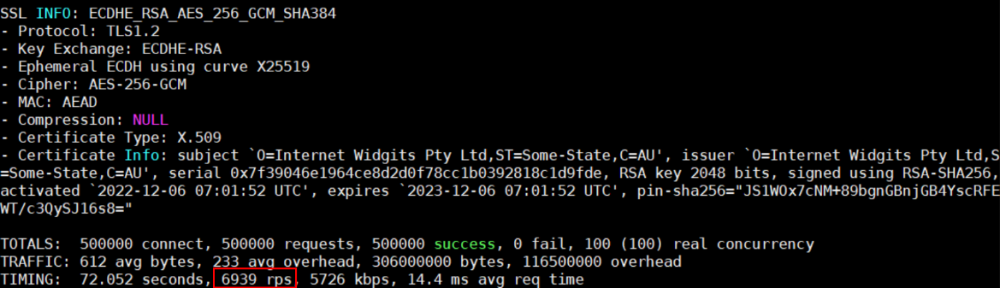
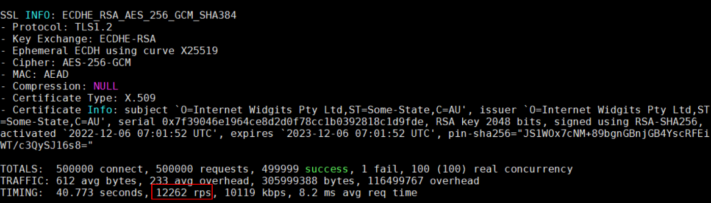
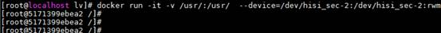

# 最佳实践

## 简介

本文档提供了鲲鹏加速引擎（KAE）加解密模块、压缩模块和一些场景化使用示例，旨在帮助用户实现在具体场景中正确快速地调用KAE。

部分算法在使用过程中的限制如下所示：

- 如果用户未购买KAE加速引擎许可证，建议用户不要通过KAE加速引擎调用相应算法，否则会影响OpenSSL加密算法的性能。
- SM4-XTS模式仅支持内核态使用，具体使用方法请参见[使用KAE提升SM4-XTS算法性能](#使用kae提升sm4-xts算法性能)。
- SM4同步性能在小包场景下（包长小于2K）性能比异步性能更优。如果使用场景多为小包场景，推荐使用同步模型。
- AES已在aarch64平台上实现软件指令集加速，硬件加速在中包或大包场景下（包长16K\~256K）异步性能相比OpenSSL才具明显优势，推荐在该场景下使用硬加速。
- SM4、AES异步模式支持数据长度为256KB及以下，数据长度大于256KB将自动切换同步模式。
- MD5算法无法防止碰撞攻击，不适用于安全性认证，如SSL公开密钥认证或数字签名等用途。
- SM3/SM4算法默认开启，用户可以通过openssl.cnf文件开启或关闭这两种算法。
- 压缩解压算法支持Zlib/Gzip、ZSTD、LZ4及Snappy。

## 加解密库

### KAE加速Nginx应用

本节提供Web场景下KAE如何使能Nginx加速的使用案例和方法。

**环境要求<a name="section1880691084819"></a>**

本案例验证的环境如[**表 1** 硬件要求](#硬件要求)和[**表 2** 操作系统与软件要求](#操作系统与软件要求)所示，其他版本的Nginx、OS也可参考本节内容验证。

**表 1** 硬件要求<a id="硬件要求"></a>

|项目|说明|
|--|--|
|CPU|鲲鹏920 7260处理器|

**表 2** 操作系统与软件要求<a id="操作系统与软件要求"></a>

|项目|版本|
|--|--|
|OS|openEuler 20.03 LTS SP1/SP2|
|Nginx|1.14.2|
|OpenSSL|1.1.1x/3.0.12|
|httpress|1.1.0|

**前提条件<a name="section2031774312223"></a>**

1. 请参见《[Nginx 移植指南](https://www.hikunpeng.com/document/detail/zh/kunpengwebs/ecosystemEnable/Nginx/kunpengnginx_02_0001.html)》使用源码编译方式安装Nginx，并完成Nginx的HTTPS功能的配置。

    > **说明：**
    >不同算法套件测试得到的性能数据存在差异，您需要根据实际情况进行算法套件的配置，若算法套件中某算法KAE不支持，则调用OpenSSL软算接口。

2. 请参见《[httpress 测试指导](https://www.hikunpeng.com/document/detail/zh/kunpengwebs/testguide/tstg/kunpenghttpress_06_0001.html)》使用源码编译方式安装并验证httpress。

**使用软算测试Nginx的性能<a name="section11318543102210"></a>**

1. 启动Nginx。

    ```shell
    /usr/local/nginx/sbin/nginx -c /usr/local/nginx/conf/nginx.conf
    ps -ef | grep nginx
    ```

2. 以50万个请求，100个并发连接数，100个线程为例测试软算性能，即未使用KAE加速器时的性能数据。

    ```shell
    ./httpress -n 500000 -c 100 -t 100 https://127.0.0.1:20000/index.html
    ```

    

**使用硬算测试Nginx的性能<a name="section183186437221"></a>**

1. 请参见《[安装指南](installation_guide.md)》完成KAE的安装和验证。
2. 关闭Nginx。

    ```shell
    /usr/local/nginx/sbin/nginx -s quit
    ps -ef | grep nginx
    ```

3. 请参见《用户指南》中的“[通过OpenSSL/Tongsuo配置文件openssl.cnf使用KAE](./user_guide.md#通过openssltongsuo配置文件opensslcnf调用kae加解密库)”章节确保OpenSSL能够通过OPENSSL\_CONF调用配置文件，识别到KAE。
4. 启动Nginx。

    ```shell
    /usr/local/nginx/sbin/nginx -c /usr/local/nginx/conf/nginx.conf
    ps -ef | grep nginx
    ```

5. 以50万个请求，100个并发连接数，100个线程为例测试硬算性能，即使用KAE加速器时的性能数据。

    ```shell
    ./httpress -n 500000 -c 100 -t 100 https://127.0.0.1:20000/index.html
    ```

    

    在测试的同时，重新开启一个终端窗口，执行**cat /sys/class/uacce/hisi\_hpre-\*/attrs/available\_instances**命令，可以看到显示结果从256变为255，说明已经消耗掉了一个硬算队列，测试执行完后数值恢复到256，说明KAE加速器已经生效。

    若KAE加速器已生效即在硬算使能情况下，性能数据无明显提高，并且available\_instances值未变化，请检查前面的步骤是否正确，若Nginx和KAE各自验证正常，可能是OPENSSL\_CONF配置文件不正确，或者权限不正确，若不能处理，请联系华为工程师。

**数据对比<a name="section1632969175612"></a>**

从以上测试结果来看，软算测试性能为6939 rps，即每秒请求数为6939个；硬算测试性能为12262 rps，即每秒请求数为12262个。可以发现使用KAE加速后，性能有明显提升。

> **说明：**
>
>- 不同算法套件测试得到的性能数据存在差异，请以实际选择的算法套件测试结果为准。
>- 如果用到openssl req -new -x509命令生成证书功能，请参见[使用openssl req -new -x509命令生成证书失败](./faq.md#使用openssl-req--new--x509命令生成证书失败)中的方法二完成openssl.cnf文件的配置。

### 使用KAE提升SM4-XTS算法性能

KAE支持对称加密算法SM4的XTS模式，用以提高算法能力。该模式仅支持内核态使用，具体使用方法是基于dm-crypt的透明分区/磁盘加密。

KAE2.0在4.19内核下仅支持用户态使用，不支持Linux内核crypto API中的加解密及压缩/解压缩接口、dm-crypt、SM4-XTS等内核态接口。因此，本章节不适用于KAE2.0在4.19内核下的用户态支持范围。

dm-crypt向上呈现为一个device mapper机制的target device，经过映射挂载后就可以作为透明加密分区/磁盘使用。

dm-crypt算法注册在crypto模块中，hisi\_sec2驱动安装后，SM4-XTS算法会注册到crypto模块中，使用LUKS（Linux Unified Key Setup，Linux统一密钥设置）进行配置即可实现硬件加解密。

一个加密盘操作要占用24个队列，当前加速器限制开放256\*2的队列数，如果需要操作更多数量的加密盘，需要先开启所有1024\*2的加速器队列。开启方法：修改/etc/modprobe.d/hisi\_sec2.conf配置文件中pf\_q\_num参数，重新加载驱动生效。

**环境要求<a name="section23981735101217"></a>**

- 已安装hisi\_sec2驱动，安装方法请参见《[安装指南](./installation_guide.md#安装指南)》。
- 为提升SM4-XTS算法性能，请将LUKS工具cryptsetup升级至2.2.0版本。

    操作系统自带cryptsetup软件可能无法正确使用SM4-XTS算法加密磁盘，需要进行升级，请下载cryptsetup-2.2.0源码到环境中，以EulerOS2.8为例，升级cryptsetup步骤如下。

    1. 依次安装cryptsetup-2.2.0的依赖包：libuuid-devel、device-mapper-devel、popt-devel、json-c-devel、libblkid-devel。

        ```shell
        yum install libuuid-devel
        yum install device-mapper-devel
        yum install popt-devel
        yum install json-c-devel
        yum install libblkid-devel
        ```

    2. 在“cryptsetup-2.2.0”源码目录下编译安装。

        ```shell
        ./configure
        make && make install
        ```

    其中libuuid-devel、device-mapper-devel、popt-devel、json-c-devel、libblkid-devel为cryptsetup依赖软件包。

**加密分区/磁盘<a name="section4178174054811"></a>**

1. 在系统根目录下生成keyfile文件。

    ```shell
    dd if=/dev/random of=/home/EncryptKeyFile bs=4k count=1
    ```

    显示结果为：

    ```text
    1+0 records in
    1+0 records out
    4096 bytes (4.1 kB, 4.0 KiB) copied, 7.635e-05 s, 23.6 MB/s
    ```

2. <a name="li123563427301"></a>加密分区/磁盘。

    ```shell
    cryptsetup --batch-mode --cipher sm4-xts-plain64 --key-size 256 --hash sha256 --sector-size=4096 --type=luks2 --key-file /home/EncryptKeyFile luksFormat /dev/sdb
    ```

3. 映射分区/磁盘。

    ```shell
    cryptsetup --key-file /home/EncryptKeyFile luksOpen /dev/sdb sx_disk
    ```

4. 查看分区/磁盘是否加密。

    ```shell
    lsblk
    ```

    显示crypt表明分区/磁盘已加密。

    ```text
    NAME           MAJ:MIN RM   SIZE RO TYPE  MOUNTPOINT
    loop0            7:0    0   5.5G  1 loop  /os_lhl
    sda              8:0    0   2.2T  0 disk
    ├─sda1           8:1    0     1G  0 part  /boot/efi
    └─sda2           8:2    0   2.2T  0 part
      ├─vg_os-swap 254:0    0    20G  0 lvm   [SWAP]
      └─vg_os-root 254:1    0   2.2T  0 lvm   /
    sdb              8:16   0 278.5G  0 disk
    └─sx_disk      254:2    0 278.5G  0 crypt
    ```

5. 格式化分区/磁盘。

    ```shell
    mkfs.xfs /dev/mapper/sx_disk
    ```

    显示结果为：

    ```text
    meta-data=/dev/mapper/sx_disk    isize=512    agcount=16, agsize=4562368 blks
             =                       sectsz=512   attr=2, projid32bit=1
             =                       crc=1        finobt=1, sparse=0, rmapbt=0, reflink=0
    data     =                       bsize=4096   blocks=72997376, imaxpct=25
             =                       sunit=64     swidth=64 blks
    naming   =version 2              bsize=4096   ascii-ci=0 ftype=1
    log      =internal log           bsize=4096   blocks=35648, version=2
             =                       sectsz=512   sunit=0 blks, lazy-count=1
    realtime =none                   extsz=4096   blocks=0, rtextents=0
    ```

6. 创建挂载点目录。

    ```shell
    mkdir /home/sec_test
    ```

7. 挂载分区/磁盘到目录。

    ```shell
    mount /dev/mapper/sx_disk /home/sec_test/
    df -h
    ```

    显示结果为：

    ```text
    Filesystem              Size  Used Avail Use% Mounted on
    devtmpfs                 63G     0   63G   0% /dev
    tmpfs                    63G     0   63G   0% /dev/shm
    tmpfs                    63G   28M   63G   1% /run
    tmpfs                    63G     0   63G   0% /sys/fs/cgroup
    /dev/mapper/vg_os-root  2.2T   18G  2.1T   1% /
    /dev/sda1              1022M  172K 1022M   1% /boot/efi
    tmpfs                    13G   20K   13G   1% /run/user/472
    tmpfs                    13G     0   13G   0% /run/user/0
    /dev/loop0              5.5G  5.5G     0 100% /os_lhl
    /dev/mapper/sx_disk     279G  317M  279G   1% /home/sec_test
    ```

8. 确认目录可正常访问。

    ```shell
    cd /home/sec_test/;ll
    ```

9. 在“/home/sec\_test”目录下查看分区/磁盘是否已加密，并且和目录是否正确对应。

    ```shell
    lsblk
    ```

    显示结果为：

    ```text
    NAME           MAJ:MIN RM   SIZE RO TYPE  MOUNTPOINT
    loop0            7:0    0   5.5G  1 loop  /os_lhl
    sda              8:0    0   2.2T  0 disk
    ├─sda1           8:1    0     1G  0 part  /boot/efi
    └─sda2           8:2    0   2.2T  0 part
      ├─vg_os-swap 254:0    0    20G  0 lvm   [SWAP]
      └─vg_os-root 254:1    0   2.2T  0 lvm   /
    sdb              8:16   0 278.5G  0 disk
    └─sx_disk      254:2    0 278.5G  0 crypt /home/sec_test
    ```

10. <a name="li3196911104520"></a>“/home”目录下查看分区/磁盘加密详细信息。

    ```shell
    cryptsetup status /dev/mapper/sx_disk
    ```

    显示结果如下：

    ```text
    /dev/mapper/sx_disk is active and is in use.
      type:    LUKS1
      cipher:  sm4-xts-plain64
      keysize: 256 bits
      key location: dm-crypt
      device:  /dev/sdb
      sector size:  512
      offset:  4096 sectors
      size:    583979008 sectors
      mode:    read/write
    ```

11. 执行[2](#li123563427301)到[10](#li3196911104520)，对多个分区/磁盘进行加密。

**删除加密的分区/磁盘<a name="section15565311498"></a>**

1. 卸载分区/磁盘的挂载目录。

    > **说明：**
    >执行指令前，用户必须先退出挂载目录。
    >当有多个分区/磁盘挂载时，需要多次执行该命令进行目录卸载。

    ```shell
    umount -l /home/sec_test
    ```

2. 执行**lsblk**命令，确认已卸载分区/磁盘的挂载目录。

    ```shell
    lsblk
    ```

    显示结果为：

    ```text
    NAME           MAJ:MIN RM   SIZE RO TYPE  MOUNTPOINT
    loop0            7:0    0   5.5G  1 loop  /os_lhl
    sda              8:0    0   2.2T  0 disk
    ├─sda1           8:1    0     1G  0 part  /boot/efi
    └─sda2           8:2    0   2.2T  0 part
      ├─vg_os-swap 254:0    0    20G  0 lvm   [SWAP]
      └─vg_os-root 254:1    0   2.2T  0 lvm   /
    sdb              8:16   0 278.5G  0 disk
    └─sx_disk      254:2    0 278.5G  0 crypt
    ```

3. 关闭映射（需要多次执行该命令关闭所有映射）。

    ```shell
    cryptsetup luksClose sx_disk
    ```

4. 查看映射是否关闭。

    ```shell
    ll /dev/mapper/
    ```

    显示结果如下：

    ```text
    total 0
    crw---- 1 root root 10, 236 Jul 31 22:27 control
    lrwxrwxrwx 1 root root       7 Jul 31 22:27 vg_os-root -> ../dm-1
    lrwxrwxrwx 1 root root       7 Jul 31 22:27 vg_os-swap -> ../dm-0
    ```

### MD5硬件加速调优

支持RGW（RADOS gateway，可扩展对象存储网关）在写对象时的MD5计算过程中使用KAE，加速RGW摘要计算。

详细信息请参见《[Ceph对象存储 调优指南](https://www.hikunpeng.com/document/detail/zh/kunpengsdss/ecosystemEnable/Ceph/kunpengcephobject_05_0018.html)》中的“KAE MD5摘要算法调优”章节。

## 压缩库

### Ceph调用KAEZlib压缩库

将Ceph程序中的zlib压缩过程交由KAE硬件加速引擎处理，能最大化CPU处理OSD进程的能力，发挥硬件最大性能。本节提供Ceph调用KAEZlib加速压缩库的使用案例和方法。

具体案例请参见：

- 《Ceph块存储 调优指南》中的“[KAE Zlib压缩调优](https://www.hikunpeng.com/document/detail/zh/kunpengsdss/ecosystemEnable/Ceph/kunpengcephblock_05_0009.html)”章节。
- 《Ceph对象存储 调优指南》中的“[KAE Zlib压缩调优](https://www.hikunpeng.com/document/detail/zh/kunpengsdss/ecosystemEnable/Ceph/kunpengcephobject_05_0013.html)”章节。
- 《Ceph文件存储 调优指南》中的“[KAE Zlib压缩调优](https://www.hikunpeng.com/document/detail/zh/kunpengsdss/ecosystemEnable/Ceph/kunpengcephfile_05_0009.html)”章节。

### RocksDB调用KAEZstd压缩库

RocksDB使用ZSTD作为compaction过程中的压缩算法时，使用KAEZstd可以对其压缩过程进行加速。本节提供RocksDB调用KAEZstd加速压缩库的使用案例和方法。

具体案例请参见《元数据加速 特性指南》中的“[KAEZstd算法加速](https://www.hikunpeng.com/document/detail/zh/kunpengsdss/appAccelFeatures/metaaccel/kunpengMetadata_34_0007.html)”章节。

### MySQL调用KAEZstd压缩库

KAEZstd支持MySQL透明页压缩，通过使用鲲鹏硬件加速模块加速ZSTD相关压缩解压缩算法。本节提供MySQL调用KAEZstd加速压缩库的使用案例和方法。

具体案例请参见《[MySQL KAEZstd页压缩解压缩优化 特性指南](https://support.huawei.com/enterprise/zh/doc/EDOC1100433078/f5fe3e32?idPath=23710424|251364417|9856629|253662285)》。

### Kafka使能KAELz4压缩库

通过使能KAELz4压缩库，使Kafka在使用LZ4压缩格式时，性能得到提升。本节提供Kafka使能KAELz4压缩库的使用案例和方法。

具体案例请参见《Kafka 调优指南》中的“[Kafka使能LZ4压缩算法](https://www.hikunpeng.com/document/detail/zh/kunpengbds/ecosystemEnable/Kafka/kunpengkafkahdp_05_0019.html)”章节。

## 通用类

### KAE在KVM虚拟机中的使用

KAE支持在KVM（Kernel-based Virtual Machine）虚拟机中使用，使用前要求HostOS上已经建立虚拟机，且已经安装KAE，最后在HostOS上完成相关配置后方可使用。

加速器设备遵循PCIe（Peripheral Component Interconnect Express）规范，在操作系统内呈现为PCIe设备，并支持SR-IOV（Single Root I/O Virtualization）能力。每个加速器提供了1024个队列，单个PF（Physical Function）默认使用256个队列，其余768个队列预留给VF（Virtual Function）使用。VF队列数量 = \(1024-PF队列数量\) / VF个数，余数队列会加到最后一个VF上。

不能直接把PF直通给虚拟机使用， 需要把PF虚拟化出多个VF供虚拟机使用。

**在HostOS上进行虚拟化配置<a name="section19621152014528"></a>**

1. 查询HostOS环境中安装的加速器和对应的bdf号。

    ```shell
    ls -al /sys/class/uacce
    ```

    

2. 虚拟化加速器VF（以hisi\_sec设备为例，各虚拟出3个VF，对应hisi\_sec - 8 \~ hisi\_sec - 13）。

    ```shell
    echo 3 > /sys/devices/pci0000:74/0000:74:01.0/0000:76:00.0/sriov_numvfs
    echo 3 > /sys/devices/pci0000:b4/0000:b4:01.0/0000:b6:00.0/sriov_numvfs
    ```

    

**在虚拟机上配置加速器<a name="section76221320165215"></a>**

1. 编辑虚拟机vm1的配置文件。

    ```shell
    virsh edit vm1
    ```

2. 在配置文件中添加vcpu配置（以配置4个core为例）。

    ```xml
    <cputune>
    <vcpupin vcpu='0' cpuset='4'/>
    <vcpupin vcpu='1' cpuset='5'/>
    <vcpupin vcpu='2' cpuset='6'/>
    <vcpupin vcpu='3' cpuset='7'/>
    <emulatorpin cpuset='4-7'/>
    </cputune>
    ```

    上述的配置完成后，虚拟机进程运行会固定在指定的主机的物理CPU上。

3. 虚拟机配置VF。

    - 配置一个VF

        ```xml
        <hostdev mode='subsystem' type='pci' managed='yes'>
          <source>
            <address bus='0x76' slot='0x00' function='0x1'/>
          </source>
        </hostdev>
        ```

        上述的配置完成后，虚拟机成功挂载了一个由加速器虚拟出来的VF。

    - 配置多个VF

        ```xml
        <hostdev mode='subsystem' type='pci' managed='yes'>
          <source>
            <address bus='0x76' slot='0x00' function='0x1'/>
          </source>
        </hostdev>
        <hostdev mode='subsystem' type='pci' managed='yes'>
          <source>
            <address bus='0x76' slot='0x00' function='0x2'/>
          </source>
        </hostdev>
        ```

    > **说明：**
    >- 本文给虚拟机配置的VF是hisi\_sec-8，对应的编码是：hisi\_sec-8 -\> ../../devices/pci0000:74/0000:74:01.0/0000:**76:00.1**/uacce/hisi\_sec-8。虚拟机xml配置的数据来自于编码里的“76:00.1”，bus对应“76”，slot对应“00”，function对应“1”，而且这些数据都是16进制的，所以要加上“0x”。
    >- 本文只给虚拟化并配置了SEC设备，所以虚拟机安装完成后，只有这个SEC设备可用。如果虚拟机需要zip或者HPRE设备，请参考操作SEC设备的方式进行增加。
    >- hisi\_sec设备SBDF号以0000:7x:xx.x，其对应CPU0上设备；以0000:bx:xx.x为开头，对应CPU1上设备。
    >- 为保证性能稳定，推荐虚拟机上核选取对应CPU上的core，同时VF也选择对应加速器上虚拟出来的VF。
    >- HostOS对单个虚拟机上VF挂载个数存在上限，默认为11个。

4. 启动虚拟机。

    ```shell
    virsh start vm1
    ```

    > **说明：**
    >
    >如果启动虚拟机失败，并提示“Unknown PCI header type '127'”，则需要对挂载的VF进行解绑操作，然后重新启动虚拟机。
    >
    >
    >
    >```shell
    >echo 0000:76:00.1 > /sys/bus/pci/drivers/hisi_sec/unbind
    >echo vfio-pci > /sys/devices/pci0000:74/0000:74:01.0/0000:76:00.1/driver_override
    >echo 0000:76:00.1 > /sys/bus/pci/drivers_probe
    >```

5. 登录虚拟机并安装KAE。

    请参见《[安装指南](../zh/installation_guide.md)》在虚拟机上安装KAE。

6. 在虚拟机上查询设备。

    ```shell
    ls /sys/class/uacce/
    ```

    显示如下，说明挂载的VF已经在虚拟机上读取成功。

    ```text
    hisi_sec-0
    ```

7. 在虚拟机上查询VF隔离状态。

    KAE支持通过UACCE的sysfs属性查询加速器隔离状态。HostOS上的PF设备触发隔离后，驱动会将隔离状态同步到对应VF，虚拟机内可以直接查询VF设备的隔离状态。

    1. 在虚拟机中执行以下命令，查询VF设备当前是否处于隔离状态。

       ```shell
       cat /sys/class/uacce/hisi_sec-0/isolate
       ```

       回显为`0`表示设备状态正常，回显为`1`表示设备已隔离，回显为`-1`表示查询异常。

    2. 查询VF设备从PF同步到的硬件故障隔离阈值。

       ```shell
       cat /sys/class/uacce/hisi_sec-0/isolate_strategy
       ```

    如果虚拟机中挂载的是hisi_hpre或hisi_zip设备，请将命令中的`hisi_sec-0`替换为虚拟机内实际查询到的设备名。

    > **说明：**
    >- 该功能用于在虚拟机内通过VF查看HostOS上PF设备的硬件故障隔离状态。
    >- VF设备的`isolate`表示当前硬件故障隔离状态，`isolate_strategy`表示从PF同步到VF的硬件故障隔离阈值。

### KAE在Docker中的使用

KAE支持在Docker中使用，使用前要求HostOS上已经建立Docker容器，且已经安装KAE，最后在HostOS上完成相关配置后方可使用。

加速器设备遵循PCIe规范，在操作系统内呈现为PCIe设备，并支持SR-IOV能力。每个加速器提供了1024个队列，单个PF默认使用256个队列，其余768个队列预留给VF使用。VF队列数量 = \(1024-PF队列数量\) / VF个数，余数队列会加到最后一个VF上。推荐一个PF虚拟化出8个VF数目。

**在HostOS上进行虚拟化配置<a name="section749210494521"></a>**

1. 查询HostOS环境中安装的加速器和对应的bdf号。

    ```shell
    ls -al /sys/class/uacce
    ```

    

2. 虚拟化加速器VF（以hisi\_sec设备为例，各虚拟出3个VF，对应hisi\_sec - 8 \~ hisi\_sec - 13）。

    ```shell
    echo 3 > /sys/devices/pci0000:74/0000:74:01.0/0000:76:00.0/sriov_numvfs
    echo 3 > /sys/devices/pci0000:b4/0000:b4:01.0/0000:b6:00.0/sriov_numvfs
    ```

    

3. 启动Docker容器，并给容器分配加速器VF。

    ```shell
    docker run -it -v /usr/:/usr/ --device=/dev/hisi_sec-8:/dev/hisi_sec-2:rwm -m 8192m --cpuset-cpus="4-7"  90b5058926a2  /bin/bash
    ```

    

    **表 1** 启动参数说明<a id="启动参数说明"></a>

|参数名|参数说明|
|--|--|
|- i|使Docker分配一个伪终端并绑定在容器的标准输入上。|
|- t|使容器的标准输入保持打开。|
|- v|使宿主机的目录挂载到镜像里，冒号前为宿主机目录，必须为绝对路径，冒号后为镜像内挂载的路径。|
|--device|指定容器使用宿主机的设备，冒号前为宿主机上创建的VF设备，冒号后为容器内目录，r，w，m用于赋予容器对设备的读、写、创建设备文件的权限。|
|-m|限制容器使用最大内存数量。|
|--cpuset-cpus|指定容器在哪些CPU内核上运行。|
|90b5058926a2|为镜像id，也可换成镜像名，查看命令为：docker images。|
|/bin/bash|启动容器的bash。|

### 使用Java调用KAE

如需实现使用Java调用KAE的功能，请使用毕昇JDK的KAE Provider特性，调用方式请参见《[BishengJDK-8 KAE Provider用户使用手册](https://atomgit.com/openeuler/bishengjdk-8/wiki/KAE_Provider%E7%94%A8%E6%88%B7%E4%BD%BF%E7%94%A8%E6%89%8B%E5%86%8C.md)》或《[BishengJDK-11 KAE Provider用户使用手册](https://atomgit.com/openeuler/bishengjdk-11/wiki/%E4%B8%AD%E6%96%87%E6%96%87%E6%A1%A3%2FKAE_Provider%E7%94%A8%E6%88%B7%E4%BD%BF%E7%94%A8%E6%89%8B%E5%86%8C.md)》。
