# 常见问题

## 硬件相关

### 加速器对BIOS和iBMC的版本有没有要求，支持哪个版本？

**问题<a name="section188741043123519"></a>**

加速器对BIOS和iBMC的版本有没有要求，支持哪个版本？

**回答<a name="section81851034203615"></a>**

- iBMC版本：V365及以上
- BIOS版本：V105及以上

### 安装加速器是否需要先安装License，以及License怎么获取？

**问题<a name="section76749596402"></a>**

安装加速器是否需要先安装License，以及License怎么获取？

**回答<a name="section20155184504116"></a>**

安装鲲鹏加速器引擎之前需要先安装相应的License，License安装成功之后，操作系统才能识别到加速器设备。License申请流程请根据实际场景选择对应版本的《[华为服务器 iBMC 许可证 使用指导书](https://support.huawei.com/enterprise/zh/management-software/ibmc-pid-8060757?category=operation-maintenance)》。

鲲鹏加速器引擎相应的License分类说明：

iBMC从V316版本开始，采用License文件方式控制版本功能。

License文件是一种授权文件，依据用户与华为公司签署的合同信息、相关服务器信息，通过专门的加密工具生成。用户获取到License文件后，手动加载到iBMC系统中，激活iBMC系统的使用权限。

目前，iBMC支持三种License：

|**License类型**|**有效期**|**特点**|**适用场景**|
|--|--|--|--|
|调测License|30天|从ESDP平台申请功能和资源数量自由选择|华为工程师进行调测|
|临时License|60天|从ESDP平台申请功能和资源数量自由选择|售前拓展、品牌展览、外部测试工程交付调测、网上事故恢复|
|商用License|永久|从ESDP平台申请功能与资源数量与合同一致|全量功能使用ESN变更产品整改货物反馈|

### 如何查看设备上的ESN号？

**问题<a name="section18240164145513"></a>**

如何查看设备上的ESN号？

**回答<a name="section204963045613"></a>**

查看设备ESN的流程为：登录iBMC系统，单击“配置”，选择“许可证管理”，弹出的界面会显示设备ESN号。流程可参见下图。

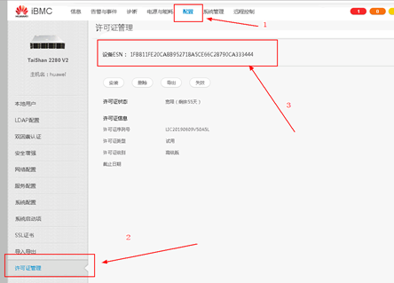

## License相关

### 如何验证License有没有使能鲲鹏加速引擎硬件设备？

**问题<a name="section989811482218"></a>**

安装完License之后，如何验证License有没有正常使能鲲鹏加速引擎硬件设备？

**回答<a name="section118041549736"></a>**

验证License有没有使能鲲鹏加速引擎硬件设备有以下两种方式：

- 在BIOS界面查看加速器状态。

    具体流程为：按**Esc**键进入BIOS界面，依次进入“Advanced \> Accelerators Status”。如果已经安装成功则会显示如下信息：

    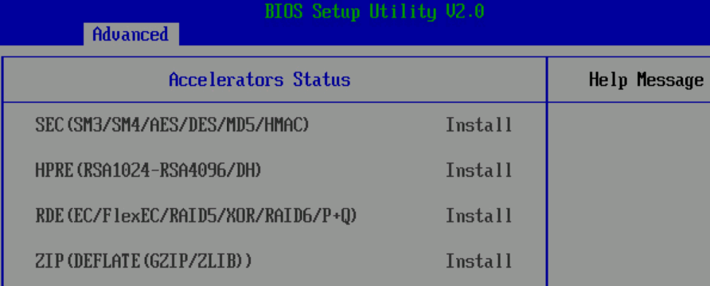

- 在操作系统命令行界面中使用**lspci**命令进行查看。

    使用方法为：在环境中输入命令**lspci | grep "_xxx_"**（其中xxx为对应的驱动模块，取值可以是HPRE、SEC、RDE、ZIP），如果执行完命令后有如下信息输出则说明License已经正常使能鲲鹏加速引擎硬件设备。

    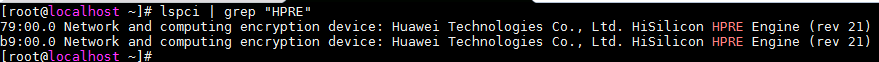

### 安装License时提示校验失败

**问题现象描述<a name="zh-cn_topic_0000001217022677_section3941254"></a>**

安装License时提示校验失败。

**关键过程、根本原因分析<a name="zh-cn_topic_0000001217022677_section35471290"></a>**

有两种可能：

- iBMC系统时间不对。
- iBMC版本太低。

**结论、解决方案及效果<a name="zh-cn_topic_0000001217022677_section50806158"></a>**

第一种情况：iBMC系统时间不对。

请检查系统时区信息，如果时区信息有误，请修改到正确的时区。

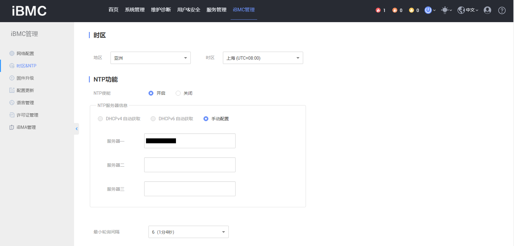

第二种情况：iBMC版本太低。

如果是这种情况，请通过[华为运营商业务网站](https://support.huawei.com/carrier/navi?coltype=software#col=software&path=PBI1-21430725/PBI1-21430756/PBI1-21431670/PBI1-251366796)或[华为企业业务网站](https://support.huawei.com/enterprise/zh/category/arm-based-pid-1548148188432?submodel=software)，找到自己的服务器型号，下载最新的iBMC安装包，升级即可。

### 使能KAE过程中成功加载许可证后，进入系统找不到SEC设备的解决方法

**问题现象描述<a name="zh-cn_topic_0000001721633562_zh-cn_topic_0000001742708945_section13982317239"></a>**

在两台设备上使能KAE，成功加载许可证之后其中一台进入系统找不到SEC设备，掉电重启BMC，重新加载许可证和SEC驱动，PCI依旧找不到设备。


**关键过程、根本原因分析<a name="zh-cn_topic_0000001721633562_zh-cn_topic_0000001742708945_section31242048897"></a>**

1. 登录服务器iBMC系统，单击“iBMC管理 \> 许可证管理”查看加速器设备是否都是“已开启”状态。

    

2. 检查是否在单路服务器下同时使能了KAE和TEE两个特性。

    如果是单路服务器，KAE和TEE两个特性无法同时使用，释放TEE也就会释放SEC设备。如需在单路服务器上使用KAE SEC算法，需要关闭TEE。

**结论、解决方案及效果<a name="zh-cn_topic_0000001721633562_section1511044274711"></a>**

在开启TEE功能的服务器上关闭TEE功能。请进入服务器BIOS，选择“Advanced \> TEE Config”，设置为“Disable”，即可关闭TEE功能，详细操作请参见《机密计算TrustZone 特性指南》中“[配置BIOS](https://www.hikunpeng.com/document/detail/zh/kunpengcctrustzone/trustzone/fg/kunpengtrustzone_20_0019.html#ZH-CN_TOPIC_0000002258299325__section132520219345)”相关内容。

## 安装KAE相关

### 如何获取鲲鹏加速引擎软件包？

**问题<a name="section63626415588"></a>**

去哪里可以获取到鲲鹏加速引擎软件包？

**回答<a name="section1016841975912"></a>**

- 请从[Kunpeng/KAE](https://gitcode.com/boostkit/KAE/tree/kae2)下载当前维护版本KAE2.0软件包。
- KAE1.0为历史版本，不再维护更新。历史版本软件包如需获取，请通过[Release](https://gitcode.com/boostkit/KAE/releases)或历史分支查找。

### 如何安装和升级鲲鹏加速引擎？

**问题<a name="section382213371104"></a>**

如何安装及升级鲲鹏加速引擎？

**回答<a name="section8247142112"></a>**

参见《[安装指南](./installation_guide.md)》。

### 驱动加载失败原因排查

1. 内核版本和内核开发包版本不一致导致内核安装失败。（包括小版本号）
  
     > uname -r 查看内核版本 rpm -qa | grep kernel-devel 查看内核开发包版本
  
     解决办法：安装和内核版本一致的开发包。
  
2. 缺少license导致加载失败
  
     > lspci | grep HPRE lspci | grep SEC lspci | grep ZIP
  
     解决办法：鲲鹏920处理器申请License安装；鲲鹏920新型号处理器更新免License版本BIOS。

### 使用源码方式编译KAE时提示cannot create regular file的解决方法

**问题现象描述<a name="zh-cn_topic_0000001216544209_section3941254"></a>**

源码方式编译安装鲲鹏加速引擎时，执行make命令，提示无法创建普通文件，即build软连接所指向的目录不存在的错误，具体信息为：“cannot create regular file '...':No such file or directory”。

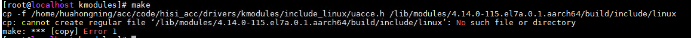

**关键过程、根本原因分析<a name="zh-cn_topic_0000001216544209_section35471290"></a>**

此问题通常是由于系统中没有安装kernel-devel或安装的kernel-devel软件包与OS的内核版本不匹配，导致build软连接所指向的内核头文件目录不存在。

**结论、解决方案及效果<a name="zh-cn_topic_0000001216544209_section50806158"></a>**

检查系统中是否已安装kernel-devel或安装的kernel-devel软件包与OS的内核版本是否匹配。

查询系统中已安装的kernel-devel软件包的版本。

```shell
rpm -qa | grep kernel-devel
```

- 若可以查询到已安装的kernel-devel软件包，则依次执行以下步骤。
    1. 查询当前正在运行的内核版本。

        ```shell
        uname -r
        ```

    2. 检查kernel-devel软件包与OS内核版本是否匹配。

        若不匹配则执行以下命令重新进行kernel-devel软件包的安装。

        ```shell
        yum install kernel-devel-$(uname -r)
        ```

- 若没有查询到kernel-devel软件包，则执行以下命令完成kernel-devel软件包的安装。

    ```shell
    yum install kernel-devel-$(uname -r)
    ```

### 源码编译安装鲲鹏加速引擎时，找不到engine.h文件

**问题现象描述<a name="zh-cn_topic_0000001217022679_section3941254"></a>**

在源码编译鲲鹏加速引擎的引擎层代码时，提示没有engine.h文件。具体错误信息：“engine.h: No such file or directory”。


**关键过程、根本原因分析<a name="zh-cn_topic_0000001217022679_section35471290"></a>**

该错误信息是由于在编译鲲鹏加速引擎的引擎层代码时需要依赖engine.h这个头文件，编译器会去默认路径下面搜索，如果搜索不到且用户没有配置其他搜索路径则会提示这个错误信息。

**结论、解决方案及效果<a name="zh-cn_topic_0000001217022679_section50806158"></a>**

1. 确保已经根据《鲲鹏加速引擎 用户指南》中的“[安装OpenSSL/Tongsuo](./installation_guide.md#安装openssltongsuo)”章节正确安装了OpenSSL。
2. 找到系统中engine.h文件所在的目录。

    ```shell
    find / -name engine.h
    ```

3. 将该目录添加到环境变量C\_INCLUDE\_PATH中。

    ```shell
    export C_INCLUDE_PATH=查询到的目录:$C_INCLUDE_PATH
    ```

4. 查询环境变量是否添加成功。

    ```shell
    echo $C_INCLUDE_PATH
    ```

    若有engine.h文件所在目录显示则添加成功。

### RPM方式安装鲲鹏加速引擎时提示no such device的解决办法

**问题现象描述<a name="zh-cn_topic_0000001171624344_section3941254"></a>**

在使用RPM方式安装鲲鹏加速引擎时，报“no such device”错误，具体错误信息：“modprobe: ERROR: could not insert 'hisi\_rde': No such device”。

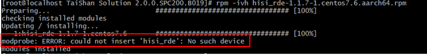

**关键过程、根本原因分析<a name="zh-cn_topic_0000001171624344_section35471290"></a>**

这种错误信息通常是由于鲲鹏加速引擎的硬件设备没有被使能所导致的，即没有正确安装有效的License。

**结论、解决方案及效果<a name="zh-cn_topic_0000001171624344_section50806158"></a>**

正确安装有效的License。License的获取和安装步骤请参见《安装指南》中“环境部署”章节的[获取License](./installation_guide.md#获取license)部分。

### EulerOS 2.8默认安装的OpenSSL 1.1.1c版本使用加速器失败，提示找不到符号

**问题现象描述<a name="zh-cn_topic_0000001171464370_section3941254"></a>**

EulerOS 2.8默认安装的OpenSSL 1.1.1c版本使用加速器失败，提示找不到符号。

**关键过程、根本原因分析<a name="zh-cn_topic_0000001171464370_section35471290"></a>**

EulerOS 2.8默认安装的OpenSSL 1.1.1c版本未开启国密算法功能（通过编译选项OPENSSL\_NO\_SM4进行控制），生成的crypto库没有相应的函数符号。

**结论、解决方案及效果<a name="zh-cn_topic_0000001171464370_section50806158"></a>**

用户需要重新下载OpenSSL版本进行编译安装，不需要在编译前的配置时加上OPENSSL\_NO\_SM4宏，请参见《安装指南》中的“[安装OpenSSL/Tongsuo](./installation_guide.md#安装openssltongsuo)”章节进行安装即可。

### 升级openEuler系统的OpenSSL版本到1.1.1e，导致SSH连接不上

**问题现象描述<a name="zh-cn_topic_0000001216944169_section3941254"></a>**

升级openEuler 20.03 LTS系统的OpenSSL版本到1.1.1e，导致SSH连接不上。

**关键过程、根本原因分析<a name="zh-cn_topic_0000001216944169_section35471290"></a>**

目前遇到一种会导致SSH连接失败情况：OpenSSL工具自带的默认openssl.cnf文件没有生效（人为修改了openssl.cnf文件的名字导致SSH连接不上），可通过命令查找这个openssl.cnf文件是否存在。

```shell
find / -name "openssl.cnf"
```

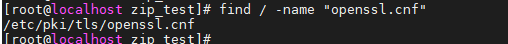

**结论、解决方案及效果<a name="zh-cn_topic_0000001216944169_section50806158"></a>**

以下为OpenSSL的详细安装指导：

1. 确认环境。

    操作系统：openEuler 20.03 LTS

    硬件环境：鲲鹏服务器，CPU为128核

2. 请先阅读《[安装指南](./installation_guide.md)》安装OpenSSL和KAE。
3. 查看系统自带的OpenSSL版本。

    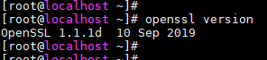

4. 因为系统有自带的OpenSSL，可以选择就用系统自带的这个版本，也可以选择将该版本升级。下面讲述这两种操作方式，请任选其中一种方式。
    - 方式一：使用系统自带的OpenSSL方式

        实际上OpenSSL 1.1.1d版本KAE也是支持的。您可以选择直接使用操作系统自带的OpenSSL 1.1.1d版本，不用升级到1.1.1e，操作方式如下：

        1. 安装本地源。
            - 如果服务器没有直接与Internet相连，建议用openEuler-20.03-LTS-everything-aarch64-dvd.iso配置本地源。
            - 如果服务器直接与Internet相连，可以忽略本步。

        2. 安装openssl-devel。

            ```shell
            yum install -y openssl-devel
            ```

        3. 参考《安装指南》中的“[源码安装](./installation_guide.md#方式一源码安装)”章节相关内容操作，就能顺利安装好KAE环境，并进行正常测试了，这里不再赘述。

    - 方式二：升级OpenSSL版本为1.1.1e的方式
        1. 按照《安装指南》中的“[安装OpenSSL/Tongsuo](./installation_guide.md#安装openssltongsuo)”章节指导，将依赖包安装好。
            1. 从官网上下载openssl-OpenSSL\_1\_1\_1e.zip。
            2. 解压源码包。

                ```shell
                unzip openssl-OpenSSL_1_1_1e.zip
                ```

                

            3. 配置并安装OpenSSL。

                ```shell
                ./config --prefix /usr/local/openssl_1
                ```

                ```shell
                make
                ```

                ```shell
                make install
                ```

                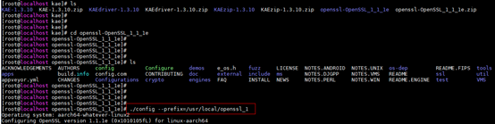

                

                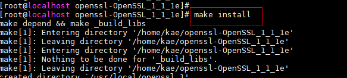

        2. 配置OpenSSL环境变量。

            检查当前OpenSSL的版本。

            

            结果显示为1.1.1d版本。

            1. 配置环境变量。

                修改配置文件/etc/bashrc，在文件末尾加上新安装的OpenSSL的路径。

                ```shell
                vi /etc/bashrc
                ```

                ```shell
                export PATH=/usr/local/openssl_1/bin:$PATH
                ```

                

                

                使修改生效。

                ```shell
                source /etc/bashrc
                ```

                再用export检查环境变量，可以看出PATH里已经存在OpenSSL配置路径。

                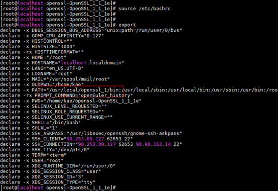

                再次检查OpenSSL的版本。

                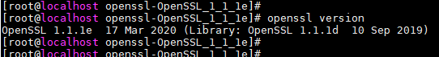

                回显结果显示为1.1.1e版本。

            2. 将OpenSSL的链接切到新安装的路径。

                备份当前OpenSSL。

                ```shell
                mv /usr/bin/openssl /usr/bin/openssl.bak
                ```

                ```shell
                mv /usr/include/openssl /usr/include/openssl.bak //这个有些场景不存在
                ```

                配置使用新版本。

                ```shell
                ln -s /usr/local/openssl_1/bin/openssl /usr/bin/openssl
                ```

                ```shell
                ln -s /usr/local/openssl_1/include/openssl /usr/include/openssl
                ```

                检查OpenSSL版本情况。

                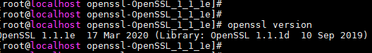

                此时OpenSSL 1.1.1e还没有完全安装成功。

            3. 更新动态链接库数据。

                在配置文件/etc/ld.so.conf中，配置OpenSSL的lib路径：/usr/local/openssl\_1/lib。执行**ldconfig -v**命令。使它生效。

                

                再次检查OpenSSL版本显示结果如下，至此OpenSSL 1.1.1e安装完成。

                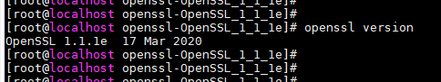

            4. 导出环境变量。

                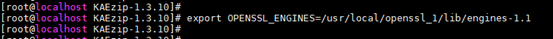

        3. 安装KAEdriver-1.3.10。
            1. 进入KAEdriver-1.3.10的源码目录进行安装。

                ```shell
                cd kae_driver/
                ```

                ```shell
                make
                ```

                ```shell
                make install
                ```

                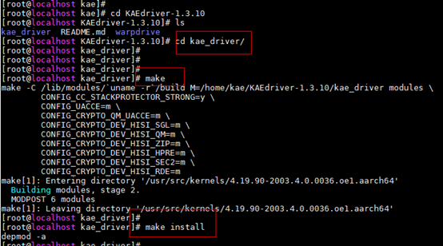

            2. 进入warpdrive目录，执行autogen.sh脚本文件，执行./configure命令配置KAEdriver。

                ```shell
                cd warpdrive/
                ```

                ```shell
                sh autogen.sh
                ```

                ```shell
                ./configure
                ```

                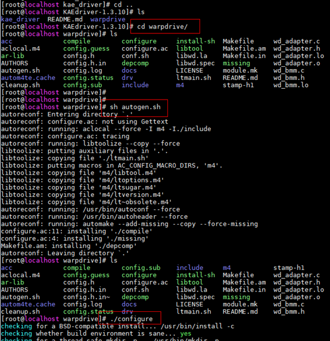

            3. 安装KAEdriver。

                ```shell
                make
                ```

                ```shell
                make install
                ```

                

        4. 加载库。

            ```shell
            lsmod | grep uace
            ```

            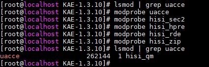

        5. 安装KAE-1.3.10。
            1. 进入KAE-1.3.10源码包，对configure文件授予可执行权限。

                ```shell
                chmod +x configure
                ```

                

            2. 配置KAE的安装路径。

                ```shell
                ./configure --openssl_path=/usr/local/openssl_1
                ```

                ```shell
                make clean && make
                ```

                ```shell
                make install
                ```

                > **说明：** 
                >在执行./configure命令的时候，必须带上新安装的OpenSSL路径，否则编译无法通过。

                

                

        6. 安装KAEzip-1.3.10。

            进入KAEzip-1.3.10源码目录，执行setup.sh脚本一键安装KAEzip。

            ```shell
            cd KAEzip-1.3.10
            ```

            ```shell
            sh setup.sh install
            ```

            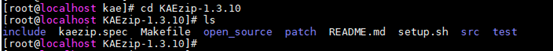

            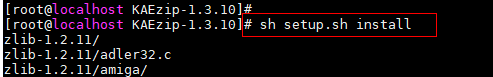

        7. 检查KAEdriver、KAE和KAEzip是否安装成功。

            ```shell
            ls -al /usr/local/lib/ | grep libwd
            ```

            ```shell
            ls -al /usr/local/openssl_1/lib/engines-1.1
            ```

            ```shell
            ls -al /sys/class/uacce
            ```

            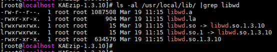

            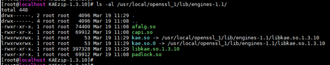

            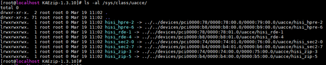

        8. 测试整个安装是否成功。

            在其中一个窗口中执行硬算命令。

            ```shell
            openssl speed -engine kae rsa2048
            ```

            

            同时，在另外一个窗口中执行下面的命令。

            ```shell
            cat /sys/class/uacce/hisi_hpre-*/attrs/available_instances
            ```

            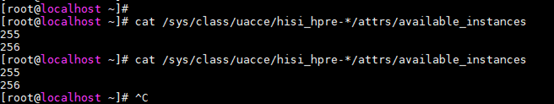

            硬算队列完全没有消耗的情况下回显结果是“256  256”，上述回显结果是“255  256”，说明已经消耗掉了一个硬算队列，则整个安装是成功的，您可以开始用鲲鹏加速引擎了。

### 源码编译安装KAE内核驱动时失败的解决办法

**问题现象描述<a name="zh-cn_topic_0000001840968873_zh-cn_topic_0000001742708945_section13982317239"></a>**

在统信UOS v20 SP1系统下使用源码编译安装KAE内核驱动时，执行**make**命令后提示“/kae\_driver/hisilicon/sec/Makefile”下没有那个文件或目录，详细信息如下：

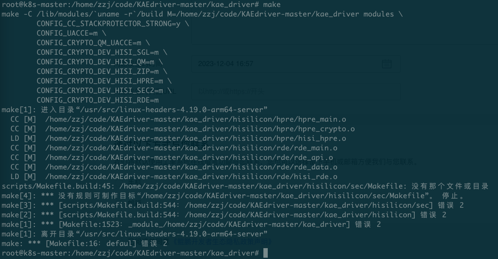

**关键过程、根本原因分析<a name="zh-cn_topic_0000001840968873_zh-cn_topic_0000001742708945_section31242048897"></a>**

无。

**结论、解决方案及效果<a name="zh-cn_topic_0000001840968873_section1511044274711"></a>**

请在“/kae\_driver/hisilicon/sec/Makefile”目录下的makefile文件中删除第二行，再重新执行编译命令。

### 使用wrk工具测试Nginx+KAE性能未得到提升

**问题现象描述<a name="section0325446598"></a>**

软硬件条件相同，采用httpress工具对Nginx进行HTTPS短连接性能测试，开启KAE加速功能后，性能显著提升。但采用wrk工具对Nginx进行HTTPS短连接性能测试，开启KAE加速功能后，性能没有得到提升。

**关键过程、根本原因分析<a name="section1482511325"></a>**

原因分析：wrk工具采用了TLS重连，整个压测过程中只有一次密钥的交换操作，RSA的占比太低，导致没有提速效果。

过程分析：结合wrk源码（如[**图 1** wrk源码片段](#wrk源码片段)所示）进行分析，首先客户端握手阶段发送Client Hello子消息，里面的Session ID值是为空的。一次完整的握手阶段结束后，客户端和服务器端都保存有该Session ID，在本次会话关闭，下一次再次访问相同的HTTPS网站时，客户端浏览器会在Client Hello子消息中附带该Session ID值，服务器端接收到请求后，将Session ID与自己在Server Cache中保存的Session ID进行匹配，如果匹配成功，那么服务器端就会恢复上一次的TLS连接，使用之前协商过的密钥，不重新进行密钥协商。客户端和服务器端各自将Session ID保存在本地中，客户端保存在内存里，服务器端保存在Server Cache中，这样就只用调用一次RSA算法。

**图 1** wrk源码片段<a name="fig133708381251"></a><a id="wrk源码片段"></a>


**结论、解决方案及效果<a name="section133105342021"></a>**

KAE对握手阶段的RSA算法进行加速，如果压测工具采用了TLS重连，则看不到加速效果，此时建议使用其他压测工具，如httpress工具。

### 升级加速器驱动失败的解决办法

**问题现象描述<a name="zh-cn_topic_0000002293564954_section0747162541710"></a>**

升级加速器驱动后，重启系统驱动版本仍为旧版本。

**关键过程、根本原因分析<a name="zh-cn_topic_0000002293564954_section7752122541710"></a>**

在升级加速器驱动前，系统更新了其他驱动包，这些驱动包可能重新更新了引导文件系统initramfs，将未升级前的加速器驱动一起更新到了initramfs文件系统中。例如系统更新了网卡驱动，或者人为更新了initramfs文件系统，导致系统重启时优先从initramfs文件系统中加载加速器驱动。

**结论、解决方案及效果<a name="zh-cn_topic_0000002293564954_section5753192514171"></a>**

升级加速器驱动版本后，通过执行**dracut --force**命令重新更新initramfs文件系统。

### 操作系统安装完OpenSSL新版本后提示相关接口符号未找到

**问题现象描述<a name="zh-cn_topic_0000002327644537_section6238163892516"></a>**

例如执行**rpm**命令时出现如下报错：

```shell
rpm: relocation error: /lib64/librpmio.so.8: symbol EVP_md2 version OPENSSL_1_1_0 not defined in file libcrypto.so.1.1 with link time reference
```

例如执行系统OpenSSL命令时出现如下报错：

```shell
/usr/bin/openssl: relocation error: /usr/bin/openssl: symbol EVP_md2 version OPENSSL_1_1_0 not defined in file libcrypto.so.1.1 with link time reference
```

**关键过程、根本原因分析<a name="zh-cn_topic_0000002327644537_section1824263810250"></a>**

OpenSSL动态库路径设置在LD\_LIBRARY\_PATH或者OpenSSL动态库安装在/usr/local/lib下时——动态库搜索路径配置文件/etc/ld.so.conf中设定了/usr/local/lib，此时若系统工具或命令调用OpenSSL的动态库，会优先调用到系统原有库而非用户安装的库，导致冲突。

**结论、解决方案及效果<a name="zh-cn_topic_0000002327644537_section1824303852515"></a>**

推荐使用《安装指南》中的“[安装OpenSSL/Tongsuo](./installation_guide.md#安装openssltongsuo)”章节安装OpenSSL软件；再参见“[安装方式说明](./installation_guide.md#安装方式说明)”章节安装KAE加速引擎软件包。

如果系统需要将/usr/local/lib路径设置在LD\_LIBRARY\_PATH环境变量或配置到/etc/ld.so.conf中，则需要通过指定安装路径与动态库路径安装OpenSSL源码。

```shell
./config --prefix=/usr/local/openssl -Wl,-rpath,/usr/local/openssl/lib
make
make install
```

- 如果加速器为RPM方式安装，则作如下修改：

    ```shell
    rpm -ivh libkae-1.0.1-1.euler2.0.aarch64.rpm --prefix=/usr/local/openssl/lib/engines-1.1
    ```

- 如果加速器为源码方式安装，则依次执行如下编译安装命令。

    ```shell
    cd KAE
    chmod +x configure
    ./configure --openssl_path=/usr/local/openssl
    make clean && make
    make install
    ```

## 验证KAE相关

### 如何获取鲲鹏加速引擎性能数据？

**问题<a name="section18596175620576"></a>**

能否提供鲲鹏加速引擎的性能数据？

**回答<a name="section118369312588"></a>**

鲲鹏加速器引擎的性能数据经过内部决策不能对外发布，只做内部参考。如果是公司内部门，请说明获取加速器性能数据的目的，我们会根据需要提供部分性能数据和对应的测试方法。

### 如何知道自己写的程序有没有调用到鲲鹏加速引擎？

**问题<a name="section9821201471713"></a>**

编写程序调用了OpenSSL提供的接口并且绑定了鲲鹏加速引擎，而且程序能够正常运行结束，但是如何才能够知道程序已经调用到了鲲鹏加速引擎而不是调用系统中本来的软算库呢？

**回答<a name="section19147131119195"></a>**

在程序运行时可以通过查看硬件设备的队列数来确认程序是否已经调用鲲鹏加速引擎。可以通过**cat /sys/class/uacce/hisi\_xxx/attrs/available\_instances**查看各驱动模块对应的队列数，默认情况下队列数都是256。

**图 1** 查看所有驱动模块的队列数<a name="fig104433984511"></a><a id="查看所有驱动模块的队列数"></a>


**图 2** 只查看某一驱动模块的队列数（如只查看hisi\_hpre的队列数）<a name="fig676105110454"></a><a id="只查看某一驱动模块的队列数（如只查看hisi\_hpre的队列数）"></a>
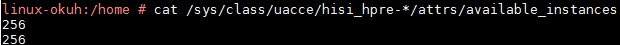

**图 3** 只查看某一驱动模块的其中一个设备的队列数（如只查看hisi\_hpre-2的队列数）<a name="fig14841143462"></a><a id="只查看某一驱动模块的其中一个设备的队列数（如只查看hisi\_hpre-2的队列数）"></a>
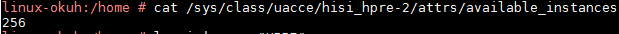

> **说明：** 
>在加速器安装完之后并不是每个机器上的驱动设备编号都一样，此处只是举例说明。

### 使用openssl req -new -x509命令生成证书失败

**问题现象描述<a name="zh-cn_topic_0000001217022681_section3941254"></a>**

安装了鲲鹏加速引擎后使用**openssl req -new -x509**命令生成证书失败，提示“281461739307968:error:0E06D06C:configuration file routines:NCONF\_get\_string:no value:crypto/conf/conf\_lib.c:273:group=req name=distinguished\_name”。


**关键过程、根本原因分析<a name="zh-cn_topic_0000001217022681_section35471290"></a>**

使用OpenSSL生成证书时，会读取OpenSSL安装目录下的配置文件openssl.cnf，如果在执行OpenSSL生成证书的命令时，安装了鲲鹏加速引擎，且按照指导文档配置了以配置文件openssl.cnf的方式使用鲲鹏加速引擎，此时，就会出现该报错。

**结论、解决方案及效果<a name="zh-cn_topic_0000001217022681_section50806158"></a>**

**方法一：不使用配置文件openssl.cnf的方式使用鲲鹏加速引擎，而是使用指定鲲鹏加速引擎路径的方式使用**

1. 取消openssl.cnf的环境变量。

    ```shell
    unset OPENSSL_CONF
    ```

2. 指定鲲鹏加速引擎路径。

    ```shell
    export OPENSSL_ENGINES="/usr/local/lib/engines-1.1"
    ```

**方法二：不使用鲲鹏加速引擎自定义创建的openssl.cnf，而是使用OpenSSL自带的openssl.cnf文件**

1. 取消鲲鹏加速引擎自定义创建的openssl.cnf的环境变量。

    ```shell
    unset OPENSSL_CONF
    ```

2. 在OpenSSL安装目录下的openssl.cnf文件中指定位置（如[**图 1** 在OpenSSL自带的openssl.cnf文件中加入鲲鹏加速引擎配置的位置](#在OpenSSL自带的openssl.cnf文件中加入鲲鹏加速引擎配置的位置)所示）加入鲲鹏加速引擎的配置内容。

    openssl.cnf文件一般在openssl安装目录中的ssl目录下，也可使用命令find / -name "openssl.cnf"查找openssl.cnf文件。

    ```ini
    openssl_conf=openssl_def
    [openssl_def]
    engines=engine_section
    [engine_section]
    kae=kae_section
    [kae_section]
    engine_id=kae
    dynamic_path=/usr/local/lib/engines-1.1/kae.so
    KAE_CMD_ENABLE_ASYNC=1 #可选配置， 0表示不使能异步功能，1表示使能异步功能，默认使能
    KAE_CMD_ENABLE_SM3=1 #可选配置， 0表示不使能SM3加速功能，1表示使能SM3加速功能 ,默认使能
    KAE_CMD_ENABLE_SM4=1 #可选配置， 0表示不使能SM4加速功能，1表示使能SM4加速功能，默认使能
    default_algorithms=ALL #表示所有算法优先查找引擎，若引擎不支持，则切换OpenSSL进行计算
    init=1 #导出
    ```

    **图 1** 在OpenSSL自带的openssl.cnf文件中加入鲲鹏加速引擎配置的位置<a name="zh-cn_topic_0000001217022681_fig1917317221555"></a><a id="在OpenSSL自带的openssl.cnf文件中加入鲲鹏加速引擎配置的位置"></a>
    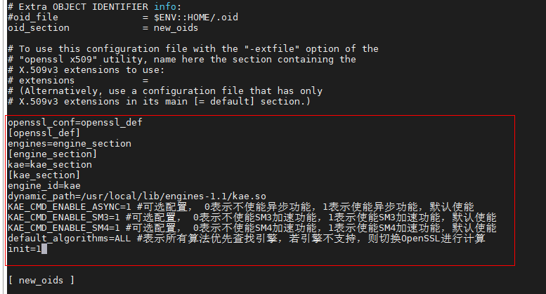

    此时可正常使用生成证书功能。

### 使用OpenSSL命令调用KAE测试RSA性能，发现性能并没有提升

**问题现象描述<a name="zh-cn_topic_0000001769473497_zh-cn_topic_0000001742708945_section13982317239"></a>**

环境配置：

- 操作系统：openEuler 20.03 LTS for ARM
- 处理器：2\*鲲鹏920 7260处理器（64 cores，2.6GHz）
- 内存：8\*32G

使用以下OpenSSL命令调用KAE测试RSA性能，发现性能并没有提升。

```shell
./openssl speed -elapsed -engine kae rsa2048
```


**关键过程、根本原因分析<a name="zh-cn_topic_0000001769473497_zh-cn_topic_0000001742708945_section31242048897"></a>**

请按照以下步骤排查问题原因：

1. KAE仅支持鲲鹏处理器，且依赖License，请确认硬件环境和License是否已加载。
2. 确认KAE的安装方式。
3. 确认OpenSSL环境变量是否配置。
4. 检查KAE安装是否成功。
5. 运行命令时，查看是否启用KAE。

**结论、解决方案及效果<a name="zh-cn_topic_0000001769473497_section1511044274711"></a>**

1. KAE仅支持鲲鹏处理器，且依赖License，请确认硬件环境和License是否已加载。
    - 鲲鹏服务器K系列自带License，因此不需要单独申请，可通过**lspci | grep HPRE**，**lspci | grep ZIP**命令来查看License支持情况。
    - 非鲲鹏服务器K系列，需要申请License，并导入License，License获取请参见“[安装加速器是否需要先安装License，以及License怎么获取？](#安装加速器是否需要先安装license以及license怎么获取)”章节，申请License安装成功之后，通过**lspci | grep HPRE**，**lspci | grep ZIP**命令确认支持情况。有如下回显内容说明License已加载成功。

        

        请联系当地华为销售人员或与华为对接的工程师确认License收费情况。

2. 确认KAE安装方式。

    当前维护版本KAE2.0支持源码安装和RPM包安装。4.19内核场景请使用源码编译安装，且仅支持用户态使用，不支持Linux内核crypto API中的加解密及压缩/解压缩接口、dm-crypt、SM4-XTS等内核态接口。请根据实际情况选择KAE的安装方式，安装步骤请参见《[安装指南](./installation_guide.md)》。

3. 确认OpenSSL环境变量是否配置。

    KAE加解密模块是基于OpenSSL的，且OpenSSL版本要求1.1.1a及以上。

4. 检查KAE安装是否成功。请参见《安装指南》中的“[安装后测试](./installation_guide.md#安装后测试)”章节下的安装后检查内容。
5. 运行命令时，查看是否启用KAE，方法如下：
    - 当启用KAE硬件加密时可在加密区相关程序运行时，通过观察加速队列的使用情况来确认加密情况，如KAE使能成功，可通过**cat /sys/class/uacce/hisi\_sec-1/attrs/available\_instances**查看队列消耗。
    - 当采用软加密（OpenSSL）时可在加密区相关程序运行时，观察是否有相关的热点函数来确认加密情况。通过执行**perf top**命令查看是否存在libcrypto.so.1.1，如果存在libcrypto.so.1.1则说明是采用的软加密。如果需要采用KAE硬件加密，则建议采用源码编译的方式重新编译KAE后，再次执行KAE使能和测试。

### 虚拟机上安装配置KAE后未生效的解决办法

**问题现象描述<a name="zh-cn_topic_0000001925948013_zh-cn_topic_0000001742708945_section13982317239"></a>**

在HostOS为openEuler 22.03 LTS SP2操作系统下进行KAE虚拟化环境配置，配置完成后使用**ls -al /sys/class/uacce**命令可以查询到HostOS环境中安装的加速器和对应的bdf号。但在虚拟机下使用ls /sys/class/uacce/命令查询不到设备。虚拟机中的日志中提示如下信息。

```text
modprobe: ERROR: could not insert 'hisi hpre': Invalid argument make:[Makefile:69: nosva] Error 1 (ignored)
modprobe hisi zip uacce mode=2 pf q num=256
modprobe: ERROR: could not insert hisi zip': Invalid argument make:[Makefile:70: nosva] Error 1 (ignored) 
```

**关键过程、根本原因分析<a name="zh-cn_topic_0000001925948013_zh-cn_topic_0000001742708945_section31242048897"></a>**

未进行hisi\_hpre和hisi\_zip设备的虚拟化配置。

**结论、解决方案及效果<a name="zh-cn_topic_0000001925948013_section1511044274711"></a>**

参考hisi\_sec设备的虚拟化配置步骤配置方式hisi\_hpre和hisi\_zip设备。详细操作步骤请参见《最佳实践》中的“[KAE在KVM虚拟机中的使用](./best_practices.md#kae在kvm虚拟机中的使用)”章节。

### 使用openssl.cnf调用KAE前后没有性能变化

**问题现象描述<a name="zh-cn_topic_0000001769473497_zh-cn_topic_0000001742708945_section13982317239"></a>**

已经参考《用户指南》中的“[通过OpenSSL/Tongsuo配置文件openssl.cnf使用KAE](./user_guide.md#通过openssltongsuo配置文件opensslcnf调用kae加解密库)”完成OPENSSL\_CONF的配置，使用**openssl speed -elapsed rsa2048**和**openssl speed -elapsed -engine kae rsa2048**命令调用KAE前后发现性能没有变化。

**关键过程、根本原因分析<a name="zh-cn_topic_0000001769473497_zh-cn_topic_0000001742708945_section31242048897"></a>**

如果已经参考《用户指南》中的“[通过OpenSSL/Tongsuo配置文件openssl.cnf使用KAE](./user_guide.md#通过openssltongsuo配置文件opensslcnf调用kae加解密库)”完成OPENSSL\_CONF的配置， 那么运行**openssl speed -elapsed rsa2048**和**openssl speed -elapsed -engine kae rsa2048**命令时KAE都会被调用，所以性能没有得到提升。

**结论、解决方案及效果<a name="zh-cn_topic_0000001769473497_section1511044274711"></a>**

1. 取消OPENSSL\_CONF的配置。

    ```shell
    unset OPENSSL_CONF
    export OPENSSL_ENGINES="/usr/local/lib/engines-1.1"
    ```

2. 进行RSA性能的测试（未调用KAE）。

    ```shell
    openssl speed -elapsed rsa2048
    ```

3. 设置OPENSSL\_CONF环境变量。

    ```shell
    export OPENSSL_CONF=/home/app/openssl.cnf  
    ```

    > **说明：** 
    >该路径为openssl.cnf文件存放路径，请根据实际存放路径填写。

4. 进行RSA性能测试（调用KAE）。

    ```shell
    openssl speed -elapsed -engine kae rsa2048
    ```

    使用鲲鹏920 7260处理器时调用KAE前性能大约为750sign/s，调用KAE后性能大约为3000sign/s，可以看到调用KAE前后性能得到了提升。

### 程序调用KAE时提示wd pool无法初始化

**问题现象描述<a name="section0325446598"></a>**

在某些环境上使用运行程序调用KAE时会报错，提示wd pool无法初始化，详细信息如下“dma\_num = x, not enough. failed to initialize wd pool.”。


**关键过程、根本原因分析<a name="section1482511325"></a>**

环境上可用的CMA空间不足，导致程序无法申请到足够大的连续内存。

在开启SMMU的情况下，可以通过SMMU把离散内存映射成连续内存。

**结论、解决方案及效果<a name="section133105342021"></a>**

如果关闭SMMU使用KAE，需要保证CMA内存空间充足；否则建议开启SMMU，开启方式请参见[配置BIOS](https://www.hikunpeng.com/document/detail/zh/kunpengcpfs/ecosystemEnable/QEMU-KVM/kunpengkvm_03_0019.html)。

### KAE初始化失败的解决办法

**问题现象描述<a name="zh-cn_topic_0000002327644517_section189811511193010"></a>**

使用KAE加速OpenSSL时报错或者没有加速效果。

**关键过程、根本原因分析<a name="zh-cn_topic_0000002327644517_section1578172814186"></a>**

- 检查加速器驱动是否加载成功。
- 检查KAE软连接是否建立成功。
- 检查OpenSSL引擎库路径的环境变量是否已配置。

**结论、解决方案及效果<a name="zh-cn_topic_0000002327644517_section1049923014301"></a>**

1. 检查加速器驱动是否加载成功。查看uacce.ko、qm.ko、sgl.ko、hisi\_sec2.ko、hisi\_hpre.ko、hisi\_rde.ko、hisi\_zip.ko是否在位。

    ```shell
    lsmod | grep uacce
    ```

    回显如下表示加载成功。若无对应模块显示，则查看安装过程是否异常，需要重新安装。

    ```text
    uacce                  262144  2 hisi_hpre,hisi_qm,hisi_sec2,hisi_rde,hisi_zip
    ```

2. 检查软件安装目录（RPM方式安装时目录为“/usr/lib64”，源码方式安装时目录为“/usr/local/lib”）和OpenSSL安装目录是否有KAE加速引擎库，且建立正确的软连接。
    1. 查询KAE是否正确安装并建立软连接。

        - 若OpenSSL版本为1.1.1x

            ```shell
            ll /usr/local/lib/engines-1.1/ | grep kae
            ```

        - 若OpenSSL版本为3.0.x

            ```shell
            ll /usr/local/lib/engines-3.0/ | grep kae
            ```

        如果有正确安装显示如：

        ```text
        lrwxrwxrwx. 1 root root     22 Nov 12 02:33 kae.so -> kae.so.1.0.1
        lrwxrwxrwx. 1 root root     22 Nov 12 02:33 kae.so.0 -> kae.so.1.0.1
        -rwxr-xr-x. 1 root root 112632 May 25  2019 kae.so.1.0.1
        ```

    2. 查询wd是否正确安装并建立软连接。

        ```shell
        ll /usr/lib64/ | grep libwd  
        ```

        如果有正确安装显示如下内容。

        ```text
        lrwxrwxrwx.  1 root root       14 Nov 12 02:33 libwd.so -> libwd.so.1.0.1
        lrwxrwxrwx.  1 root root       14 Nov 12 02:33 libwd.so.0 -> libwd.so.1.0.1
        -rwxr-xr-x.  1 root root   137120 May 25  2019 libwd.so.1.0.1
        ```

3. 检查OpenSSL引擎库的路径是否通过**export**命令进行设置了。

    ```shell
    echo $OPENSSL_ENGINES 
    ```

    - 若OpenSSL版本为1.1.1x

        ```shell
        export OPENSSL_ENGINES=/usr/local/lib/engines-1.1
        ```

    - 若OpenSSL版本为3.0.x

        ```shell
        export OPENSSL_ENGINES=/usr/local/lib/engines-3.0
        ```

### 安装完加速引擎之后，查找不到加速器设备

**问题现象描述<a name="zh-cn_topic_0000002327644549_section14808174319516"></a>**

安装完KAE加速引擎之后，查找不到加速器设备。

**关键过程、根本原因分析<a name="zh-cn_topic_0000002327644549_section0392163331913"></a>**

1. 检查虚拟文件系统下是否有相应设备。
2. 排查KAE加速引擎软件是否已正确安装。
3. 通过**lspci**命令查看物理设备是否存在。
4. 若未查询到相应的物理设备，请确认是否已正确导入加速器许可证或iBMC和BIOS版本是否支持加速器特性。

**结论、解决方案及效果<a name="zh-cn_topic_0000002327644549_section168911281068"></a>**

1. <a name="zh-cn_topic_0000002327644549_li19353192114321"></a>检查虚拟文件系统下是否有相应设备。

    ```shell
    ls -al /sys/class/uacce/
    ```

    正常情况下有如下相应的加速器设备。

    ```text
    total 0
    lrwxrwxrwx. 1 root root 0 Nov 14 03:45 hisi_hpre-2 -> ../../devices/pci0000:78/0000:78:00.0/0000:79:00.0/uacce/hisi_hpre-2
    lrwxrwxrwx. 1 root root 0 Nov 14 03:45 hisi_hpre-3 -> ../../devices/pci0000:b8/0000:b8:00.0/0000:b9:00.0/uacce/hisi_hpre-3
    lrwxrwxrwx. 1 root root 0 Nov 17 22:09 hisi_rde-4 -> ../../devices/pci0000:78/0000:78:01.0/uacce/hisi_rde-4
    lrwxrwxrwx. 1 root root 0 Nov 17 22:09 hisi_rde-5 -> ../../devices/pci0000:b8/0000:b8:01.0/uacce/hisi_rde-5
    lrwxrwxrwx. 1 root root 0 Nov 14 08:39 hisi_sec-0 -> ../../devices/pci0000:74/0000:74:01.0/0000:76:00.0/uacce/hisi_sec-0
    lrwxrwxrwx. 1 root root 0 Nov 14 08:39 hisi_sec-1 -> ../../devices/pci0000:b4/0000:b4:01.0/0000:b6:00.0/uacce/hisi_sec-1
    ../../devices/pci0000:74/0000:74:00.0/0000:75:00.0/uacce/hisi_zip-6
    lrwxrwxrwx. 1 root root 0 Nov 17 22:09 hisi_zip-7 -> ../../devices/pci0000:b4/0000:b4:00.0/0000:b5:00.0/uacce/hisi_zip-7
    ```

2. <a name="zh-cn_topic_0000002327644549_li1600175515610"></a>若要使用HPRE或ZIP设备但是在[1](#zh-cn_topic_0000002327644549_li19353192114321)中未查询到，请参见[KAE初始化失败的解决办法](#kae初始化失败的解决办法)排查KAE加速引擎软件是否已正确安装。
3. <a name="zh-cn_topic_0000002327644549_li1560012551369"></a>若[2](#zh-cn_topic_0000002327644549_li1600175515610)已确认KAE加速引擎软件正确安装，请排查通过**lspci**命令查看物理设备是否存在。
    1. 查看HPRE是否存在。

        ```shell
        lspci | grep HPRE
        ```

        显示结果如下：

        ```text
        79:00.0 Network and computing encryption device: Huawei Technologies Co., Ltd. HiSilicon HPRE Engine (rev 21)
        b9:00.0 Network and computing encryption device: Huawei Technologies Co., Ltd. HiSilicon HPRE Engine (rev 21)
        ```

    2. 查看SEC是否存在。

        ```shell
        lspci | grep SEC
        ```

        显示结果如下：

        ```text
        76:00.0 Network and computing encryption device: Huawei Technologies Co., Ltd. HiSilicon SEC Engine (rev 21)
        b6:00.0 Network and computing encryption device: Huawei Technologies Co., Ltd. HiSilicon SEC Engine (rev 21)
        ```

    3. 查看RDE是否存在。

        ```shell
        lspci | grep RDE
        ```

        显示结果如下：

        ```text
        78:01.0 RAID bus controller: Huawei Technologies Co., Ltd. HiSilicon RDE Engine (rev 21)
        b8:01.0 RAID bus controller: Huawei Technologies Co., Ltd. HiSilicon RDE Engine (rev 21)
        ```

    4. 查看ZIP是否存在。

        ```shell
        lspci | grep ZIP
        ```

        显示结果如下：

        ```text
        75:00.0 Processing accelerators: Huawei Technologies Co., Ltd. HiSilicon ZIP Engine (rev 21)
        b5:00.0 Processing accelerators: Huawei Technologies Co., Ltd. HiSilicon ZIP Engine (rev 21)
        ```

4. 若步骤[3](#zh-cn_topic_0000002327644549_li1560012551369)未查询到相应的物理设备，请确认以下，不分先后：
    - 确认是否已正确导入加速器许可证，若未导入，请参见《[TaiShan 机架服务器 iBMC \(V300及以上\) 用户指南](https://support.huawei.com/enterprise/zh/doc/EDOC1100048792/ba20dd15)》中“许可证管理”章节，导入加速器许可证。导入加速器许可证之后，需要掉电重启iBMC，使能License。
    - 确认iBMC和BIOS版本是否支持加速器特性，支持KAE需要BIOS版本高于1.05版本，iBMC版本高于3.65版本。

### Ceph使用KAEzip对大于4MB文件压缩报错问题

**问题现象描述<a name="zh-cn_topic_0000002270266173_zh-cn_topic_0000001216722055_section3941254"></a>**

Ceph对象存储，测试zlib硬算压缩率，使用超过4MB的文件进行测试时，出现“Compression error:  compress unused input”的报错信息。

**关键过程、根本原因分析<a name="zh-cn_topic_0000002270266173_zh-cn_topic_0000001216722055_section35471290"></a>**

关键过程：

- 触发场景

    该场景下有可能未压缩最后一笔数据。

    - 用户直接使用zlib的deflate接口进行压缩。
    - 对4MB以上大文件进行块模式压缩。
    - 且输出缓存比较小需要分批的时候，会导致KAEzip未压缩最后一笔数据，提前退出，返回Z\_OK，且strm.vaild\_in未处理完成。
    - 若应用软件未判断需要压缩的有效数据为0\(strm.vaild\_in\)。

- 影响范围

    使用KAEzip硬加速的鲲鹏服务器，KAEzip 1.3.10及以下版本存在该问题。

- 问题代码示例

    ```c
    int err = deflateInit(&strm, level);
    if (err != Z_OK) return err;
    strm.avail_out = 0;
    strm.avail_in = sourceLen; //大于4M
    strm.next_in = (Bytef*)source;
    int flush = Z_FINISH;
    
    char* szBuf = new char[CEPH_PAGE_SIZE];
    do {
    memset(szBuf, 0, CEPH_PAGE_SIZE); //CEPH_PAGE_SIZE=64*1024
    strm.next_out = (Bytef*)szBuf;
    strm.avail_out = CEPH_PAGE_SIZE;
    
    ret = deflate(&strm, flush);    /* no bad return value */
    if (ret == Z_STREAM_ERROR) {
    deflateEnd(&strm);
    return -1;
    }
    have = CEPH_PAGE_SIZE - strm.avail_out;
    
    memcpy(dest + outnum, szBuf, have);
    outnum += have;
    } while (strm.avail_out == 0);
    
    //退出压缩时,问题场景下,ret = Z_OK且strm.avail_in  != 0
    *destLen = outnum;
    
    if (strm.avail_in != 0) {
    deflateEnd(&strm);
    return -1; //错误返回。
    }
    ```

    如果客户没有按照[zlib标准使用用例](https://zlib.net/zlib_how.html)，没有做如下图所示判断，则会出现最后一笔压缩数据未完成。

    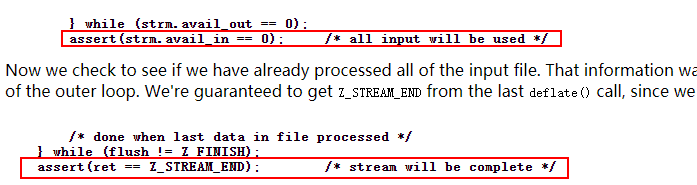

根本原因：

因为KAEzip内部对于压缩输出有缓存，当外部传入的空间不够时，KAEzip将当次的没有传出的数据缓存在内部。在下次调用压缩接口的时候，会先去取缓存里面的内容，如果这次是最后一次，那么KAEzip逻辑上取完缓存就不再进行压缩处理而退出了。

**结论、解决方案及效果<a name="zh-cn_topic_0000002270266173_zh-cn_topic_0000001216722055_section50806158"></a>**

该问题在KAE 1.3.10及以下版本存在，在1.3.11版本已经修复（2021年5月20日已经发布），请将KAEzip软件包升级到1.3.11版本。

### 测试KAE解压缩性能时提示没有权限获取相关设备资源的解决办法

**问题现象描述<a name="zh-cn_topic_0000002235226834_zh-cn_topic_0000001925948013_zh-cn_topic_0000001742708945_section13982317239"></a>**

完成KAE的安装部署后，测试KAE解压缩性能时提示无法打开“/dev“路径下的相关字符设备，报错信息为：“open /dev/hisi\_zip-5 failed, errno = 13!”，如下图所示。

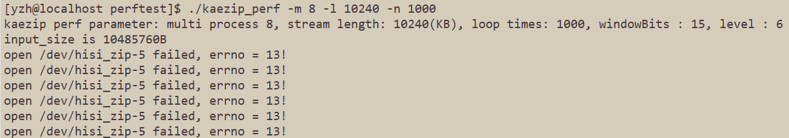

**关键过程、根本原因分析<a name="zh-cn_topic_0000002235226834_zh-cn_topic_0000001925948013_zh-cn_topic_0000001742708945_section31242048897"></a>**

查看“/dev”下相关设备权限。

```shell
ll | grep hisi
```

回显信息如下所示，可知只有root用户具有读写权限，普通用户在运行KAE性能测试程序时，缺少权限从而提示无法打开“/dev”路径下的相关字符设备。


若KAE使用root用户进行安装，而业务使用普通用户来执行，则可能出现由于没有权限获取相关设备资源而无法使能的问题，此时需要将“/dev”下hisi前缀的设备给对应的普通用户赋予权限。

**结论、解决方案及效果<a name="zh-cn_topic_0000002235226834_zh-cn_topic_0000001925948013_section1511044274711"></a>**

1. 创建kaegroup用户组，将设备文件添加到该用户组，更改设备文件权限，并让需要使用KAE的用户加入该组。

    ```text
    groupadd kaegroup
    chown :kaegroup /dev/hisi_*
    chmod 660 /dev/hisi_*
    usermod -aG kaegroup KAE用户名
    ```

2. 查看“/dev”下相关设备权限。

    ```shell
    ll | grep hisi
    ```

    

3. 重新执行性能测试命令。

    ```shell
    ./kaezip_perf -m 8 -l 10240 -n 1000
    ```

    

### 查看zlib库加速引擎是否生效时提示部分库找不到的解决办法

**问题现象描述<a name="zh-cn_topic_0000002270146217_zh-cn_topic_0000001925948013_zh-cn_topic_0000001742708945_section13982317239"></a>**

源码安装KAE后，通过**ldd /usr/local/kaezip/lib/libz.so.1.2.11**命令查看zlib加速库是否链接到动态库时，提示libkaezip.so、libwd.so.2等库not found的错误信息。

**关键过程、根本原因分析<a name="zh-cn_topic_0000002270146217_zh-cn_topic_0000001925948013_zh-cn_topic_0000001742708945_section31242048897"></a>**

无。

**结论、解决方案及效果<a name="zh-cn_topic_0000002270146217_zh-cn_topic_0000001925948013_section1511044274711"></a>**

1. 编辑修改ld.so.conf文件。

    ```shell
    vi /etc/ld.so.conf
    ```

2. 在文件末尾添加如下内容

    ```text
    /usr/local/lib
    /usr/local/kaezip/lib
    ```

3. 使配置生效。

    ```shell
    ldconfig
    ```

    重新查看zlib加速库是否链接到动态库时成功。

### 毕昇JDK下使用KAEzip特性解压数据时提示“gzip header append\_info\_sz is 0”

**问题现象描述<a name="zh-cn_topic_0000002270146249_zh-cn_topic_0000001925948013_zh-cn_topic_0000001742708945_section13982317239"></a>**

场景描述：毕昇JDK下使用KAEzip特性解压零字节数组压缩后的文件。

前提条件：环境中已经部署8u422及以上版本的毕昇JDK和2.0.3以下版本的KAE。

操作步骤：使用《[KAE ZIP用户使用指导](https://atomgit.com/openeuler/bishengjdk-8/wiki/KAE_ZIP_%E7%94%A8%E6%88%B7%E4%BD%BF%E7%94%A8%E6%8C%87%E5%AF%BC.md)》的操作步骤将一个零字节数组压缩，又执行“java -DGZIP\_USE\_KAE=true 测试文件”命令将压缩后的文件进行解压缩后提示“gzip header append\_info\_sz is 0”，回显信息如下图所示。


**关键过程、根本原因分析<a name="zh-cn_topic_0000002270146249_zh-cn_topic_0000001925948013_zh-cn_topic_0000001742708945_section31242048897"></a>**

KAEzip压缩后的文件格式与Gzip文件格式不一致，导致文件无法被正确解压。

**结论、解决方案及效果<a name="zh-cn_topic_0000002270146249_zh-cn_topic_0000001925948013_section1511044274711"></a>**

该问题已在KAE最新版本中解决，请获取最新版本的KAE安装后重新执行用例。

KAE最新版本[获取链接](https://gitcode.com/boostkit/KAE)。

### 关于KAEGzip工具对于尾部长度字段处理逻辑的说明

**问题现象描述<a name="zh-cn_topic_0000002235067006_zh-cn_topic_0000001925948013_zh-cn_topic_0000001742708945_section13982317239"></a>**

场景描述：篡改Gzip文件尾的长度字段，Gzip工具会产生报错，但KAEGzip工具能够正常解压，与Gzip工具行为存在差异。

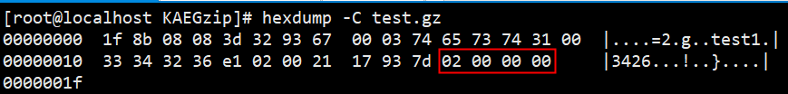

对于test.gz压缩文件，将文件尾的长度字段由**05 00 00 00**篡改为**02 00 00 00**。


Gzip工具会因为长度字段被篡改而产生报错，KAEGzip工具则会正常解压出符合协议的正确原始数据。

**原因分析及说明<a name="zh-cn_topic_0000002235067006_zh-cn_topic_0000001925948013_zh-cn_topic_0000001742708945_section31242048897"></a>**

Gzip在解压过程中会对长度字段进行校验，但由于当前硬件及驱动未实现对长度字段进行校验的功能，故而KAEGzip在该场景下采取了不同的处理逻辑，即对于完整且符合标准协议的核心数据段，正常解压出符合协议的正确原始数据。

### 关于KAEZlib块解压接口异常使用场景说明

KAEZlib模块提供了与zlib开源库兼容的部分压缩与解压缩接口。这包括用于流式处理的deflate/inflate接口，以及用于块式处理的compress/uncompress接口。

对于uncompress块解压接口，调用时需传入目标缓冲区的容量作为参数。这意味着调用者必须确保目标缓冲区的容量大于解压后的数据量。如果目标缓冲区容量不足，执行解压缩操作可能触发未定义行为，导致程序出现不可预测的运行结果。

因此，在解压缩原始数据大小未知的场景下，建议优先采用流式解压模式（inflate）进行处理。如果必须使用块解压接口（uncompress），则必须分配足够大的目标缓冲区，以保证其容量绝对充足。
