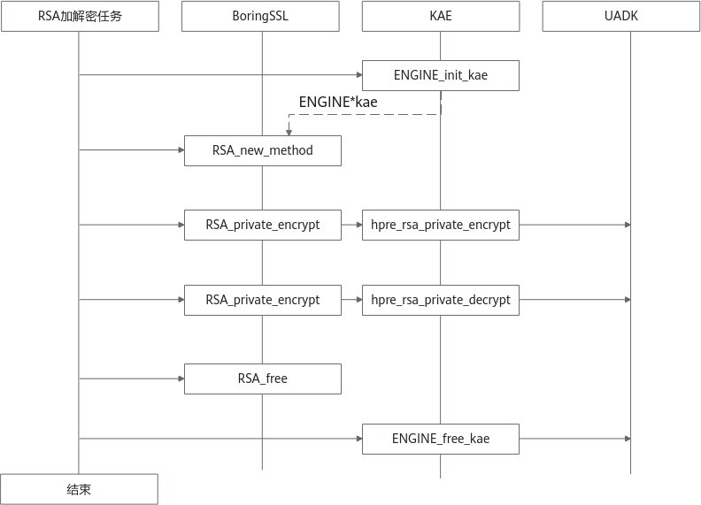

# 用户指南<a name="ZH-CN_TOPIC_0000002516017768"></a>

## 使用KAE加解密库<a name="ZH-CN_TOPIC_0000002515434272"></a>

### 通过ENGINE\_by\_id函数调用KAE加解密库<a name="ZH-CN_TOPIC_0000002547114101"></a>

当用户需要使用C语言调用KAE时，可以通过ENGINE\_by\_id函数来获取KAE句柄后再使能相应的算法。本节提供的仅是使用示例代码，使用过程中请根据实际业务需求进行配置修改。

```c
#include <stdio.h>
#include <stdlib.h>

/* OpenSSL headers */
#include <openssl/bio.h>
#include <openssl/ssl.h>
#include <openssl/err.h>
#include <openssl/engine.h>
 
int main(int argc, char **argv)
{
    /* Initializing OpenSSL */
    SSL_load_error_strings();
    ERR_load_BIO_strings();
    OpenSSL_add_all_algorithms();
    
    /*You can use ENGINE_by_id Function to get the handle of the Huawei Accelerator Engine*/
    ENGINE *e = ENGINE_by_id("kae");
    /*使能KAE加速引擎异步功能，该功能为可选配置，设置为“0”表示不使能，设置为“1”表示使能，默认使能异步功能*/
    ENGINE_ctrl_cmd_string(e, "KAE_CMD_ENABLE_ASYNC", "1", 0);
    ENGINE_init(e);
    /*指定KAE加速引擎用于RSA加解密，如果初始化时使用ENGINE_set_default_RSA(ENGINE *e);则无需传入e*/
    RSA *rsa = RSA_new_method(e);
    /*The user code*/
    ……
    
    ENGINE_free(e);
    
}
```

用户还可以在初始化阶段指定crypto相应算法使用KAE加速引擎，其他算法不需要使用KAE加速引擎，这种方式可减少现有代码的修改量，只需要在初始化的某个阶段设置一下即可。

```c
int ENGINE_set_default_RSA(ENGINE *e); 
int ENGINE_set_default_DH(ENGINE *e);
int ENGINE_set_default_ciphers(ENGINE *e);
int ENGINE_set_default_digests(ENGINE *e);
int ENGINE_set_default(ENGINE *e, unsigned int flags);
```

更多使用API方法请访问[OpenSSL官网](https://www.openssl.org/docs/manpages.html)。


### 通过OpenSSL/Tongsuo配置文件openssl.cnf调用KAE加解密库<a name="ZH-CN_TOPIC_0000002515434274"></a>

当需要使用OpenSSL配置文件调用KAE时，需要在配置文件openssl.cnf中添加KAE相关配置参数。通过配置文件方式使用KAE，可以使用户的APP在较小的修改量的情况下使用加速器功能。

如下所示，仅需调用一次此初始化API即可完成相应的配置工作：

```c
OPENSSL_init_crypto(OPENSSL_INIT_LOAD_CONFIG, NULL); //加载配置文件并初始化
```

> **说明：** 
>若加解密库为Tongsuo，使用方法和OpenSSL一致。
>如果用到**openssl req -new -x509**命令生成证书功能，请参见[使用openssl req -new -x509命令生成证书失败](./faq.md#使用openssl-req--new--x509命令生成证书失败)中的方法二完成openssl.cnf文件的配置。

新建openssl.cnf需要添加如下配置信息。

```ini
openssl_conf=openssl_def
[openssl_def]
engines=engine_section
[engine_section]
kae=kae_section
[kae_section]
engine_id=kae
#openssl版本为1.1.1x
dynamic_path=/usr/local/lib/engines-1.1/kae.so
#openssl版本为3.0.x设置为如下路径
#dynamic_path=/usr/local/lib/engines-3.0/kae.so
KAE_CMD_ENABLE_ASYNC=1
KAE_CMD_ENABLE_SM3=1
KAE_CMD_ENABLE_SM4=1
default_algorithms=ALL
init=1
```

> **说明：** 
>
>- KAE\_CMD\_ENABLE\_ASYNC为可选配置，0表示不使能异步功能，1表示使能异步功能，默认使能。
>- KAE\_CMD\_ENABLE\_SM3为可选配置，0表示不使能SM3加速功能，1表示使能SM3加速功能，默认使能。
>- KAE\_CMD\_ENABLE\_SM4为可选配置，0表示不使能SM4加速功能，1表示使能SM4加速功能，默认使能。
>- default\_algorithms=ALL表示所有算法优先查找KAE加速引擎，若引擎不支持，则切换OpenSSL进行计算。

设置OPENSSL\_CONF环境变量：

```shell
export OPENSSL_CONF=/home/app/openssl.cnf  #该路径为openssl.cnf存放路径
```

使用OpenSSL配置文件示例如下：

```c
#include <stdio.h> 
#include <stdlib.h> 
 
/* OpenSSL headers */ 
#include <openssl/bio.h> 
#include <openssl/err.h> 
#include <openssl/engine.h> 
int main(int argc, char **argv) 
{ 
    /* Initializing OpenSSL */  

    ERR_load_BIO_strings(); 
    /* Load openssl configure */
    OPENSSL_init_crypto(OPENSSL_INIT_LOAD_CONFIG, NULL);
    ENGINE *e = ENGINE_by_id("kae");
    /*指定KAE加速引擎用于RSA加解密，如果初始化时使用ENGINE_set_default_RSA(ENGINE *e);则无需传入e*/
    RSA *rsa = RSA_new_method(e);
    /*The user code*/ 
    …… 

    ENGINE_free(e);
    
}
```

当需要使用OpenSSL配置文件调用KAE时，需要在配置文件openssl.cnf中添加KAE相关配置参数。通过配置文件方式使用KAE，可以使用户的APP在较小的修改量的情况下使用加速器功能。

### 通过BoringSSL调用KAE加解密库<a name="ZH-CN_TOPIC_0000002515594190"></a>

#### 调用方案<a name="ZH-CN_TOPIC_0000002515594198"></a>

KAE支持使用BoringSSL调用，提供两种调用方案。方案一：用户在业务代码中调用API接口；方案二：修改BoringSSL源码，合入相关补丁。本章节对两种方案原理进行详细介绍。

BoringSSL的Engine机制不能通过设置类似于“OPENSSL\_ENGINES“的环境变量来调用KAE，因此KAE提供了相关的对外接口ENGINE\_init\_kae和ENGINE\_free\_kae。提供两种BoringSSL调用KAE的方案。

**方案一：用户在业务代码中调用接口<a name="zh-cn_topic_0000002332729981_section123525975417"></a>**

该方案的优点是无需重新编译BoringSSL，缺点是用户可能需要修改现有调用BoringSSL业务代码。

RSA私钥加密、私钥解密的接口兼容性如下：

- RSA\_new\(\)：无法调用到KAE。
- RSA\_new\_method\(\)：将KAE作为输入参数，可以调用到KAE。

在进行加密前调用ENGINE\_init\_kae获取KAE，将KAE作为RSA\_new\_method的入参，后续的私钥加密和公钥加密就会调用到KAE，任务完成后调用ENGINE\_free\_kae进行KAE资源释放。如[**图 1** BoringSSL通过API调用KAE原理图](#BoringSSL通过API调用KAE原理图)所示为通过API调用的原理图。

**图 1** BoringSSL通过API调用KAE原理图<a name="zh-cn_topic_0000002332729981_fig571210343319"></a><a id="BoringSSL通过API调用KAE原理图"></a>



**方案二：修改BoringSSL源码，合入相关补丁<a name="zh-cn_topic_0000002332729981_section1277662845415"></a>**

修改BoringSSL源码，合入相关patch，使BoringSSL的RSA算法默认使用KAE来做加解密。目前已针对0.20250311.0版本的BoringSSL给出相应补丁文件bssl\_add\_kae\_support.patch。不同版本的BoringSSL源码有差异，该patch不具有兼容性，如果需要使用其他版本的BoringSSL，可以参考该patch文件中的内容修改相应的源码，修改量并不多。

该方案的优点是无需修改现有业务代码；缺点是BoringSSL需要强依赖于KAE动态库。

RSA私钥加密、私钥解密的接口兼容性如下：

- RSA\_new\(\)：默认使用KAE。
- RSA\_new\_method\(\)：将KAE作为输入参数，可以调用到KAE。

KAE支持使用BoringSSL调用，提供两种调用方案。方案一：用户在业务代码中调用API接口；方案二：修改BoringSSL源码，合入相关补丁。本章节对两种方案原理进行详细介绍。

#### 调用示例<a name="ZH-CN_TOPIC_0000002547114093"></a>

使用BoringSSL调用KAE前需要先安装KAE，再进行BoringSSL编译，随后选择调用方案进行调用。本章节提供两种调用方式的调用示例。

**前提条件<a name="zh-cn_topic_0000002298930250_section14710172717351"></a>**

请参见《[安装指南](./installation_guide.md)》完成KAE的安装。

在编译安装KAEOpensslEngine加速引擎步骤中需要使用BoringSSL源码路径，如下所示。

```shell
sh build.sh engine_boringssl /opt/boringssl
```

**安装BoringSSL<a name="zh-cn_topic_0000002298930250_section13607252155212"></a>**

1. 下载[BoringSSL源码包](https://github.com/google/boringssl/releases)，将BoringSSL源码包拷贝到自定义路径下并解压（如“/opt/boringssl“）。
2. 编译并安装。

    BoringSSL默认编译Debug版本，发布版本需要添加-DCMAKE\_BUILD\_TYPE=Release进行编译。

    ```shell
    cmake -DCMAKE_BUILD_TYPE=Release  -B build -DBUILD_SHARED_LIBS=1
    make -C build -j
    cd build
    make install
    ```

3. 查看BoringSSL是否安装成功。

    使用**make install**安装后，BoringSSL的源码路径会生成“install“目录，查看“install“目录下的文件。

    ```shell
    ll /opt/boringssl/install/
    ```

    回显信息如下，表示安装成功。

    ```text
    total 16
    drwxr-xr-x. 3 root root 4096 Apr  8 11:41 bin
    drwxr-xr-x. 3 root root 4096 Apr  8 09:14 include
    drwxr-xr-x. 3 root root 4096 Apr  8 09:14 lib
    drwxr-xr-x. 2 root root 4096 Apr  8 09:14 lib64
    ```

**方案一：在业务代码中调用接口<a name="zh-cn_topic_0000002298930250_section260785225210"></a>**

**使用前提**：编译业务代码时需要链接KAE的头文件和动态库

- 头文件：/usr/local/boringssl/include/kae\_bssl.h
- 动态库：/usr/local/boringssl/lib/engines-1.1/kae\_bssl.so

**使用示例**

示例文件可参考testsuit\_rsa.cpp文件，该文件给出了通过ENGINE\_init\_kae和ENGINE\_free\_kae接口调用KAE的示例代码，文件路径为：“KAEOpensslEngine/test/bssl\_test/src/rsa/“。使用步骤如下：

1. 设置KAE和BoringSSL动态库查找路径。

    ```shell
    export LD_LIBRARY_PATH=/usr/local/boringssl/lib/engines-1.1:/opt/boringssl/install/lib64
    ```

2. 进入Makefile文件路径，打开Makefile脚本。

    ```shell
    cd KAE/KAEOpensslEngine/test/bssl_test/src
    vi Makefile
    ```

3. 按“i“进入编辑模式，修改第26行**-I**为BoringSSL的头文件路径，第28行**-L**为BoringSSL动态库路径。

    按“Esc“键，输入**:wq!**，按“Enter“保存并退出编辑。

4. 进入测试脚本路径，执行测试脚本build.sh，该脚本会自动编译使用示例testsuit\_rsa.cpp文件。

    ```shell
    cd ../
    sh build.sh
    ```

5. 执行测试用例。

    ```shell
    cd src
    ./kaedemo
    ```

**方案二：修改BoringSSL源码<a name="zh-cn_topic_0000002298930250_section6608165285211"></a>**

**使用前提**：编译业务代码时需要链接KAE的头文件和动态库

- KAE提供的bssl\_add\_kae\_support.patch只适用于0.20250311.0版本的BoringSSL，若使用其他版本的BoringSSL需要对该patch内容进行修改后再合入，修改点已在patch中详细说明，修改量较小（patch文件的加号表示新增，减号表示删除，修改的位置可以参考上下文）。
- 头文件：/usr/local/boringssl/include/kae\_bssl.h
- 动态库：/usr/local/boringssl/lib/engines-1.1/kae\_bssl.so

1. 重新下载一份BoringSSL源码。
2. 将bssl\_add\_kae\_support.patch文件复制到新的BoringSSL源码同级目录，bssl\_add\_kae\_support.patch文件路径为“KAEOpensslEngine/patch/bssl\_add\_kae\_support.patch“。
3. 使用**cd**命令进入BoringSSL源码目录。
4. 合入bssl\_add\_kae\_support.patch文件。

    ```shell
    patch -Np1 < ../bssl_add_kae_support.patch
    ```

5. 构建，需要传入**-DENABLE\_KAE=ON**。

    ```shell
    cmake -DENABLE_KAE=ON -DCMAKE_BUILD_TYPE=Release  -B build -DBUILD_SHARED_LIBS=1
    ```

6. 编译安装。

    ```shell
    make -C build -j
    cd build
    make install
    ```

**使用示例**

编译安装BoringSSL后，使用**bssl**命令进行性能测试，该命令在BoringSSL源码的“install/bin“目录中，**bssl**命令参数如[**表 1** **bssl**命令参数说明](#**bssl**命令参数说明)所示。

**表 1** **bssl**命令参数说明<a id="**bssl**命令参数说明"></a>

|参数|参数说明|
|--|--|
|-filter|筛选指定算法进行运行|
|-timeout|测试项运行时间|

以下为使用**bssl speed**进行性能测试的示例步骤，对比**bssl**不使用KAE和使用KAE的签名性能结果差异。

- 不使用KAE，即使用未合入patch之前的BoringSSL。
    1. 设置KAE和BoringSSL动态库路径。

        ```shell
        export LD_LIBRARY_PATH=/opt/boringssl/install/lib64
        ```

    2. 进入bssl命令路径并执行测试命令。

        ```shell
        cd /opt/boringssl/install/bin
        ./bssl speed -filter RSA -timeout 6
        ```

        回显信息如下所示。

        ```text
        Did 4823 RSA 2048 signing operations in 6019561us (801.2 ops/sec)
        Did 202000 RSA 2048 verify (same key) operations in 6010664us (33606.9 ops/sec)
        Did 173000 RSA 2048 verify (fresh key) operations in 6005633us (28806.3 ops/sec)
        Did 28148 RSA 2048 private key parse operations in 6000050us (4691.3 ops/sec)
        Did 1650 RSA 3072 signing operations in 6006562us (274.7 ops/sec)
        Did 95000 RSA 3072 verify (same key) operations in 6010544us (15805.6 ops/sec)
        Did 85000 RSA 3072 verify (fresh key) operations in 6022383us (14114.0 ops/sec)
        Did 14204 RSA 3072 private key parse operations in 6050679us (2347.5 ops/sec)
        Did 750 RSA 4096 signing operations in 6039070us (124.2 ops/sec)
        Did 54808 RSA 4096 verify (same key) operations in 6075612us (9021.0 ops/sec)
        Did 49600 RSA 4096 verify (fresh key) operations in 6001654us (8264.4 ops/sec)
        Did 10004 RSA 4096 private key parse operations in 6073923us (1647.0 ops/sec)
        ```

        可以看到使用未合入patch之前的BoringSSL的RSA算法时，RSA 2048 signing性能为801.2 ops/sec，RSA 3072 signing性能为274.7 ops/sec，RSA 4096 signing性能为124.2 ops/sec。

- 使用KAE，即使用合入patch之后的BoringSSL。
    1. 设置KAE和合入patch的BoringSSL动态库路径。

        ```shell
        export LD_LIBRARY_PATH=/usr/local/boringssl/lib/engines-1.1:/opt/patch/boringssl/install/lib64
        ```

    2. 进入bssl命令路径并执行测试命令。

        ```shell
        cd /opt/patch/boringssl/install/bin
        ./bssl speed -filter RSA -timeout 6
        ```

        回显信息如下所示。

        ```text
        Did 19536 RSA 2048 signing operations in 6020015us (3245.2 ops/sec)
        Did 202000 RSA 2048 verify (same key) operations in 6022999us (33538.1 ops/sec)
        Did 171250 RSA 2048 verify (fresh key) operations in 6020358us (28445.2 ops/sec)
        Did 32760 RSA 2048 private key parse operations in 6083206us (5385.3 ops/sec)
        Did 7215 RSA 3072 signing operations in 6035497us (1195.4 ops/sec)
        Did 95000 RSA 3072 verify (same key) operations in 6013634us (15797.4 ops/sec)
        Did 85625 RSA 3072 verify (fresh key) operations in 6033388us (14191.9 ops/sec)
        Did 14410 RSA 3072 private key parse operations in 6108017us (2359.2 ops/sec)
        Did 3268 RSA 4096 signing operations in 6030206us (541.9 ops/sec)
        Did 54303 RSA 4096 verify (same key) operations in 6016396us (9025.8 ops/sec)
        Did 49749 RSA 4096 verify (fresh key) operations in 6018416us (8266.1 ops/sec)
        Did 9072 RSA 4096 private key parse operations in 6080936us (1491.9 ops/sec)
        ```

        可以看到使用合入patch之后的BoringSSL的RSA算法时，RSA 2048 signing性能为3245.2 ops/sec，RSA 3072 signing性能为1195.4 ops/sec，RSA 4096 signing性能为541.9 ops/sec，性能有明显提升 。

## 使用KAE压缩库<a name="ZH-CN_TOPIC_0000002515594212"></a>

### 调用KAEZlib加速库<a name="ZH-CN_TOPIC_0000002515434294"></a>

本节提供分布式存储场景下KAEZlib加速压缩库的使用方法。

请参见[安装指南](./installation_guide.md)章节编译并安装好软件。应用层可以通过以下两种方式链接到zlib加速压缩库：

- 应用层在编译阶段指定运行时加载libz.so的位置，通过以下编译选项进行链接：

    ```shell
    -Wl,-rpath=/usr/local/kaezip/lib
    ```

    其中“/usr/local/kaezip/lib“为一示例，表示新安装zlib库的路径。

- 设置环境变量：

    ```shell
    export LD_LIBRARY_PATH=/usr/local/kaezip/lib:$LD_LIBRARY_PATH
    ```

若需要使用KAEZlib的异步接口，请参考KAEZlib目录下的[README](../../KAEZlib/README.md)。

### 调用KAEZstd加速库<a name="ZH-CN_TOPIC_0000002515434306"></a>

本节提供KAEZstd加速压缩库的使用方法。

- 通过lib库调用KAEZstd加速压缩库。

    请参见[安装指南](./installation_guide.md)章节编译并安装好软件。应用层可以通过以下两种方式链接到KAEZstd加速压缩库。

    - 应用层在编译阶段指定运行时加载libkaezstd.so的位置，通过以下编译选项进行链接：

        ```shell
        -Wl,-rpath=/usr/local/kaezstd/lib
        ```

    - 设置环境变量：

        ```shell
        export LD_LIBRARY_PATH=/usr/local/kaezstd/lib:$LD_LIBRARY_PATH
        ```

- 通过二进制文件调用KAEZstd加速压缩库。

    请参见[安装指南](./installation_guide.md)章节编译并安装好软件。可以直接使用“/usr/local/kaezstd/bin/zstd“应用程序进行解压缩。

    - 设置环境变量。

        ```shell
        export LD_LIBRARY_PATH=/usr/local/kaezstd/lib:$LD_LIBRARY_PATH
        ```

    - 使用应用程序进行文件压缩。

        ```shell
        /usr/local/kaezstd/bin/zstd -f filename -o compressed_file
        ```

    - 使用应用程序对压缩文件进行解压缩。

        ```shell
        /usr/local/kaezstd/bin/zstd -d -f compressed_file -o decompressed_file
        ```

### 调用KAELz4加速库<a name="ZH-CN_TOPIC_0000002515434298"></a>

**同步接口的使用<a name="section47033483288"></a>**

本节提供KAELz4加速压缩库同步接口的使用方法。

- 通过lib库调用KAELz4加速压缩库。

    请参见[安装指南](./installation_guide.md)章节编译并安装好软件。应用层可以通过以下两种方式链接到KAELz4加速压缩库。

    - 应用层在编译阶段指定运行时加载libkaelz4.so的位置，通过以下编译选项进行链接：

        ```shell
        -Wl,-rpath=/usr/local/kaelz4/lib
        ```

    - 设置环境变量：

        ```shell
        export LD_LIBRARY_PATH=/usr/local/kaelz4/lib:$LD_LIBRARY_PATH
        ```

- 通过二进制文件调用KAELz4加速压缩库。

    请参见[安装指南](./installation_guide.md)章节编译并安装好软件。可以直接使用“/usr/local/kaelz4/bin/lz4“应用程序进行解压缩。

    - 设置环境变量。

        ```shell
        export LD_LIBRARY_PATH=/usr/local/kaelz4/lib:$LD_LIBRARY_PATH
        ```

    - 使用应用程序进行文件压缩。

        ```shell
        /usr/local/kaelz4/bin/lz4 filename compressed_file
        ```

    - 使用应用程序对压缩文件进行解压缩。

        ```shell
        /usr/local/kaelz4/bin/lz4 -d compressed_file decompressed_file
        ```

**异步接口的使用<a name="section115671214297"></a>**

本节提供KAELz4加速压缩库异步接口的使用方法。

KAELz4异步接口当前支持2种模式，polling模式压缩接口、非polling模式压缩接口，polling模式下需要由用户线程主动调用相关接口回收压缩数据，非polling模式下，数据通过接口直接被异步压缩处理，最终由callback函数回调压缩结果的相关接口。同时，KAELz4异步接口支持3种压缩数据格式：block、frame、lz77\_raw，其中block与frame格式与社区lz4标准block\\frame格式兼容，lz77\_raw格式需要调用对应的后处理接口进行转换成标准block\\frame格式。 

以下给出非polling模式下压缩生成frame格式的代码样例。详细的API接口说明及使用样例请参见[KAELz4开源仓README](https://gitcode.com/boostkit/KAE/blob/kae2/KAELz4/README.md)。

1. 请参见[安装指南](./installation_guide.md)章节编译并安装好软件。
2. 应用层在编译阶段指定libkaelz4.so的位置，指定KAELz4异步头文件的位置，通过以下编译选项进行链接。

    ```shell
    -I/usr/local/kaelz4/include -L/usr/local/kaelz4/lib -llz4
    ```

    设置环境变量。

    ```shell
    export LD_LIBRARY_PATH=/usr/local/kaelz4/lib:$LD_LIBRARY_PATH
    export C_INCLUDE_PATH=/usr/local/kaelz4/include:$C_INCLUDE_PATH
    ```

3. 使用异步接口编写压缩代码main.c。frame格式压缩代码示例如下。

    ```c
    #include <stdio.h>
    #include <stdlib.h>
    #include <string.h>
    #include <time.h>
    #include <lz4.h>
    #include <lz4frame.h>
    #include <unistd.h>
    #include <sys/stat.h>
    int g_has_done = 0; // 异步回调是否完成。需要初始化为0。
    int g_test_file = 0; // 是否使用文件测试。
    struct my_custom_data {
        void *src;
        void *dst;
        void *src_decompd;
        size_t src_len;
        size_t dst_len;
        size_t src_decompd_len;
    };
    // 随机生成256KB的数据
    static void generate_random_data(void *data, size_t size) {
        unsigned char *bytes = (unsigned char *)data;
        for (size_t i = 0; i < size; i++) {
            bytes[i] = rand() % 256;  // 随机生成字节
        }
    }
    static size_t read_inputFile(const char* fileName, void** input)
    {
        FILE* sourceFile = fopen(fileName, "r");
        if (sourceFile == NULL) {
            fprintf(stderr, "%s not exist!\n", fileName);
            return 0;
        }
        int fd = fileno(sourceFile);
        struct stat fs;
        (void)fstat(fd, &fs);
        size_t input_size = fs.st_size;
        *input = malloc(input_size);
        if (*input == NULL) {
            return 0;
        }
        (void)fread(*input, 1, input_size, sourceFile);
        fclose(sourceFile);
        return input_size;
    }
    void compression_callback(struct kaelz4_result *result) {
        if (result->status != 0) {
            printf("Compression failed with status: %d\n", result->status);
            return;
        }
        // 在回调中获取压缩后的数据
        struct my_custom_data *my_data = (struct my_custom_data *)result->user_data;
        void *compressed_data = my_data->dst;
        size_t compressed_size = result->dst_len;
        my_data->dst_len = compressed_size;
        // 使用LZ4解压缩数据
        size_t tmp_src_len = result->src_size * 10;
        // 为解压数据分配内存
        void *dst_buffer = malloc(tmp_src_len);
        if (!dst_buffer) {
            printf("Memory allocation failed for decompressed data.\n");
            return;
        }
        LZ4F_decompressionContext_t dctx;
        LZ4F_createDecompressionContext(&dctx, 100);
        int ret = LZ4F_decompress(dctx, dst_buffer, &tmp_src_len,
                                                compressed_data, &compressed_size, NULL);
        if (ret < 0) {
            printf("Decompression failed with error code: %d\n", ret);
            free(dst_buffer);
            return;
        }
        my_data->src_decompd = dst_buffer;
        my_data->src_decompd_len = tmp_src_len;
        if (my_data->src_decompd_len != my_data->src_len) {
            printf("Test Error: 解压后与原始长度不一样. result->src_size=%ld   原始长度=%ld   压缩后解压长度=%ld \n",
                result->src_size,
                my_data->src_len,
                my_data->src_decompd_len);
        }
        // 比较解压后的数据和原始数据
        if (memcmp(my_data->src_decompd, my_data->src, result->src_size) == 0) {
            printf("Test Success.\n");
        } else {
            printf("Test Error:Decompressed data does not match the original data.\n");
        }
        // 释放解压后的数据
        free(dst_buffer);
        g_has_done = 1;
    }
    static int test_async_frame_with_perferences(int contentChecksumFlag, int blockChecksumFlag, int contentSizeFlag)
    {
        g_has_done = 0;
        size_t src_len = 258 * 1024;  // 256KB
        void *inbuf = malloc(src_len);
        if (!inbuf) {
            printf("Memory allocation failed for input data.\n");
            return -1;
        }
        // 生成随机数据
        generate_random_data(inbuf, src_len);
        if (g_test_file) {
            src_len = read_inputFile("../../../scripts/compressTestDataset/x-ray", &inbuf);
        }
        // 为压缩数据分配内存
        size_t compressed_size = LZ4F_compressBound(src_len, NULL);
        void *compressed_data = malloc(compressed_size);
        if (!compressed_data) {
            printf("Memory allocation failed for compressed data.\n");
            free(inbuf);
            return -1;
        }
        // 初始化LZ4F压缩的参数
        LZ4F_preferences_t preferences = {0};
        preferences.frameInfo.blockSizeID = LZ4F_max64KB;  // 设定块大小
        if (contentChecksumFlag) {
            preferences.frameInfo.contentChecksumFlag = LZ4F_contentChecksumEnabled;
        }
        if (blockChecksumFlag) {
            preferences.frameInfo.blockChecksumFlag = LZ4F_blockChecksumEnabled;
        }
        if (contentSizeFlag) {
            preferences.frameInfo.contentSize = src_len;
        }
        // 异步压缩
        struct kaelz4_result result = {0};
        struct my_custom_data mydata = {0};
        mydata.src = inbuf;
        mydata.src_len = src_len;
        mydata.dst = compressed_data;
        result.user_data = &mydata;
        result.src_size = src_len;
        result.dst_len = compressed_size;
        LZ4_async_compress_init();
        int compression_status = LZ4F_compressFrame_async(inbuf, compressed_data,
                                                          compression_callback, &result, &preferences);
        if (compression_status != 0) {
            printf("Compression failed with error code: %d\n", compression_status);
            free(inbuf);
            free(compressed_data);
            return -1;
        }
        while (g_has_done != 1) {
            usleep(100);
        }
        LZ4_teardown_async_compress();
        return compression_status;
    }
    int main()
    {
        return test_async_frame_with_perferences(1, 1, 1);
    }
    ```

4. 编译并运行代码。

    ```shell
    gcc main.c -I/usr/local/kaelz4/include -L/usr/local/kaelz4/lib -llz4 -o kaelz4_frame_async_test
    ./kaelz4_frame_async_test
    ```

    显示结果如下。

    ```text
    Test Success.
    ```

### 调用KAESnappy加速库<a name="ZH-CN_TOPIC_0000002515434306"></a>

- 本节提供通过lib库调用KAESnappy加速压缩库的使用方法。

    请参见[安装指南](./installation_guide.md)章节编译并安装好软件。应用层可以通过以下两种方式链接到KAESnappy加速压缩库。

    - 应用层在编译阶段指定运行时加载libkaesnappy.so的位置，通过以下编译选项进行链接：

        ```shell
        -Wl,-rpath=/usr/local/kaesnappy/lib
        ```

    - 设置环境变量：

        ```shell
        export LD_LIBRARY_PATH=/usr/local/kaesnappy/lib:$LD_LIBRARY_PATH
        ```

## 维护KAE<a name="ZH-CN_TOPIC_0000002547114107"></a>

### 查询KAE日志<a name="ZH-CN_TOPIC_0000002515434302"></a>

掌握日志查询方法以便您在遇到故障时对故障根因进行准确定位和分析。

KAE涉及日志信息如[**表 1** 日志信息](#日志信息)所示。

**表 1** 日志信息<a id="日志信息"></a>

|目录|文件名|文件内容说明|
|--|--|--|
|/var/log/|kae.log|OpenSSL引擎日志默认打印等级为error级别。<br>如需要设置日志级别，按照如下操作设置环境变量：```export KAE_CONF_ENV=/var/log/```，在/var/log/下创建kae.cnf文件。并在kae.cnf文件中设置如下：```[LogSection]debug_level=error```。<br>debug_level取值范围：none、error、info、warning、debug。不建议开启info或debug级别日志，否则会导致加速器性能的下降。|
|/var/log/|kaezip.log|KAEZlib加速库日志默认不打印。<br>如需要设置日志级别，按照如下操作设置环境变量：```export KAEZIP_CONF_ENV=/var/log/```，在/var/log/下创建文件kaezip.cnf。并在kaezip.cnf文件中设置如下：```[LogSection]debug_level=error```。<br>debug_level取值范围：none、error、info、warning、debug。不建议开启info或debug级别日志，否则会导致加速器性能的下降。|
|/var/log/|kaezstd.log|KAEZstd加速库日志默认不打印。<br>如需要设置日志级别，按照如下操作设置环境变量：```export KAEZSTD_CONF_ENV=/var/log/```在/var/log/下创建kaezstd.cnf文件。并在kaezstd.cnf文件中设置如下：```[LogSection]debug_level=error```。<br>debug_level取值范围：none、error、info、warning、debug。不建议开启info或debug级别日志，否则会导致加速器性能的下降。|
|/var/log/|kaelz4.log|KAELz4加速库日志默认不打印。<br>如需要设置日志级别，按照如下操作设置环境变量：```export KAELZ4_CONF_ENV=/var/log/```，在/var/log/下创建kaelz4.cnf文件。并在kaelz4.cnf文件中设置如下：```[LogSection]debug_level=error```。<br>debug_level取值范围：none、error、info、warning、debug。正常情况下不建议开启info或debug级别日志，否则会导致加速器性能的下降。|
|/var/log/|kaesnappy.log|KAESnappy加速库日志默认不打印。<br>如需要设置日志级别，按照如下操作设置环境变量：```export KAESNAPPY_CONF_ENV=/var/log/```，在/var/log/下创建kaesnappy.cnf文件。并在kaesnappy.cnf文件中设置如下：```[LogSection]debug_level=error```。<br>debug_level取值范围：none、error、info、warning、debug。正常情况下不建议开启info或debug级别日志，否则会导致加速器性能的下降。|
|/var/log/|message/syslog|CentOS，SUSE，Euler等OS内核日志路径为/var/log/message。Ubuntu等OS内核日志路径为/var/log/syslog。或通过dmesg > /var/log/dmesg.log日志收集内核相关日志，包含驱动及内核态日志。|

掌握日志查询方法以便您在遇到故障时对故障根因进行准确定位和分析。
